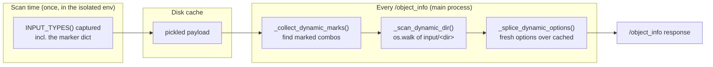

# Dynamic combos (`comfy_env_dynamic_dir`)

*How an isolated node keeps a file-listing dropdown live, when its
`INPUT_TYPES` is a snapshot taken minutes ago in another process.*

## The problem this exists to solve

In vanilla ComfyUI, `INPUT_TYPES()` is a **function of live state**, and core
re-evaluates it on **every** `/object_info` request -- twice per node, in fact
(`server.py:756-757`). That is why the checkpoint dropdown updates when you
drop a new file into `models/checkpoints/` and hit refresh. Core pays real cost
to keep that promise: `folder_paths.CacheHelper` exists solely to stop the
repeated `get_filename_list()` calls inside all those `INPUT_TYPES()` from
re-walking the disk on every request.

An isolated node cannot work that way. Its class lives in a worker process, so
the main process holds only a **proxy** whose `INPUT_TYPES` replays a payload
captured once, by the [metadata scan](register-nodes.md#what-it-does), and then
cached on disk. A combo built from a directory listing is therefore frozen at
scan time:

```python
# inside the isolated pack -- evaluated ONCE, in the scan child
io.Combo.Input("file_path", options=[f for f in os.listdir(input_dir/"3d")])
```

Upload a new `.obj` and it never appears. Not on refresh, not on restart --
the disk cache means the stale answer outlives the process that produced it.

!!! danger "This is the sharpest correctness gap between an isolated node and a native one"
    Measured across the 493-pack third-party corpus, **236 packs (48%) have an
    `INPUT_TYPES` that reads the filesystem**. Freezing that list is not an edge
    case; it is the modal behaviour of the ecosystem.

## The mechanism

A node **opts a single combo** into live refresh by attaching a marker to that
input's options dict. The parent then re-scans the directory itself, on every
`/object_info`, and splices fresh options over the cached ones.

The crucial property: the refresh is a plain `os.listdir` / `os.walk` of a
**ComfyUI input folder**. It needs none of the node's isolated dependencies, so
it runs *in the main process* -- the read path never touches the worker, which
may be busy with a long execution, or hung, or not yet spawned.



## Author reference

### Simple form -- one directory, non-recursive

```python
io.Combo.Input("filename", options=_get_cad_files(),
               extra_dict={
                   "comfy_env_dynamic_dir": "cad",
                   "comfy_env_exts": [".step", ".stp", ".iges", ".igs", ".brep"],
                   "comfy_env_placeholder": "(no CAD files found in input/cad)",
               })
```

### Multi-source form -- several roots, mixed recursion

`comfy_env_sources` supersedes the single directory; `comfy_env_dynamic_dir`
then acts only as the trigger and its value is ignored.

```python
io.Combo.Input("file_path", options=mesh_files,
               extra_dict={
                   "comfy_env_dynamic_dir": "3d",          # trigger only
                   "comfy_env_sources": [
                       {"dir": "3d", "recursive": True,  "rel_to_input": True},
                       {"dir": "",   "recursive": False, "rel_to_input": False},
                   ],
                   "comfy_env_exts": cls.SUPPORTED_EXTENSIONS,
                   "comfy_env_placeholder": placeholder,
               })
```

### Keys

| Key | Meaning |
|---|---|
| `comfy_env_dynamic_dir` | Subdirectory of ComfyUI's `input/` to scan. Also the opt-in trigger -- ignored as a path when `comfy_env_sources` is present. |
| `comfy_env_sources` | List of `{"dir", "recursive", "rel_to_input"}`. Results are concatenated, de-duplicated, then sorted. |
| `comfy_env_exts` | Extensions to keep, compared **lowercased**. Empty/absent means every file. |
| `comfy_env_placeholder` | Single entry substituted when the scan finds nothing, so the dropdown never renders empty. |

### Per-source fields

| Field | Default | Meaning |
|---|---|---|
| `dir` | `""` | Subdirectory of `input/`. Empty string means the input root. |
| `recursive` | `False` | `os.walk` instead of a flat listing. |
| `rel_to_input` | `False` | Return values relative to the **input root** (`"3d/foo.obj"`) rather than to the scanned dir (`"foo.obj"`). |

`rel_to_input` is what lets one combo mix a recursive subfolder with the input
root and still hand ComfyUI paths it can resolve.

## Implementation

All of it lives in `src/comfy_env/isolation/metadata.py`.

| Function | Role |
|---|---|
| `_extract_dynamic_spec(entry)` | Finds the marker in a captured combo entry. An entry is a `(options_or_io_type, opts_dict)` tuple; the marker is the first `dict` element carrying either key. |
| `_collect_dynamic_marks(input_types)` | Walks `required` + `optional`, returning `[(section, input_name, spec)]`. Run **once**, at proxy-build time. |
| `_scan_one_source(base, src, exts)` | Scans one source. Never raises. |
| `_scan_dynamic_dir(spec)` | Resolves `folder_paths.get_input_directory()`, scans every source, de-dupes, sorts, applies the placeholder. Returns `None` if the input dir cannot be resolved. |
| `_splice_dynamic_options(sections, marks)` | Returns a **copy** of the sections with each marked combo's options replaced. Handles the V1 bare-list shape (`entry[0]` is the option list). |

The proxy builder only installs the dynamic path when a class actually has
marks, so unmarked nodes keep the cheap replay:

```python
if dynamic_marks:
    @classmethod
    def _input_types(cls, _cached=input_types, _marks=dynamic_marks): ...
    @classmethod
    def _get_node_info_v1(cls, _info=node_info, _marks=dynamic_marks): ...
```

Both V1 `INPUT_TYPES` and the V3 `GET_NODE_INFO_V1()` path are spliced, so the
node menu and `/object_info` agree.

!!! note "Everything on this path is written to never raise"
    `/object_info` enumerates *every* node, so one bad marker must not take the
    endpoint down. `_scan_one_source` swallows its errors, and
    `_splice_dynamic_options` keeps the **cached** options whenever
    `_scan_dynamic_dir` returns `None`. The failure mode is a stale dropdown,
    never a broken endpoint.

## Limits -- read this part

This mechanism is deliberately narrow, and it does **not** close the general
staleness gap.

1. **It is opt-in and author-annotated.** A pack must add a comfy-env-specific
   key to its own schema. Third-party packs will never carry it. Users today:
   `ComfyUI-GeometryPack`, `ComfyUI-CADabra`, `ComfyUI-3D-Pack-enved` -- all
   first-party.
2. **It only covers ComfyUI's `input/` directory.** It does **not** cover
   `folder_paths.get_filename_list("checkpoints" / "loras" / "vae" / ...)` --
   the model categories, which is what most dynamic packs actually call. It
   solves *"I uploaded a mesh"*, not *"I downloaded a checkpoint"*.
3. **Everything else in the payload stays frozen** -- `RETURN_TYPES`, tooltips,
   and any option list computed from something other than a directory walk
   (installed backends, GPU capability probes, API queries).

### The generalisation, not yet built

The mechanism is right; the trigger is wrong. Rather than asking authors to
annotate, the scan child could **detect** volatility: shim
`folder_paths.get_filename_list` / `get_folder_paths` during the scan (the hook
point already exists where the child repoints `folder_paths` from
`COMFYUI_BASE`), record which node touched which category, and emit a
`volatile_inputs` entry in the payload. The parent then re-derives exactly those
combos through this same splice machinery -- automatic instead of annotated, and
extended from `input/` to the model folders.

That would make the 48% correct by default, and reduce
`comfy_env_dynamic_dir` to what it should be: the manual override for the cases
detection cannot see.

## See also

- [`register_nodes()`](register-nodes.md) -- where proxies are synthesized and
  the metadata scan runs.
- [The process boundary](process-boundary.md) -- why the class is not in the
  main process to begin with.
- [ComfyUI background](comfyui-background.md) -- what core does with
  `INPUT_TYPES` and `/object_info`.
