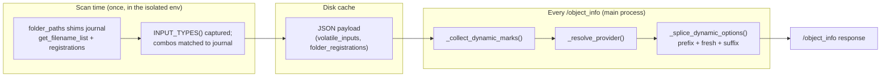

# Dynamic combos

*How an isolated node keeps a file-listing dropdown live, when its
`INPUT_TYPES` is a snapshot taken minutes ago in another process.*

## The problem this exists to solve

In vanilla ComfyUI, `INPUT_TYPES()` is a **function of live state**, and core
re-evaluates it on **every** `/object_info` request -- twice per node, in fact
(`server.py:756-757`). That is why the checkpoint dropdown updates when you
drop a new file into `models/checkpoints/` and hit refresh. Core pays real cost
to keep that promise: `folder_paths.CacheHelper` exists solely to stop the
repeated `get_filename_list()` calls inside all those `INPUT_TYPES()` from
re-walking the disk on every request.

An isolated node cannot work that way. Its class lives in a worker process, so
the main process holds only a **proxy** whose `INPUT_TYPES` replays a payload
captured once, by the [metadata scan](register-nodes.md#what-it-does), and then
cached on disk. Left alone, a combo built from a directory listing would be
frozen at scan time: upload a new `.obj` and it never appears -- not on
refresh, not on restart, because the disk cache outlives the process that
produced it.

!!! danger "This is the sharpest correctness gap between an isolated node and a native one"
    Measured across the 493-pack third-party corpus, **236 packs (48%) have an
    `INPUT_TYPES` that reads the filesystem**. Freezing that list is not an edge
    case; it is the modal behaviour of the ecosystem.

comfy-env closes the gap by capturing not just the *list* but the **recipe
that produced it** -- a *provider* -- and re-running the recipe in the main
process on every `/object_info`. The refresh is a plain directory walk that
needs none of the pack's isolated dependencies, so the read path never touches
the worker, which may be busy, hung, or not yet spawned.

## What stays live, and what you write

| # | Your combo is built from | What you write | What happens |
|---|---|---|---|
| 1 | `folder_paths.get_filename_list("checkpoints")` (any model category) | **Nothing** -- ordinary ComfyUI code | Detected automatically at scan time; re-resolved live on every `/object_info` |
| 2 | Files under ComfyUI's `input/` directory | `comfy_env.input_files(...)` builds the options | The recipe travels with the list; the parent re-scans live |
| 3 | Anything else -- hand-rolled `os.walk`, backend probes, API queries | (nothing available) | **Frozen at scan time.** The legacy [marker keys](#legacy-markers-the-old-opt-in) are the manual override for input-dir walks |

## Case 1: `get_filename_list` is detected, not declared

During the scan, the child process wraps two `folder_paths` functions:

- **`get_filename_list(name)`** -- calls through to core, first mapping legacy
  names the way core does (`map_legacy`: `"unet"` becomes
  `"diffusion_models"`, so later lookups do not miss). The result comes back
  as a *tagged* list subclass carrying `{kind: "filename_list", category}`,
  and the `(category, result)` pair is journaled.
- **`add_model_folder_path(name, path)`** -- calls through, and journals the
  registration (see [the registry rule](#the-registry-is-never-written)).

After `INPUT_TYPES` is captured, each combo is matched against the journal:

1. **Tag identity** -- the options list *is* a tagged result, used verbatim.
   The tag survives `["none"] + get_filename_list(...)` too: list
   concatenation on the subclass keeps the tag and records the offset, so the
   literal `"none"` is preserved as a **prefix** and only the listed span
   refreshes. Same for suffixes.
2. **Whole-list equality** -- `sorted()` and `list()` shed the tag, so an
   untagged options list exactly equal to one journaled result (and only one)
   still binds to that category.

Matches are recorded per node as `volatile_inputs` in the payload. At
`/object_info` time the proxy splices `prefix + fresh + suffix` over the
cached options.

!!! note "Why replacement is not wholesale"
    Of 983 `get_filename_list` call sites inside `INPUT_TYPES` bodies across
    the corpus, only 48% are the bare shape; 321 are `["none"] + ...`
    concatenations. Replacing the whole list would delete the `"none"`
    sentinel out of a third of the ecosystem -- hence the offset math.

## Case 2: `input_files()` for input-directory pickers

For dropdowns listing ComfyUI's `input/` directory there is no core function
to detect, so the pack states the recipe by building its options with one
helper:

```python
from comfy_env import input_files

class LoadMesh(io.ComfyNode):
    @classmethod
    def define_schema(cls):
        mesh_files = input_files(
            [{"dir": "3d", "recursive": True,  "rel_to_input": True},
             {"dir": "",   "recursive": False, "rel_to_input": False}],
            exts=cls.SUPPORTED_EXTENSIONS,
            placeholder="No mesh files found in input/3d or input folders",
        )
        ...
        io.Combo.Input("file_path", options=mesh_files)
```

`input_files()` **returns the live listing** -- it is correct un-isolated too
-- and the returned list carries the recipe as a provider, exactly like the
tagged `get_filename_list` result. A plain string is accepted for the simple
case: `input_files("cad", exts=[".step", ".stp"])`.

| Argument | Meaning |
|---|---|
| `sources` | A dir string, or a list of dir strings / dicts (below). Results are concatenated, de-duplicated, sorted. |
| `exts` | Extensions to keep (with leading dots), compared **lowercased**. `None` means every file. |
| `placeholder` | Single entry substituted when nothing matches, so the dropdown never renders empty and saved workflows stay loadable. |

Per-source dict fields:

| Field | Default | Meaning |
|---|---|---|
| `dir` | `""` | Subdirectory of `input/`. Empty string means the input root. Fenced: a source resolving outside `input/` is ignored. |
| `recursive` | `False` | Walk subdirectories instead of a flat listing. |
| `rel_to_input` | `False` | Return values relative to the **input root** (`"3d/foo.obj"`) rather than to the scanned dir (`"foo.obj"`). |

`rel_to_input` is what lets one combo mix a recursive subfolder with the input
root and still hand ComfyUI paths it can resolve.

The helper resolves in all three habitats: in a plain un-isolated import it
lists against the host's `folder_paths`; in the scan child it additionally
journals the recipe; in the worker a self-contained twin ships with the
`comfy_env` stub (the worker never has comfy-env installed,
[ADR-0006](adr/0006-worker-crosses-the-boundary-as-source-text.md)).

## How the parent resolves a provider



**`filename_list` providers** are membership-gated: if the host defines the
category, the parent makes a read-only `get_filename_list` call (inheriting
core's mtime-validated cache and the request-scoped `CacheHelper` that
`server.py` holds open across `/object_info`). If only the *pack* registered
the category, the parent replays the recorded paths through core's own pure
helpers, `recursive_search` + `filter_files_extensions` -- the same algorithm,
not a second copy to drift.

**`input_dir` providers** run through the same scanner as the legacy markers,
behind a `{directory: st_mtime_ns}` cache keyed on every directory the
previous scan visited -- so a change in a subfolder at any depth invalidates,
and an unchanged tree costs a handful of `stat` calls.

### The registry is never written

A pack's `add_model_folder_path("checkpoints", ...)` is journaled, **not**
replayed into the host's `folder_paths.folder_names_and_paths`. Two reasons:

1. **The host wins.** 3D-Pack really does register extra paths under
   `"checkpoints"`; mutating the host registry from pack metadata would let
   one pack's layout leak into every other node's dropdown -- and into
   ComfyUI's asset database, which enrolls registered roots.
2. The pack's own registration still applies **inside its worker**, where its
   nodes actually run.

Recorded registrations live in a per-pack private registry, consulted only
for categories the host does not define.

### Never raises

`/object_info` enumerates *every* node, and a raise inside `INPUT_TYPES`
makes core **omit the node entirely** -- a vanished node is strictly worse
than a stale dropdown. Every resolver on this path returns `None` on any
failure, and the splice keeps the cached options when it does. The failure
mode is a stale dropdown, never a missing node or a broken endpoint.

## Validation and caching, parent-side

A live dropdown is useless if execution then rejects the freshly-uploaded
value against the *baked* option list. Two synthesized classmethods close the
loop, both parent-side -- never forwarded to the worker (a forward would
cold-spawn every env at prompt-validation time, and linked inputs arrive
stubbed as `None` during caching, poisoning the signature):

- **Validation exemption.** The proxy gets a validate function whose argspec
  names **exactly** the dynamic inputs (plus any the pack's own validate
  named). Core exempts an input from its built-in combo/min/max checks iff
  the input's name appears in that argspec (`execution.py:1019`) -- a
  `**kwargs` form would exempt *every* input on the node, silently disabling
  numeric clamps, which is why the names are exact. V3 proxies get the
  lowercase `validate_inputs`; V1 proxies get `VALIDATE_INPUTS`.
- **Staleness fingerprint.** A parent-side `fingerprint_inputs` hashes each
  dynamic input's value by resolved-file mtime, so re-running a workflow
  after overwriting the file re-executes instead of serving the stale cache.
  It attaches only when it cannot change unrelated caching: when the pack's
  own declared fingerprint args are a subset of the dynamic inputs, or on
  explicit opt-in (`comfy_env_fingerprint = "mtime"` in a legacy marker).

## Legacy markers (the old opt-in)

Before 0.4.34 the only mechanism was an author-annotated marker dict on the
combo's options. It is **still honored**, as the manual override for cases
detection cannot see (e.g. a hand-rolled walk you cannot rewrite yet) -- but a
journal record for the same input **silences** the marker, so there is one
resolver and one walk per input, never a race between two.

```python
io.Combo.Input("filename", options=_get_cad_files(),
               extra_dict={
                   "comfy_env_dynamic_dir": "cad",
                   "comfy_env_exts": [".step", ".stp", ".iges", ".igs", ".brep"],
                   "comfy_env_placeholder": "(no CAD files found in input/cad)",
               })
```

| Key | Meaning |
|---|---|
| `comfy_env_dynamic_dir` | Subdirectory of `input/` to scan. Also the opt-in trigger -- ignored as a path when `comfy_env_sources` is present. |
| `comfy_env_sources` | List of `{"dir", "recursive", "rel_to_input"}` -- same fields as `input_files()`. |
| `comfy_env_exts` | Extension allow-list, compared lowercased. |
| `comfy_env_placeholder` | Entry substituted when the scan finds nothing. |
| `comfy_env_fingerprint` | `"mtime"` opts the input into the staleness fingerprint above. |

New code should call `input_files()` instead: same semantics, one line, no
comfy-env-specific keys in the schema, and correct when the pack runs
un-isolated. ComfyUI-GeometryPack has migrated; ComfyUI-CADabra and
ComfyUI-3D-Pack-enved still carry markers.

## Limits -- read this part

1. **Hand-rolled walks are not detected.** A pack that builds its options
   with raw `os.listdir`/`os.walk` gets a frozen list unless it switches to
   `input_files()` (input dir) or `get_filename_list` (model categories), or
   carries a marker. Deliberate: inferring a transform from an arbitrary walk
   is guesswork, and promoting an arbitrary directory into a parent-side
   listing is how a convenience becomes a security hole.
2. **Everything else in the payload stays frozen** -- `RETURN_TYPES`,
   tooltips, and any option list computed from something other than a file
   listing (installed backends, GPU capability probes, API queries).
3. **No `remote` widget.** ComfyUI's lazy-options widget is frontend-only;
   the server still validates against the baked options, and there is no
   floor on the frontend versions users run. Rejected for now; packs that
   already declare `remote` themselves pass through untouched.

## See also

- [`register_nodes()`](register-nodes.md) -- where proxies are synthesized and
  the metadata scan runs.
- [The process boundary](process-boundary.md) -- why the class is not in the
  main process to begin with.
- [ComfyUI custom nodepack background](comfyui-background.md) -- what core does with
  `INPUT_TYPES` and `/object_info`.
