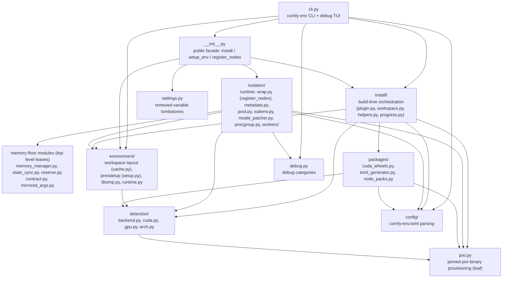

# Import layering

*How the modules under `src/comfy_env/` depend on each other, the one-way rule
that keeps the graph acyclic, and how CI enforces it. For what each file
actually **does**, see the [module inventory](modules.md); for how big each
subsystem is, the [code breakdown](code-breakdown.md).*

The import graph is layered and **acyclic at the module level**, enforced in
CI by [import-linter](https://import-linter.readthedocs.io/) (`lint-imports`,
contracts in `.importlinter`). The core invariant: **nothing under
`isolation/` imports the top orchestrator `wrap.py`** except the public
facade, and the transport leaf `_ipc_shared.py` imports nothing from
`comfy_env` at all. Arrows read "depends on" and point one way.

!!! note "History (fixed in 0.4.20)"
    Earlier versions had three module-level *cycles* broken by lazy imports
    (an `import` moved into a function body so the module loader never trips
    on it). A four-reviewer layering review found they were not deliberate
    -- they were three misplaced definitions, each an *upward* lazy import
    hiding a layering violation. All three were fixed by moving code **down**
    the graph so every arrow points one way, and every former function-body
    cross-module import became an ordinary top-level import:

    - `build_isolation_env` (a stdlib-only leaf) moved out of `wrap.py` into
      `isolation/subenv.py`; `subprocess.py`/`metadata.py` now import it
      downward.
    - the CUDA-IPC forwarding cache moved into `_ipc_shared.py` (the one
      `comfy_env`-import-free leaf, next to the eviction policy that bounds
      it); `tensor_utils.py` imports it downward instead of reaching *up*
      into the worker driver.
    - the worker pool moved out of `wrap.py` into `isolation/pool.py`;
      `metadata.py` imports it downward, closing the `wrap`↔`metadata` cycle.

    The lazy imports that remain are legitimate: deferring optional or
    heavy dependencies (`torch`, `comfy.*`, `aiohttp`) so the CPU metadata
    scan runs on machines without them, and a handful of intra-package
    function-body imports (`workspace.py` reaching into `environment.cache`,
    `metadata.py` probing `detection.backend`, `pool.py` pulling
    `contract`) -- all of which point *down*, never up.

The graph above is derived from two sources: the contracts in `.importlinter`
(which name the layers and the forbidden edges) and a sweep of every
`from ..`, `from comfy_env` and `import comfy_env` line under
`src/comfy_env/`, function-body imports included. Edges that exist only as a
function-body import (`install --> packages`, `install --> detection`,
`isolation --> detection`, and the `contract` / `memory_manager` /
`mirrored_args` edges into the memory-floor group) are drawn the same as
top-level ones; every one of them points down. The five memory-floor modules,
like `config/`, `debug.py`, `settings.py` and `pixi.py`, import nothing from
`comfy_env`. `settings.py` is imported by the facade alone; nothing under
`isolation/` imports `packages/` or `install/`.

**The graph is fully acyclic at the module level -- no cycles, no
exemptions for cycles.** Every edge points one way, and the only
`import-linter` exemptions are legitimate public-facade re-exports (the
root `comfy_env/__init__` and `isolation/__init__` re-export their
subpackages' API), never a cycle.

`pixi.py` is a leaf (pinned pixi-binary provisioning): both `detection`
(which runs `pixi info` to probe CUDA) and `packages` import it *downward*
-- it was moved out of `packages/` in 0.4.21 precisely to break the old
`detection ↔ packages` cycle where `detection` reached up for the `PIXI`
path. (0.4.22 removed the last cycle too: the parent-side shareable-pool
hook, which made `environment` reach up into `isolation`, was deleted --
it was an experimental, default-off, unsound optimization slated for
removal, so the honest fix was to delete it, not exempt it.)

Inside `isolation/` the order runs bottom → top: `_ipc_shared` / `subenv` /
`tensor_utils` (leaves) → `_ipc_parent` → `workers/subprocess` → `pool` →
`metadata` → `wrap` (register_nodes).

The whole graph is checked in CI by `lint-imports`
([import-linter](https://import-linter.readthedocs.io/) contracts in
`.importlinter`); the build fails if any edge points the wrong way,
including a cycle re-hidden in a function body.

See the [module inventory](modules.md) and [code breakdown](code-breakdown.md)
for every file's responsibility.
