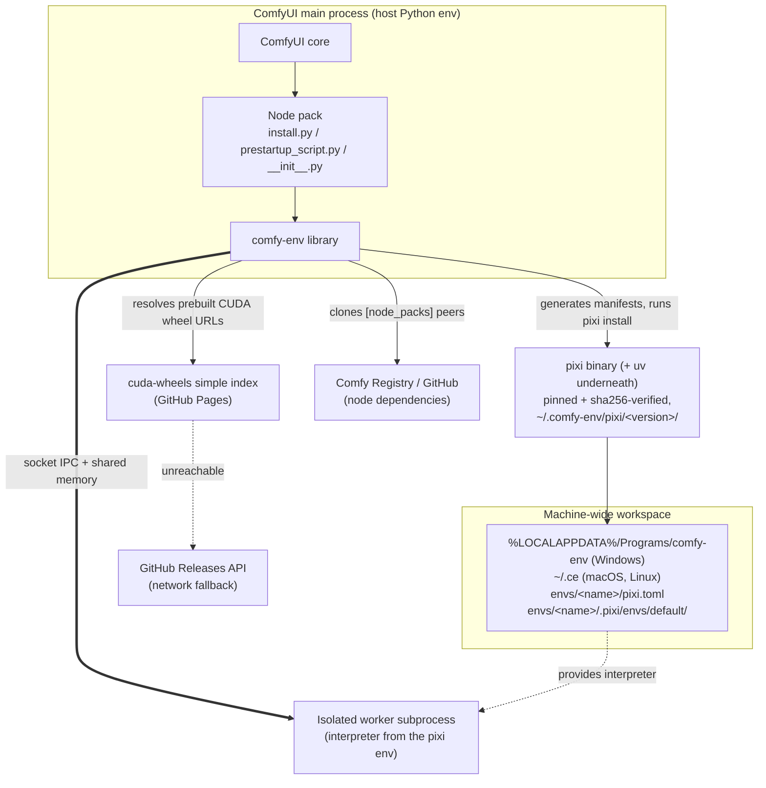

# comfy-env

[comfy-env](https://github.com/PozzettiAndrea/comfy-env) is environment
management and automatic CUDA wheel resolution for ComfyUI custom nodes
([~13,000 lines of Python](code-breakdown.md) under `src/comfy_env/`).

!!! abstract "The promise"
    *You click the install button for a node pack in ComfyUI Manager, and it just runs, without breaking any other pre existing node pack.*

    No build tools. No CUDA toolkit. No hunting for the one torch version that
    satisfies everything. **No PhD in dependency management**. 100% certainty that installing a node pack from ComfyUI Manager won't destroy your existing setup.

    That is the whole point: **node packs should behave like real software**
    ([the aim](../aims.md)).

Several things stand between a node pack and that promise. comfy-env removes
two of them outright:

1. **Environment isolation**: Vanilla ComfyUI loads every pack into one shared environment, so two packs that need
   incompatible versions of the same library cannot coexist. When one installs a custom node, they never know if they are about to damage the existing setup.
2. **CUDA / prebuilt wheels / conda packages**: dependencies pip alone
   cannot deliver (compiled CUDA extensions, conda-only native libraries),
   can take a long time and manual work to find or compile for the user's exact machine and operating system.

!!! info "And the ones it does not remove"

    <small markdown>
    *__Frontend JavaScript.__ Isolation stops at the process boundary. A pack's
    JS still runs in one shared browser origin -- one `window`, one `document`,
    one extension-name namespace -- because ComfyUI serves every pack's scripts
    into the same page and there is no per-pack boundary to isolate at. What
    ships instead is containment rather than isolation: comfy-test's
    `javascript` level lints for collisions, and iframe-only bundles stay out of
    the shared realm by being named `.mjs`, which ComfyUI's `**/*.js` scan does
    not pick up. The reasoning is
    [ADR-0031](adr/0031-frontend-javascript-isolation.md); what would have to
    change upstream is
    [Frontend JavaScript isolation](../roadmap.md#frontend-javascript-isolation).*

    *__Whatever a pack's `__init__.py` does on the way in.__ ComfyUI does not
    sandbox that file, and neither can comfy-env: `register_nodes()` is called
    **from** it, so the module still executes in ComfyUI's process and only the
    node code moves to a worker. Anything the import does first still lands on
    everybody -- 9% of the top-500 packs mutate `sys.path`, two `pip install`
    into the shared env, one replaces `PromptServer.start`. Isolation makes
    those side effects local for node code, not for the module that registers
    it: [Import-time side effects in the wild](import-side-effects.md).*

    *__Model weights.__ A pack only runs once its checkpoints are on disk, and
    nothing installs them. `pyproject.toml` even has a `Models` field carrying
    `location` and `model_url` -- but `load_custom_node` never reads it. That
    field is Registry metadata for comfy.org, not an instruction to the running
    server, and comfy-env does not fetch weights either. Between "the install
    succeeded" and "the workflow runs", this is usually what is missing.*

    *__Name collisions between packs.__ Node ids and socket type names are open,
    string-keyed global registries. Two packs that both pick `MESH`, or both
    claim the same node id, are the same thing as far as ComfyUI is concerned,
    and the winner is whichever loaded last. comfy-env cannot fix this -- its
    proxies register into that same dict -- though comfy-test's
    [registration level](../comfy-test/levels/registration.md) detects it.*
    </small>

## ComfyUI background

comfy-env has to honour the contract vanilla ComfyUI already defines: how a
pack is discovered, what `__init__.py` must export, which hooks run when etc.

The rest of this page assumes that the user is already familiar with this crucial context.

**[If you're not, please read this page first](comfyui-background.md)**.

## The two problems: environment isolation and CUDA/conda packages

### Problem 1: Environment isolation

One shared environment for every pack breaks in predictable ways:

- **Conflicting Python deps** -- node A pins `numpy<2` (it has an
  extension compiled against the numpy 1.x ABI), node B needs `numpy>=2`;
  pip installs into one shared env, so whichever lands last wins and the
  other crashes on import.
- **Conflicting native libraries** -- the classic is the **duplicate
  OpenMP runtime**: torch bundles one (`libiomp5`), another package
  bundles another (`libomp`/`libgomp`), and loading both into one process
  aborts with `OMP: Error #15` or silently corrupts numerics. (comfy-env
  papers over this today with `KMP_DUPLICATE_LIB_OK=TRUE`; see
  [ADR-0002](adr/0002-pixi-as-environment-manager.md).)
- **Wrong interpreter entirely** -- a node may need a different Python version
  than ComfyUI runs. Blender's official `bpy` whee, for example, is built for one
  specific Python (e.g. 3.11) and refuses to install on any other.

comfy-env's answer is **process isolation**: any subdirectory that declares a
`comfy-env.toml` gets its own pixi-managed environment: separate
interpreter, conda packages, pip packages.

Its nodes then execute in a persistent subprocess worker using that interpreter.

Moving node code out of the parent breaks exactly one upstream contract that
has to be rebuilt by hand: **API routes**. A pack that serves its own HTTP
endpoints -- 23% of the top-500 corpus do -- hangs them off
`PromptServer.instance`, and that server exists only in the parent process. A
worker registering a route would be talking to a server that is not there, so
comfy-env re-registers **forwarding proxies** in the parent
(`_register_proxy_routes`): the endpoint answers on ComfyUI's own server and
the call crosses to the worker like any node execution. Everything else a pack
contributes -- workflow templates, subgraphs, locales -- is read straight off
disk by the parent and needs no bridging at all
([ComfyUI background](comfyui-background.md)).

As a principle, comfy-env **never installs anything into the host environment** -- the host
env's only comfy-env-related content is `comfy-env` itself
([ADR-0003](adr/0003-two-config-files-with-two-roles.md)).

### Problem 2: CUDA, prebuilt wheels, and conda packages

Two kinds of dependency `pip install` alone cannot deliver:

| | Kind | Why pip fails |
|---|---|---|
| **2A** | CUDA packages | they **are** on PyPI, but only for a fraction of the builds users have |
| **2B** | Conda packages | they are **not on PyPI at all** |

#### 2A — CUDA packages

flash-attn, nvdiffrast, pytorch3d, gsplat, nunchaku. Each wheel is compiled
for **one exact combination** of five axes:

| Axis | Values |
|---|---|
| Python ABI | 3.10 / 3.11 / 3.12 / 3.13 |
| torch | 2.4 … 2.11 |
| CUDA | 12.x / 13.0 |
| OS | Windows / Linux |
| GPU arch | `sm_50`+ on cu124/cu126 rows; `sm_70`/`sm_75`+ on cu128 and newer; a few packages floor higher (flash-attn, natten) |

Upstream publishes a fraction of that matrix, and building the rest needs a
CUDA toolkit, a C++ compiler and time, which is sometimes in short supply.

**The answer:** a prebuilt wheel index,
[cuda-wheels](https://github.com/PozzettiAndrea/cuda-wheels). Packages listed
under `[cuda]` in comfy-env.toml are resolved at install time against the machine's detected
`(GPU, torch, Python)` and installed ready-made.
([ADR-0004](adr/0004-prebuilt-cuda-wheel-index.md)).

**Accelerator-agnostic in principle.** Backend detection already recognises
ROCm (torch's `+rocm` tag), and a separate **rocm-wheels** index mirroring
cuda-wheels is planned. At the moment this is blocked only on the maintainer not owning ROCm
hardware. Today only CUDA is compiled end to end.

!!! note "Why this logic lives in comfy-env at all"
    Ideally none of it would: resolution would be delegated to conda and the
    prebuilt wheels published to a conda channel as packages, resolved by native solver against torch/operating system pins etc like everything
    else. That path is closed today because **the PyTorch team does not publish
    conda packages**, which is quite egregious, given torch is the poster child for the
    exact problems conda exists to solve (bundled libomp copies,
    import-numpy-before-torch-or-was-it-the-other-way-around native loading order).
    Until torch is resolvable through conda, the custom index, combo detection and torch-family pinning
    stay here.

!!! note "Another note about the PyTorch situation because I'm really not happy about it"
    PyTorch saying "we will shut down conda support because only 5% of our downloads come through there" is like a hospital saying:
    "Only 5% of our arrivals are by ambulance, so ambulances are clearly low ROI and we shouldn't support them anymore"

#### 2B — Conda packages

Some dependencies absolutely require us to use conda, and we can broadly subdivide them into three categories:

| # | Reason | Examples |
|---|---|---|
| 1 | **Not Python.** | headless GL/X stack (`mesalib`, `libglu`, `libglvnd`, `xorg-libsm`), `libstdcxx-ng`, `pythonocc-core` (no PyPI distribution at any version) |
| 2 | **Copyleft.** A wheel vendors the native library *into* the artifact, fusing a GPL derivative work and forcing copyleft (or a commercial licence) onto the wheel and everyone who installs it. Conda's separate-package model keeps the boundary at install-time aggregation, with conda-forge carrying source-availability compliance. | `cgal`, Blender `bpy` |
| 3 | **Root-free toolchains.** Install-time compilation on an end-user machine needs compilers and CUDA dev packages, per-user, solver-managed, no admin rights. conda-forge is the only channel that delivers these. | `c-compiler`, `cxx-compiler`, `cuda-nvcc`, `cuda-cccl`, `cuda-cudart-dev`, `occt-rt` |

([ADR-0002](adr/0002-pixi-as-environment-manager.md) has the full argument):

This is why comfy-env generates **pixi** manifests.
**Pixi** is the uv equivalent for conda, speaking conda-forge and PyPI in one file with one
lockfile ([ADR-0003](adr/0003-two-config-files-with-two-roles.md)).

## The three-call contract

A consuming node pack integrates with exactly three lines:

```python
# install.py
from comfy_env import install; install()

# prestartup_script.py
from comfy_env import setup_env; setup_env()

# __init__.py
from comfy_env import register_nodes
NODE_CLASS_MAPPINGS, NODE_DISPLAY_NAME_MAPPINGS = register_nodes()
```

Each maps to a lifecycle phase and has its own documentation page:

| Call | Phase | Page |
|------|-------|------|
| `install()` | build time (Manager install / `python install.py`) | [install()](install.md) |
| `setup_env()` | every launch, before the server boots | [setup_env()](setup-env.md) |
| `register_nodes()` | every launch, node registration | [register_nodes()](register-nodes.md) |

Once `register_nodes()` has built the proxies, every node execution crosses a
process boundary: how a call and its tensors travel, and what each side may
import, is in **[The process boundary](process-boundary.md)**.

## System context



The workspace is shared machine-wide: env names (`<plugin>-<subdir>`,
`ComfyUI-` prefix stripped, lowercased) act as global identifiers, so two
ComfyUI installs that declare the same node reuse one materialized env
([ADR-0007](adr/0007-machine-wide-workspace-with-per-env-manifests.md)).

## Import layering

The modules under `src/comfy_env/` form a layered, **acyclic** import graph:
nothing under `isolation/` imports the top orchestrator `wrap.py`, and the
transport leaf `_ipc_shared.py` imports nothing from `comfy_env` at all. The
full graph, the invariants, and the CI contracts that check them are in
**[Import layering](import-layering.md)**.

## Where to go next

- [Module inventory](modules.md) -- what every file under `src/comfy_env/` does
- [Decision records](adr/index.md) -- the "why" behind each of these choices
- [System footprint](system-footprint.md) -- exactly what comfy-env writes
  outside the ComfyUI folder, why, and how to remove it
