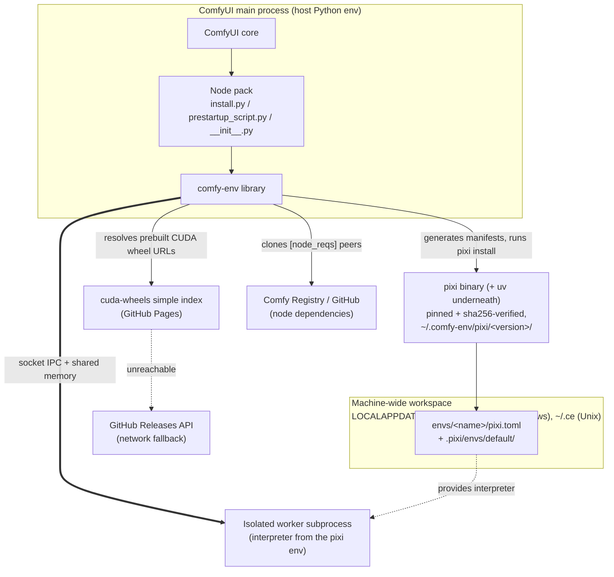
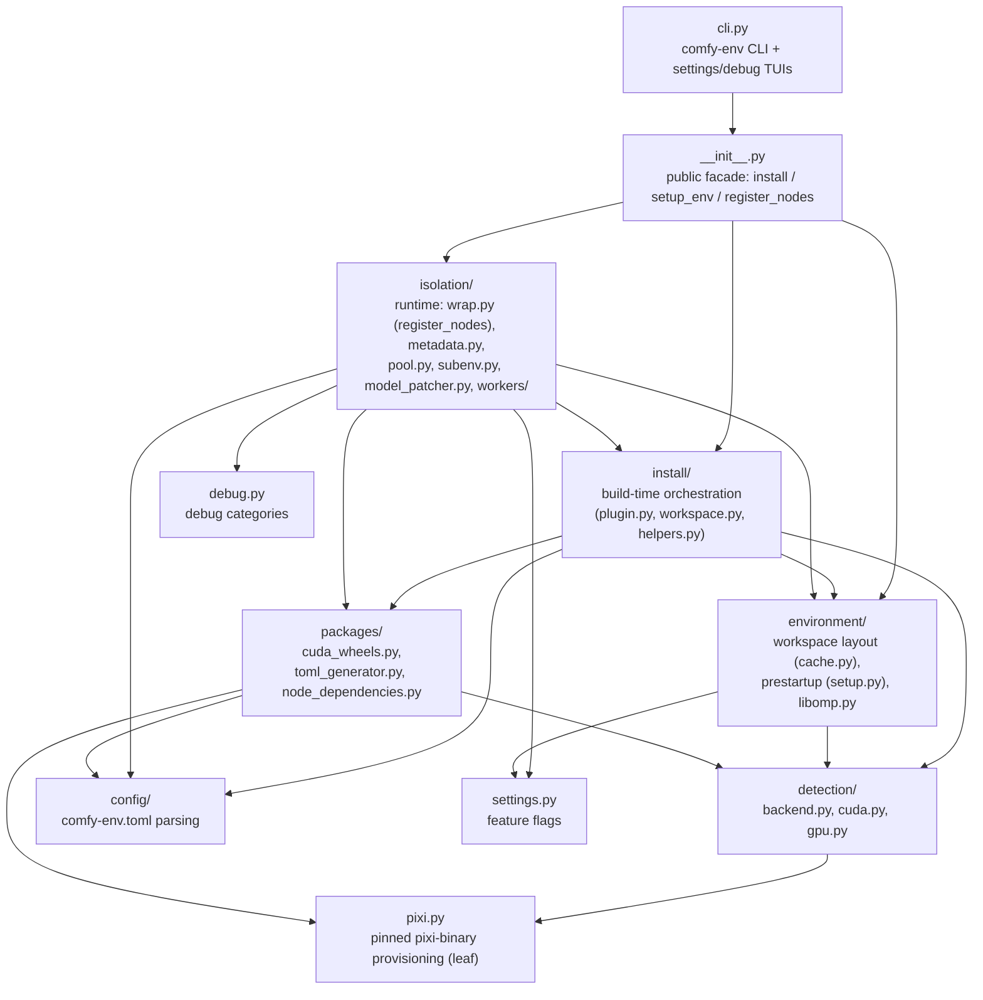
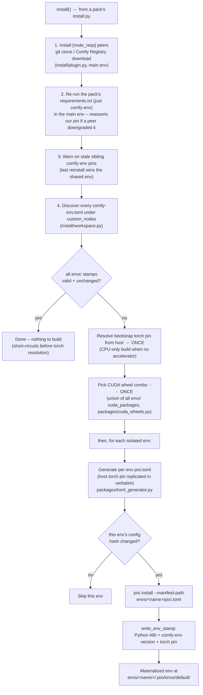
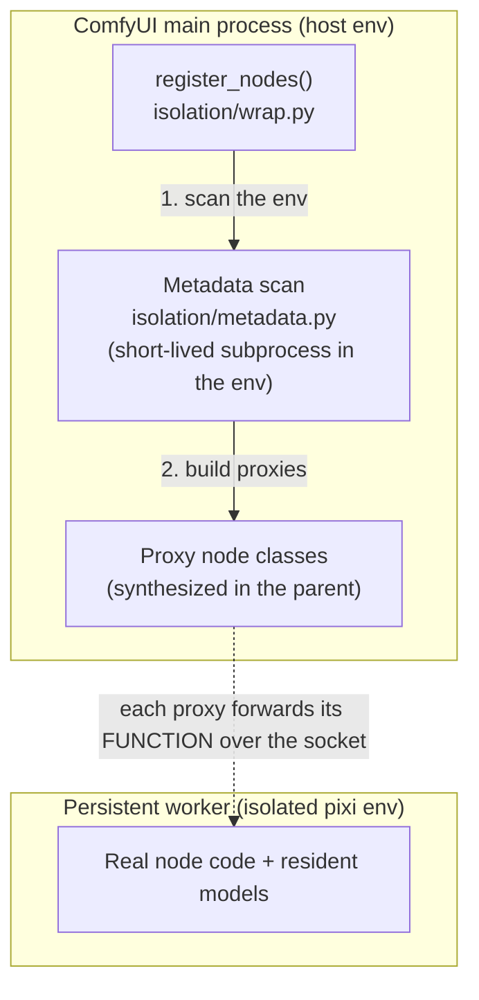
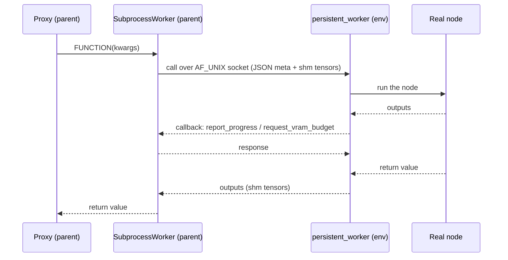
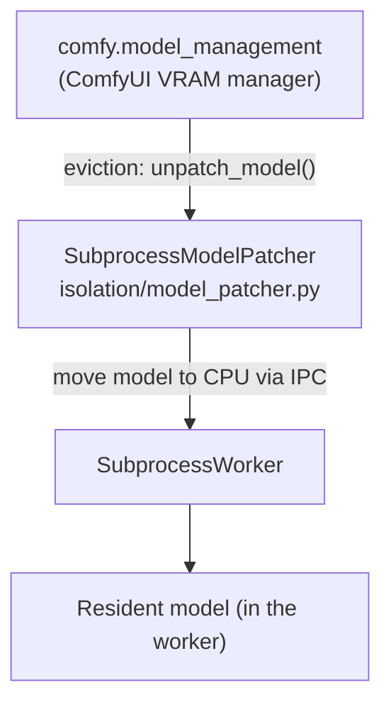

# comfy-env architecture

[comfy-env](https://github.com/PozzettiAndrea/comfy-env) is environment
management and automatic CUDA wheel resolution for ComfyUI custom nodes
([~13,000 lines of Python](code-breakdown.md) under `src/comfy_env/`).

comfy-env solves two problems:

1. **Environment isolation** -- nodes with conflicting dependencies each
   get their own Python environment, transparently. (Vanilla ComfyUI
   loads every pack into one shared environment, so two packs that need
   incompatible versions of the same library cannot coexist.)
2. **CUDA / prebuilt wheels / conda packages** -- dependencies pip alone
   cannot deliver (compiled CUDA extensions, conda-only native libraries),
   resolved for the user's exact machine with no compiler and no CUDA
   toolkit installed.

Both are expanded
[below](#the-two-problems-environment-isolation-and-cudaconda-packages),
after a short ComfyUI primer.

## ComfyUI background, for newcomers

Vanilla ComfyUI loads every custom node pack into
one shared Python process with one shared environment. A node pack is a
directory under `custom_nodes/` whose `__init__.py` exports
`NODE_CLASS_MAPPINGS`.

At install time, the standard installation flow (ComfyUI-Manager, nowadays
bundled with ComfyUI -- at least the Desktop version):

- first pip-installs the pack's `requirements.txt`, if present
- then runs its `install.py`, if present

At startup time there is also a per-pack hook: ComfyUI itself executes each
pack's `prestartup_script.py`, if present, before the server boots.

### Anatomy of a node pack

Using [ComfyUI-KJNodes](https://github.com/kijai/ComfyUI-KJNodes) (a popular
real-world pack) as the example:

```
ComfyUI/custom_nodes/
`-- ComfyUI-KJNodes/
    +-- __init__.py             <- THE contract: exports NODE_CLASS_MAPPINGS,
    |                              NODE_DISPLAY_NAME_MAPPINGS, WEB_DIRECTORY
    +-- requirements.txt        <- PyPI deps, pip-installed into the ONE shared env
    +-- pyproject.toml          <- Comfy Registry metadata (name, version, publisher, ...)
    +-- nodes/                  <- the node classes, grouped by topic
    |   +-- nodes.py               (constants, scheduling, utils ...)
    |   +-- image_nodes.py         (ColorMatch, ImageResizeKJ, ...)
    |   +-- curve_nodes.py, mask_nodes.py, batchcrop_nodes.py, ...
    +-- web/                    <- JS extensions served to the browser UI
    |                              (pointed at by WEB_DIRECTORY = "./web")
    +-- fonts/, docs/, example_workflows/, kjweb_async/   <- assets
```

At startup ComfyUI `import`s each pack's `__init__.py` and takes several
distinct things from it:

```python
# __init__.py (KJNodes, condensed)
from .nodes.nodes import INTConstant, Sleep, WidgetToString, ...
from .nodes.image_nodes import ColorMatch, ImageResizeKJ, ...

NODE_CLASS_MAPPINGS = {"INTConstant": INTConstant, ...}   # id -> class
NODE_DISPLAY_NAME_MAPPINGS = {"INTConstant": "INT Constant", ...}
WEB_DIRECTORY = "./web"                                   # optional JS for the UI
__all__ = ["NODE_CLASS_MAPPINGS", "NODE_DISPLAY_NAME_MAPPINGS", "WEB_DIRECTORY"]
```

Exactly what ComfyUI takes from the imported module (verified against
core `nodes.py` `load_custom_node`):

1. **The nodes** -- one of two ways:
    - **V1 (the common one):** the `NODE_CLASS_MAPPINGS` dict (`id -> class`,
      **required** -- no dict, no nodes) plus the optional
      `NODE_DISPLAY_NAME_MAPPINGS` (`id -> pretty name`).
    - **V3 (newer):** a `comfy_entrypoint()` function returning a
      `ComfyExtension`, whose `get_node_list()` + each class's
      `GET_SCHEMA()` produce the same node registry. (comfy-env's metadata
      scan only reads the V1 dict today -- [roadmap](../roadmap.md) item.)
2. **The frontend JS directory** -- `WEB_DIRECTORY` (or `[tool.comfy].web`
   in `pyproject.toml`). **ComfyUI does NOT import this into Python.** It
   just *registers the directory* and serves the files statically; the
   **browser** then auto-imports every `.js` under it when the UI loads.
   Python-side registration, browser-side execution -- two different
   processes. (This split is why frontend JS **cannot currently be
   isolated** the way the Python can be -- there is no per-pack browser
   boundary to isolate at, only one shared origin; deferred with the
   reasoning in [ADR-0031](adr/0031-frontend-javascript-isolation.md).)
3. **Whatever the import *did*** -- running `__init__.py` fires every
   side effect it contains. The most common one: **API route
   registration**, where the pack hangs its own HTTP endpoints off
   ComfyUI's shared server --

    ```python
    from server import PromptServer

    @PromptServer.instance.routes.post("/geompack/upload")
    async def upload_mesh(request):
        ...   # now GET/POST http://127.0.0.1:8188/geompack/upload hits this
    ```

    -- plus any monkeypatching or global setup the pack does at import
    time. ComfyUI reads no named attribute for any of this; it just runs
    the module, and the side effects happen.

Plus two things that are *not* part of the `__init__.py` import at all,
covered in the lifecycle table below: `prestartup_script.py` (run **before**
import) and the install-time `requirements.txt` + `install.py` (run by
Manager, earlier still).

Each node is a plain class with a well-known shape -- this is the whole
interface ComfyUI needs (real node, verbatim from `nodes/nodes.py`):

```python
class INTConstant:
    @classmethod
    def INPUT_TYPES(s):                      # -> input sockets/widgets in the UI
        return {"required": {
            "value": ("INT", {"default": 0, "min": -0xffffffffffffffff,
                              "max": 0xffffffffffffffff}),
        }}
    RETURN_TYPES = ("INT",)                  # -> output socket types
    RETURN_NAMES = ("value",)                # -> output socket labels
    FUNCTION = "get_value"                   # -> method ComfyUI calls to execute
    CATEGORY = "KJNodes/constants"           # -> where it sits in the node menu

    def get_value(self, value):              # the actual work
        return (value,)
```

### Lifecycle hooks and who runs them

Every file besides `__init__.py` is optional, and different actors run them
at different times:

| File | Run by | When | Logic |
|------|--------|------|-------|
| `requirements.txt` | **ComfyUI-Manager** (not core) | install / update | pip-installed line by line |
| `install.py` | **ComfyUI-Manager** (not core) | install / update, **after** requirements | run with `sys.executable` |
| `prestartup_script.py` | **ComfyUI core** | every launch, before the server boots | imported and executed (`main.py:execute_prestartup_script`) |
| `__init__.py` | **ComfyUI core** | every launch | imported; `NODE_CLASS_MAPPINGS` read |

The install-time order is defined in Manager's `execute_install_script`
(`glob/manager_core.py`):

- if `requirements.txt` exists it is pip-installed first
- *then* `install.py` is executed, if present

ComfyUI core never runs
either -- installing by plain `git clone` skips both steps, and the user is
expected to run them manually (`pip install -r requirements.txt` and/or
`python install.py`, typically spelled out in the pack's README, or simply
assumed).

Real packs cover the whole spectrum of these hooks:

- **No `requirements.txt` at all** --
  [cg-use-everywhere](https://github.com/chrisgoringe/cg-use-everywhere)
  (the most-downloaded pack on the Comfy Registry, ~1.9M downloads) and
  [ComfyUI-Custom-Scripts](https://github.com/pythongosssss/ComfyUI-Custom-Scripts)
  ship only Python-stdlib + frontend JS: nothing to install, nothing that can
  conflict in the Python environment.
- **`requirements.txt` only** -- KJNodes, above; the common case.
- **`prestartup_script.py`** --
  [ComfyUI-Manager](https://github.com/ltdrdata/ComfyUI-Manager) itself uses
  it to execute its queued ("lazy") install scripts and set up log capture
  before the server boots;
  [rgthree-comfy](https://github.com/rgthree/rgthree-comfy) ships one too.
  This hook exists precisely because it runs *before* anything imports --
  the only moment you can still fix the environment.

## The two problems: environment isolation and CUDA/conda packages

### Environment isolation

One shared environment for every pack breaks in predictable ways:

- **Conflicting Python deps** -- node A pins `numpy<2` (it has an
  extension compiled against the numpy 1.x ABI), node B needs `numpy>=2`;
  pip installs into one shared env, so whichever lands last wins and the
  other crashes on import. Same story for `transformers`/`diffusers`
  version pins, `pydantic` 1 vs 2, or the three `opencv-python*` variants
  that all install the same `cv2` and clobber each other.
- **Conflicting native libraries** -- the classic is the **duplicate
  OpenMP runtime**: torch bundles one (`libiomp5`), another package
  bundles another (`libomp`/`libgomp`), and loading both into one process
  aborts with `OMP: Error #15` or silently corrupts numerics. (comfy-env
  papers over this today with `KMP_DUPLICATE_LIB_OK=TRUE`; see
  [ADR-0002](adr/0002-pixi-as-environment-manager.md).) Duplicate CUDA
  runtimes and multiple `cv2` builds fail the same way.
- **Wrong interpreter entirely** -- a node needs a different Python version
  than ComfyUI runs. Blender's official `bpy` wheel is built for one
  specific Python (e.g. 3.11) and refuses to install on any other; a pack
  wrapping an older library such as PyMesh may in turn need 3.9. ComfyUI
  has exactly one interpreter, so at most one of them can even be installed.

comfy-env's answer is **process isolation**: any subdirectory that declares a
`comfy-env.toml` gets its own pixi-managed environment -- separate
interpreter, conda packages, pip packages -- and its nodes execute in a
persistent subprocess worker using that interpreter. As a principle,
comfy-env **never installs anything into the host environment** -- the host
env's only comfy-env-related content is `comfy-env` itself
([ADR-0003](adr/0003-two-config-files-with-two-roles.md)).

The parent synthesizes
proxy classes with the standard node shape (see the anatomy above), so to
ComfyUI -- and to the user wiring a workflow -- nothing changed.
([ADR-0001](adr/0001-process-isolation-via-persistent-subprocess-workers.md),
[ADR-0002](adr/0002-pixi-as-environment-manager.md))

### CUDA, prebuilt wheels, and conda packages

The second problem is delivering the dependencies that `pip install` alone
cannot: CUDA-compiled packages that need matching binaries, and packages that
do not exist on PyPI at all.

**Conda packages.** A small, enumerable tail of dependencies cannot come
from PyPI: non-Python system libraries with no wheel form (the headless
GL/X stack -- mesalib, libglu, libglvnd; `pythonocc-core`), copyleft native
libraries that cannot be legally vendored into wheels (CGAL, Blender's
`bpy` -- GPL: a wheel fuses the library into a derivative artifact, while
conda keeps the boundary at install-time aggregation), and root-free native
toolchains (compilers, CUDA dev packages for install-time builds). See
[ADR-0002](adr/0002-pixi-as-environment-manager.md) for the full
three-pillar argument. This is exactly why comfy-env generates **pixi**
manifests.
pixi is like uv for conda: a fast Rust-based package manager (it actually
uses uv under the hood for the PyPI side) that speaks conda-forge and PyPI
in the same file with one lockfile -- so a `comfy-env.toml` can declare
conda packages, pip packages, and CUDA wheels side by side and have them
resolved together.
([ADR-0002](adr/0002-pixi-as-environment-manager.md),
[ADR-0003](adr/0003-two-config-files-with-two-roles.md))

**CUDA packages -> prebuilt wheels.** Modern CV/ML packs depend on
CUDA-compiled packages: flash-attn, nvdiffrast, pytorch3d, gsplat, nunchaku.
Every such wheel is compiled for one exact combination of:

- Python ABI (3.10 / 3.11 / 3.12 / 3.13)
- torch version (2.4 ... 2.11)
- CUDA version (12.x / 13.0)
- OS (Windows / Linux)
- GPU architecture(s) (SM 8.0+)

Upstream projects publish only a fraction of that matrix, and building from
source needs a CUDA toolkit plus a C++ compiler -- something end users do not
have. comfy-env's answer is a **prebuilt wheel index**:
[cuda-wheels](https://github.com/PozzettiAndrea/cuda-wheels). Packages listed
under `[cuda]` in the config are resolved at install time against the user's
detected GPU/torch/Python combination and installed as ready-made wheels --
no compiler, no CUDA toolkit, with a Releases-API fallback when the index is
unreachable.
([ADR-0004](adr/0004-prebuilt-cuda-wheel-index.md))

**Accelerator-agnostic in principle.** Nothing in the design is
CUDA-specific: backend detection already recognizes ROCm (torch's
`+rocm` version tag), and ROCm wheels are planned as a separate
**rocm-wheels** repo with its own index, mirroring cuda-wheels -- currently
blocked simply on the maintainer not owning ROCm hardware to test on. Today
only the CUDA wheels are compiled end-to-end.

!!! note "Why this logic lives in comfy-env at all"
    Ideally the CUDA-wheel-specific machinery would not exist here: package
    resolution would be delegated to conda and the prebuilt wheels published
    to a conda channel, resolved together with everything else. That path is
    closed because the PyTorch team does not publish conda packages --
    which is rather egregious given that torch is the poster child for the
    exact problems conda exists to solve (bundled libomp copies,
    import-this-library-before-that-one native loading order). Until torch
    is resolvable through conda, the custom index, combo detection, and
    torch-family pinning stay in comfy-env.

## The three-call contract

A consuming node pack integrates with exactly three lines:

```python
# install.py
from comfy_env import install; install()

# prestartup_script.py
from comfy_env import setup_env; setup_env()

# __init__.py
from comfy_env import register_nodes
NODE_CLASS_MAPPINGS, NODE_DISPLAY_NAME_MAPPINGS = register_nodes()
```

These map to the three lifecycle phases below, and each call has its own
documentation page:

| Call | Phase | Page |
|------|-------|------|
| `install()` | build time (Manager install / `python install.py`) | [install()](install.md) |
| `setup_env()` | every launch, before the server boots | [setup_env()](setup-env.md) |
| `register_nodes()` | every launch, node registration | [register_nodes()](register-nodes.md) |

## System context



The workspace is shared machine-wide: env names (`<plugin>-<subdir>`,
`ComfyUI-` prefix stripped, lowercased) act as global identifiers, so two
ComfyUI installs that declare the same node reuse one materialized env
([ADR-0007](adr/0007-machine-wide-workspace-with-per-env-manifests.md)).

## Module layering

The import graph is layered and **acyclic at the module level**, enforced in
CI by [import-linter](https://import-linter.readthedocs.io/) (`lint-imports`,
contracts in `.importlinter`). The core invariant: **nothing under
`isolation/` imports the top orchestrator `wrap.py`** except the public
facade, and the transport leaf `_ipc_shared.py` imports nothing from
`comfy_env` at all. Arrows read "depends on" and point one way.

!!! note "History (fixed in 0.4.20)"
    Earlier versions had three module-level *cycles* broken by lazy imports
    (an `import` moved into a function body so the module loader never trips
    on it). A four-reviewer layering review found they were not deliberate
    -- they were three misplaced definitions, each an *upward* lazy import
    hiding a layering violation. All three were fixed by moving code **down**
    the graph so every arrow points one way, and every former function-body
    cross-module import became an ordinary top-level import:

    - `build_isolation_env` (a stdlib-only leaf) moved out of `wrap.py` into
      `isolation/subenv.py`; `subprocess.py`/`metadata.py` now import it
      downward.
    - the CUDA-IPC forwarding cache moved into `_ipc_shared.py` (the one
      `comfy_env`-import-free leaf, next to the eviction policy that bounds
      it); `tensor_utils.py` imports it downward instead of reaching *up*
      into the worker driver.
    - the worker pool moved out of `wrap.py` into `isolation/pool.py`;
      `metadata.py` imports it downward, closing the `wrap`↔`metadata` cycle.

    The only lazy imports that remain are legitimate: deferring optional or
    heavy dependencies (`torch`, `comfy.*`, `aiohttp`) so the CPU metadata
    scan runs on machines without them -- those point *down*, never up.



**The graph is fully acyclic at the module level -- no cycles, no
exemptions for cycles.** Every edge points one way, and the only
`import-linter` exemptions are legitimate public-facade re-exports (the
root `comfy_env/__init__` and `isolation/__init__` re-export their
subpackages' API), never a cycle.

`pixi.py` is a leaf (pinned pixi-binary provisioning): both `detection`
(which runs `pixi info` to probe CUDA) and `packages` import it *downward*
-- it was moved out of `packages/` in 0.4.21 precisely to break the old
`detection ↔ packages` cycle where `detection` reached up for the `PIXI`
path. (0.4.22 removed the last cycle too: the parent-side shareable-pool
hook, which made `environment` reach up into `isolation`, was deleted --
it was an experimental, default-off, unsound optimization slated for
removal, so the honest fix was to delete it, not exempt it.)

Inside `isolation/` the order runs bottom → top: `_ipc_shared` / `subenv` /
`tensor_utils` (leaves) → `_ipc_parent` → `workers/subprocess` → `pool` →
`metadata` → `wrap` (register_nodes).

The whole graph is checked in CI by `lint-imports`
([import-linter](https://import-linter.readthedocs.io/) contracts in
`.importlinter`); the build fails if any edge points the wrong way,
including a cycle re-hidden in a function body.

See the [module inventory](modules.md) and [code breakdown](code-breakdown.md)
for every file's responsibility.

## Build time: `install()`

One straight sequence, top to bottom. First the main-env work (peer packs),
then per isolated env the "already up to date? skip it" gate:



Steps 1-3 run once in the main env. Then: the workspace checks **all** env
stamps first and stops entirely if everything is up to date (the cheap
warm-run path -- it never even resolves torch). Otherwise the host torch
pin and CUDA combo are resolved **once** for the whole workspace (not
per env -- that is what makes parent and every worker share an identical
torch, [ADR-0007](adr/0007-machine-wide-workspace-with-per-env-manifests.md)),
and only the `generate → hash-check → install` block loops per env.

Installs run **per env manifest** deliberately: a parse error in one env's
`pixi.toml` cannot poison another env's scan or install
(`environment/cache.py` module docstring). The host's torch family pin is
replicated verbatim into every generated feature so parent and workers share
an identical torch
([ADR-0007](adr/0007-machine-wide-workspace-with-per-env-manifests.md)).

## Startup: `setup_env()`

The prestartup hook (`environment/setup.py`) is thin: enable `faulthandler`,
print the workspace banner (`[OK]` / `[MISSING -- run install.py]` per env),
dedupe macOS libomp copies, and ensure ComfyUI's `base_directory` is set.

## Runtime: `register_nodes()` and the process boundary

Three separate concerns, one diagram each: how the boundary is *set up*,
what *one execution* looks like, and how resident models obey ComfyUI's
VRAM manager.

### 1. The boundary -- who holds what



The parent holds **only proxies** -- it never imports node code. Proxies
are built once at `register_nodes()` by the short-lived metadata scan;
the persistent worker is a separate, long-lived process (one per env,
auto-restarted on crash).

### 2. One node execution

A call travels parent → worker and back; progress and VRAM-budget
callbacks flow the other way *during* the call.



### 3. VRAM co-management

When ComfyUI needs VRAM back, it evicts a worker's resident model the
same way it evicts its own -- through a proxy patcher.



Key facts these diagrams encode:

- **The parent never imports node code.** `metadata.py` spawns a short-lived
  subprocess inside the isolation env to pickle out `INPUT_TYPES` /
  `RETURN_TYPES` etc., then synthesizes proxy classes in the parent
  ([ADR-0001](adr/0001-process-isolation-via-persistent-subprocess-workers.md)).
- **`_persistent_worker.py` is never imported by the parent.** It crosses the
  process boundary as *source text*: read at `subprocess.py:96` and
  materialized into a temp dir for the isolated interpreter
  ([ADR-0006](adr/0006-worker-crosses-the-boundary-as-source-text.md)).
- **`_ipc_shared.py` exists on both sides.** It is deliberately stdlib-only
  and is copied next to the worker script so the worker can `import
  _ipc_shared` without having comfy-env installed.
- **Models stay resident in workers** but participate in ComfyUI's VRAM
  accounting via `SubprocessModelPatcher` -- the only module that imports
  ComfyUI at module scope.

## Tensor serialization ladder

Results and inputs cross the boundary via the first applicable strategy
([ADR-0005](adr/0005-tiered-tensor-serialization.md)):

| # | Strategy | Wire type | Mechanism | Copies | Constraints |
|---|----------|-----------|-----------|--------|-------------|
| 1 | CUDA IPC | `CudaIPC` | `reduce_tensor()` / `rebuild_cuda_tensor()` | zero-copy GPU | Linux only; broken under `cudaMallocAsync` |
| 2 | Pool IPC | `PoolIPC` | `cudaMemPoolExportPointer` + FD passing | zero-copy GPU | **experimental, default-off, Linux only** ([ADR-0030](adr/0030-gpu-platform-floors.md)) |
| 3 | Torch shared memory | `TensorRef` | `file_system` strategy (/dev/shm) | zero-copy CPU | |
| 4 | NumPy | -- | converted to torch tensor, then #3 | zero-copy CPU | |
| 5 | Pickle (last resort) | -- | pickled into a `SharedMemory` block | 1 copy | unregistered types (pack types belong in [`[types]` declarations](adr/0015-declared-wire-types.md)); unpicklable values raise a named error |
| 6 | Primitives | -- | inline in the JSON message | -- | small values |

!!! note "The `cudaMallocAsync` situation"
    ComfyUI sets `PYTORCH_CUDA_ALLOC_CONF=backend:cudaMallocAsync`, which
    breaks legacy CUDA IPC (`reduce_tensor()` raises). The `_probe_cuda_ipc()`
    checks on both sides now exercise `reduce_tensor()` itself and **fail
    closed** (a historical version tested only `Event` + allocation and
    could misreport -- fixed, see
    [ADR-0005](adr/0005-tiered-tensor-serialization.md)); the canary
    handshake additionally verifies the production path per worker at
    startup. Pool IPC (strategy 2) is the zero-copy path under
    `cudaMallocAsync`; until it is default-on the ladder falls back to
    CPU shared memory.

## Where to go next

- [Module inventory](modules.md) -- what every file under `src/comfy_env/` does
- [Decision records](adr/index.md) -- the "why" behind each of these choices
- [System footprint](system-footprint.md) -- exactly what comfy-env writes
  outside the ComfyUI folder, why, and how to remove it
