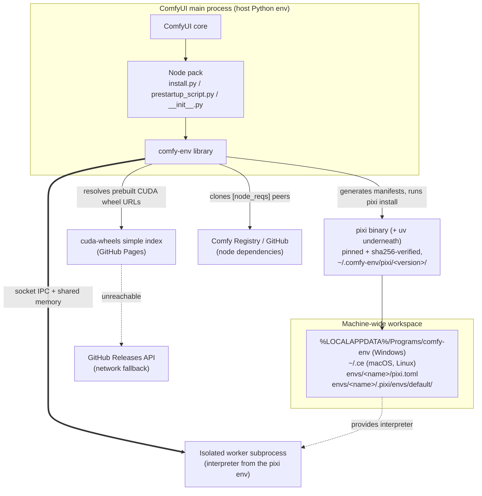

# comfy-env

[comfy-env](https://github.com/PozzettiAndrea/comfy-env) is environment
management and automatic CUDA wheel resolution for ComfyUI custom nodes
([~13,000 lines of Python](code-breakdown.md) under `src/comfy_env/`).

!!! abstract "The promise"
    *You click install on a node pack in ComfyUI Manager, and it just runs.*

    No build tools. No CUDA toolkit. No hunting for the one torch version that
    satisfies everything. **No PhD in dependency management** -- on the machine
    a non-developer actually has.

    That is the whole point: **node packs should behave like real software**
    ([the aim](../aims.md)). ComfyUI is the platform, node packs are
    applications, and comfy-env is the runtime and compatibility layer between
    them. Everything below follows from that one sentence.

Two things stand between a node pack and that promise. comfy-env exists to
remove both:

1. **Environment isolation** -- nodes with conflicting dependencies each
   get their own Python environment, transparently. (Vanilla ComfyUI
   loads every pack into one shared environment, so two packs that need
   incompatible versions of the same library cannot coexist.)
2. **CUDA / prebuilt wheels / conda packages** -- dependencies pip alone
   cannot deliver (compiled CUDA extensions, conda-only native libraries),
   resolved for the user's exact machine with no compiler and no CUDA
   toolkit installed.

## ComfyUI background

comfy-env has to honour the contract vanilla ComfyUI already defines: how a
pack is discovered, what `__init__.py` must export, which hooks run when, and
**[ComfyUI background, for newcomers](comfyui-background.md)** first -- the
rest of this page assumes it.

## The two problems: environment isolation and CUDA/conda packages

### Problem 1: Environment isolation

One shared environment for every pack breaks in predictable ways:

- **Conflicting Python deps** -- node A pins `numpy<2` (it has an
  extension compiled against the numpy 1.x ABI), node B needs `numpy>=2`;
  pip installs into one shared env, so whichever lands last wins and the
  other crashes on import. Same story for `transformers`/`diffusers`
  version pins, `pydantic` 1 vs 2, or the three `opencv-python*` variants
  that all install the same `cv2` and clobber each other.
- **Conflicting native libraries** -- the classic is the **duplicate
  OpenMP runtime**: torch bundles one (`libiomp5`), another package
  bundles another (`libomp`/`libgomp`), and loading both into one process
  aborts with `OMP: Error #15` or silently corrupts numerics. (comfy-env
  papers over this today with `KMP_DUPLICATE_LIB_OK=TRUE`; see
  [ADR-0002](adr/0002-pixi-as-environment-manager.md).) Duplicate CUDA
  runtimes and multiple `cv2` builds fail the same way.
- **Wrong interpreter entirely** -- a node needs a different Python version
  than ComfyUI runs. Blender's official `bpy` wheel is built for one
  specific Python (e.g. 3.11) and refuses to install on any other; a pack
  wrapping an older library such as PyMesh may in turn need 3.9. ComfyUI
  has exactly one interpreter, so at most one of them can even be installed.

comfy-env's answer is **process isolation**: any subdirectory that declares a
`comfy-env.toml` gets its own pixi-managed environment -- separate
interpreter, conda packages, pip packages -- and its nodes execute in a
persistent subprocess worker using that interpreter. As a principle,
comfy-env **never installs anything into the host environment** -- the host
env's only comfy-env-related content is `comfy-env` itself
([ADR-0003](adr/0003-two-config-files-with-two-roles.md)).

The parent synthesizes
proxy classes with the standard node shape (see the anatomy above), so to
ComfyUI -- and to the user wiring a workflow -- nothing changed.
([ADR-0001](adr/0001-process-isolation-via-persistent-subprocess-workers.md),
[ADR-0002](adr/0002-pixi-as-environment-manager.md))

### Problem 2: CUDA, prebuilt wheels, and conda packages

Two kinds of dependency `pip install` alone cannot deliver:

| | Kind | Why pip fails |
|---|---|---|
| **2A** | CUDA packages | they **are** on PyPI, but only for a fraction of the builds users have |
| **2B** | Conda packages | they are **not on PyPI at all** |

#### 2A — CUDA packages

flash-attn, nvdiffrast, pytorch3d, gsplat, nunchaku. Each wheel is compiled
for **one exact combination** of five axes:

| Axis | Values |
|---|---|
| Python ABI | 3.10 / 3.11 / 3.12 / 3.13 |
| torch | 2.4 … 2.11 |
| CUDA | 12.x / 13.0 |
| OS | Windows / Linux |
| GPU arch | `sm_50`+ on cu124/cu126 rows; `sm_70`/`sm_75`+ on cu128 and newer; a few packages floor higher (flash-attn, natten) |

Upstream publishes a fraction of that matrix, and building the rest needs a
CUDA toolkit, a C++ compiler and time, which sometimes they do not have.

**The answer:** a prebuilt wheel index,
[cuda-wheels](https://github.com/PozzettiAndrea/cuda-wheels). Packages listed
under `[cuda]` in comfy-env.toml are resolved at install time against the machine's detected
`(GPU, torch, Python)` and installed ready-made.
([ADR-0004](adr/0004-prebuilt-cuda-wheel-index.md)).

**Accelerator-agnostic in principle.** Backend detection already recognises
ROCm (torch's `+rocm` tag), and a separate **rocm-wheels** index mirroring
cuda-wheels is planned. At the moment this is blocked only on the maintainer not owning ROCm
hardware. Today only CUDA is compiled end to end.

!!! note "Why this logic lives in comfy-env at all"
    Ideally none of it would: resolution would be delegated to conda and the
    prebuilt wheels published to a conda channel as packages, resolved by native solver against torch/operating system pins etc like everything
    else. That path is closed today because **the PyTorch team does not publish
    conda packages**, which is quite egregious, given torch is the poster child for the
    exact problems conda exists to solve (bundled libomp copies,
    import-numpy-before-torch-or-was-it-the-other-way-around native loading order).
    Until torch is resolvable through conda, the custom index, combo detection and torch-family pinning
    stay here.

!!! note "Another note because I'm pissed about it"
    PyTorch saying "we will shut down conda support because only 5% of our downloads come through there" is like a hospital saying:
    "Only 5% of our arrivals are by ambulance, so ambulances are clearly low ROI and we shouldn't support them anymore"

#### 2B — Conda packages

Three reasons, none of them fixable by packaging harder
([ADR-0002](adr/0002-pixi-as-environment-manager.md) has the full argument):

| # | Reason | Examples |
|---|---|---|
| 1 | **Not Python.** | headless GL/X stack (`mesalib`, `libglu`, `libglvnd`, `xorg-libsm`), `libstdcxx-ng`, `pythonocc-core` (no PyPI distribution at any version) |
| 2 | **Copyleft.** A wheel vendors the native library *into* the artifact, fusing a GPL derivative work and forcing copyleft (or a commercial licence) onto the wheel and everyone who installs it. Conda's separate-package model keeps the boundary at install-time aggregation, with conda-forge carrying source-availability compliance. | `cgal`, Blender `bpy` |
| 3 | **Root-free toolchains.** Install-time compilation on an end-user machine needs compilers and CUDA dev packages, per-user, solver-managed, no admin rights. conda-forge is the only channel that delivers these. | `c-compiler`, `cxx-compiler`, `cuda-nvcc`, `cuda-cccl`, `cuda-cudart-dev`, `occt-rt` |

This is why comfy-env generates **pixi** manifests.
**Pixi** is the uv equivalent for conda, speaking conda-forge and PyPI in one file with one
lockfile ([ADR-0003](adr/0003-two-config-files-with-two-roles.md)).

## The three-call contract

A consuming node pack integrates with exactly three lines:

```python
# install.py
from comfy_env import install; install()

# prestartup_script.py
from comfy_env import setup_env; setup_env()

# __init__.py
from comfy_env import register_nodes
NODE_CLASS_MAPPINGS, NODE_DISPLAY_NAME_MAPPINGS = register_nodes()
```

Each maps to a lifecycle phase and has its own page:

| Call | Phase | Page |
|------|-------|------|
| `install()` | build time (Manager install / `python install.py`) | [install()](install.md) |
| `setup_env()` | every launch, before the server boots | [setup_env()](setup-env.md) |
| `register_nodes()` | every launch, node registration | [register_nodes()](register-nodes.md) |

Once `register_nodes()` has built the proxies, every node execution crosses a
process boundary: how a call and its tensors travel, and what each side may
import, is in **[The process boundary](process-boundary.md)**.

## System context



The workspace is shared machine-wide: env names (`<plugin>-<subdir>`,
`ComfyUI-` prefix stripped, lowercased) act as global identifiers, so two
ComfyUI installs that declare the same node reuse one materialized env
([ADR-0007](adr/0007-machine-wide-workspace-with-per-env-manifests.md)).

## Import layering

The modules under `src/comfy_env/` form a layered, **acyclic** import graph:
nothing under `isolation/` imports the top orchestrator `wrap.py`, and the
transport leaf `_ipc_shared.py` imports nothing from `comfy_env` at all. The
full graph, the invariants, and the CI contracts that check them are in
**[Import layering](import-layering.md)**.

## Where to go next

- [Module inventory](modules.md) -- what every file under `src/comfy_env/` does
- [Decision records](adr/index.md) -- the "why" behind each of these choices
- [System footprint](system-footprint.md) -- exactly what comfy-env writes
  outside the ComfyUI folder, why, and how to remove it
