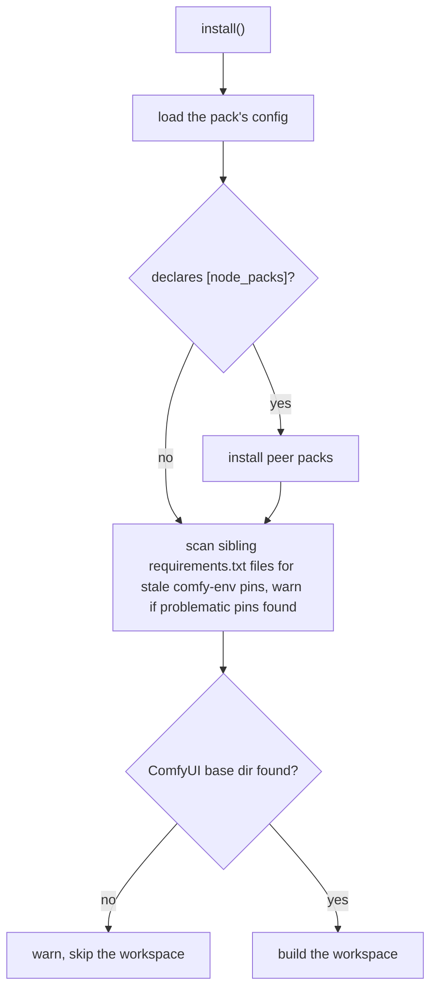

# `install()`

```python
# install.py
from comfy_env import install; install()
```

The **build-time** entry point, called once when a pack is installed or updated.

**Three things happen, in order:**

(1) peer packs named in `[node_packs]` are
installed, *if the config declares any*;

(2) every sibling pack is scanned for
stale `comfy-env` pins, *always*;

(3) every isolated env declared anywhere under
`custom_nodes/` is built or refreshed. **Only (3) is slow**, but if the isolated envs had already been built it exits without touching the network.

## When it runs

In the standard install path, ComfyUI-Manager pip-installs the pack's
`requirements.txt` and then executes its `install.py`.
A user cloning by hand should do the same.

Of the [three calls](index.md#the-three-call-contract), this is the **only** one
that does network and disk work. `install()` is the sole builder of isolated
envs: nothing materializes one at runtime.

A missing env means [`register_nodes()`](register-nodes.md) falls back to in-process import for that
pack, and stays that way until `install()` is successfully ran.

## What `install()` does



### 1. Peer packs from `[node_packs]`

*Runs only if the config declares `[node_packs]`;
every accepted spelling for requirements is tabulated in the
[config reference](config.md#node_packs-every-spelling-the-code-accepts)).

Peer node packs are cloned from GitHub or downloaded from the Comfy Registry, then their own
`requirements.txt` and `install.py` run.

The pack's own `requirements.txt` is then re-run in the main env. just to ensure that the main pack's comfy-env is the right version.
This re-run exists because a peer pins its **own** comfy-env version and may have downgraded ours; reinstalling
reasserts this pack's pin ([ADR-0022](adr/0022-comfy-env-placement-in-host-env.md), the sibling-pin
hazard).

A peer that is not itself comfy-env'd installs its dependencies straight into
the shared host env. That is permitted today and [tracked as a
direction](../roadmap.md) to close.

### 2. Stale sibling pin check

*Always runs* (`install/__init__.py:84`).
Every sibling `requirements.txt` under `custom_nodes/` is scanned for `comfy-env` pins
that would downgrade the installed version:

| Pin form | Flagged? |
|---|---|
| `comfy-env==0.3.9` | yes |
| `comfy-env<=0.4.0`, `<0.4` | yes |
| `comfy-env>=…`, `~=…`, unpinned | no |

```
[comfy-env] WARNING: ComfyUI-OldPack/requirements.txt pins 'comfy-env==0.3.9'
but comfy-env 0.4.12 is installed. If that pack reinstalls its requirements,
comfy-env will be DOWNGRADED for every pack -- update ComfyUI-OldPack (or
relax its pin).
```
Warn-only; never fails an install
(`check_sibling_comfy_env_pins`, `install/plugin.py`).

### 3. The workspace build (`install_workspace()`)

### Bootstrap and discovery

`ensure_pixi()` runs **first** (`workspace.py:606`), before discovery and before
any skip gate. It is a no-op when the pinned binary is already present
(`pixi.py`, early return), which is what makes an unchanged machine cost zero
network -- but on a **first** install the download happens here, ahead of the
gate. See [System footprint](system-footprint.md) for what it puts on disk and
why it is deliberately not `~/.pixi`
([ADR-0002](adr/0002-pixi-as-environment-manager.md)).

Discovery then walks `custom_nodes/` for bindable configs. Three things are
skipped silently, and one is fatal:

- directories prefixed `.` or `_`, and those suffixed `.disabled` / `._disabled`
  (the quarantine convention) -- skipped;
- configs outside `nodes/comfy-env.toml` or `nodes/<subdir>/comfy-env.toml` --
  invisible, deliberately, because the runtime binder can only bind those two
  shapes;
- a config that does not parse -- skipped, and reported in a batch at the end;
- **two configs deriving the same env name -- `ValueError`**, because they would
  share one env directory and rebuild over each other forever
  (`workspace.py:226`).

### The skip gate

Two hashes decide whether anything is rebuilt: a cheap **fast key** over local
inputs, and a precise **identity** over what those inputs derive to. The gate is
all-or-nothing at the top -- the zero-network exit requires *every* env to be
clean; partial staleness derives only the dirty subset. The full mechanism,
including why a version bump rebuilds nothing, is
[The three seals](seals.md).

### Torch pin vs wheel combo

These answer different questions and this page is the only place that says so.
The **pin** is *what ComfyUI itself runs*. The **combo** is *which
(cuda × torch × python) cell the prebuilt wheels are published for*.

Usually the [cuda-wheels index](../cuda-wheels/index.md) has every needed wheel
for the host's own cell and the two coincide. When some package is not built for
that cell -- say the host runs a torch newer than spconv's newest wheel -- only
the **cuda envs** drop to a known-good fallback cell, while the comfyui feature
keeps the host torch. If the fallback also misses, the install fails loudly,
naming the package and the index URL.

The fallback is **per CPU architecture**: `cu12.8 / torch 2.8` on x86_64,
`cu13.0 / torch 2.10` on linux aarch64. ARM is its own cell rather than a nudge
of the x86 one -- the reasoning is the wheel farm's, and lives in
[cuda-wheels coverage](../cuda-wheels/coverage.md#linux-aarch64).

!!! warning "No GPU means CPU torch, whatever the host's torch says"
    Portable ComfyUI ships `torch+cu128` inside `python_embeded` even on
    machines with no NVIDIA driver. GPU presence therefore **overrides** the
    torch build (`workspace.py:83-88`): with no GPU detected, envs pin **CPU
    torch** and `[cuda]` packages are not resolved or installed at all. You will
    see `cuda-wheels: skipping (no NVIDIA GPU detected)` in the log. Installing
    cu\* wheels on a driverless machine makes `import torch` die later with
    `WinError 127` / `libtorch_cuda.so`. Nodes importing a skipped CUDA package
    get a plain `ImportError` -- comfy-env does not stub them
    ([accelerator declarations](accelerators.md)).

### Building each env

The work is **phase-major, not env-major**: every env goes through a phase
before any env goes through the next. Manifests are written for all of them,
then all installs run, then stamps, then hash files. That ordering is
deliberate and produces three behaviours worth knowing:

- **One `pixi install` per manifest**, so a broken manifest cannot poison another
  env's scan or install.
- **`pixi` failures are collected and raised at the end** (`workspace.py:856`),
  so one run surfaces *every* broken env rather than stopping at the first.
- **Hash files are written last** (`workspace.py:966`), after that raise point.
  So if any env fails, the run leaves no hash bookkeeping for the envs that
  succeeded alongside it, and they are re-derived next time.

The CUDA wheels are **inside** the generated manifest, as direct-URL
pypi-dependencies (0.4.31): they land in `pixi.lock`, hash-verified when the
index anchor carries a `#sha256=` fragment, and there is no second install
system. The out-of-band `uv pip install --no-deps` pass this replaced, and
why it existed, is the history section of [One solver](one-solver.md).

## When it fails

| What | Result |
|---|---|
| ComfyUI base dir not found | workspace skipped, warning; steps 1-2 stand |
| A config does not parse | that pack skipped, batch-reported, install continues |
| Two configs derive one env name | **`ValueError`** -- rename a directory |
| No cuda-wheels combo covers a package | **`RuntimeError`** naming package + index URL |
| `pixi install` fails for an env | collected; **`RuntimeError`** at the end listing every failure |
| An env ends up unbuilt | marked `[MISSING]` at next launch by [`setup_env()`](setup-env.md); ComfyUI still boots and those nodes fall back to in-process import at [`register_nodes()`](register-nodes.md) time ([ADR-0008](adr/0008-graceful-degradation-everywhere.md)) |

**Start here when debugging:** every workspace install tees its full output to
`<workspace>/install.log` (`workspace.py:680`), including the discovery list,
the resolved combo, and each `pixi install` invocation.