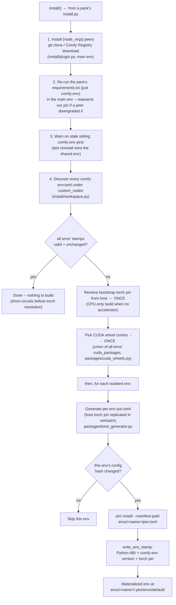

# `install()`

```python
# install.py
from comfy_env import install; install()
```

The **build-time** entry point. It runs when the pack is installed or
updated -- ComfyUI-Manager executes `install.py` after pip-installing
`requirements.txt`, or the user runs `python install.py` by hand. It is the
only one of the three calls that touches the network or writes to disk
outside the pack.

Source: `install()` in `src/comfy_env/install/__init__.py`.

## Signature

```python
def install(
    config: str | Path | None = None,     # explicit config path; default: discover
    node_dir: Path | None = None,         # default: the CALLER's directory
    log_callback: Callable | None = None, # default: print
    dry_run: bool = False,
) -> bool
```

With no arguments it figures out everything itself: `node_dir` is inferred
from the caller's file via `inspect.stack()` -- which is how the one-liner in
`install.py` works -- and the config is discovered by looking for
`comfy-env-root.toml` / `comfy-env.toml` in that directory. No config file
at all raises `FileNotFoundError`.

Importing the module also sets `PYTHONUNBUFFERED=1` and switches
stdout/stderr to line buffering, so install output streams live even when
ComfyUI-Manager pipes it.

## What it does



Steps 1-3 run once in the main env. Then: the workspace checks **all** env
stamps first and stops entirely if everything is up to date (the cheap
warm-run path -- it never even resolves torch). Otherwise the host torch
pin and CUDA combo are resolved **once** for the whole workspace (not
per env -- that is what makes parent and every worker share an identical
torch, [ADR-0007](adr/0007-machine-wide-workspace-with-per-env-manifests.md)),
and only the `generate → hash-check → install` block loops per env.

Installs run **per env manifest** deliberately: a parse error in one env's
`pixi.toml` cannot poison another env's scan or install
(`environment/cache.py` module docstring). The host's torch family pin is
replicated verbatim into every generated feature so parent and workers share
an identical torch
([ADR-0007](adr/0007-machine-wide-workspace-with-per-env-manifests.md)).


Two halves, in order:

### 1. Plugin half (main environment)

Only runs if the config declares `[node_reqs]`:

- **Install node dependencies** (`install/plugin.py`) -- other ComfyUI packs
  this one depends on, cloned from GitHub (git, zip fallback) or downloaded
  from the Comfy Registry into `custom_nodes/`, then their
  `requirements.txt` and `install.py` are run.
- **Re-run this pack's own `requirements.txt`** in the main env -- for a
  comfy-env pack that is *just* `comfy-env` (the host-env principle: nothing
  else goes in the host). A peer pack's `requirements.txt` pins its **own**
  comfy-env version and may have downgraded ours; the reinstall reasserts
  this pack's pin ([ADR-0022](adr/0022-comfy-env-placement-in-host-env.md),
  the sibling-pin hazard).

!!! note "This is ComfyUI-convention mechanics, not comfy-env installing to the host"
    The requirements.txt reinstalls above follow ComfyUI's standard install
    flow for the packs involved. comfy-env's own principle is that it
    **never installs libraries into the host environment** -- the host gets
    exactly one thing, `comfy-env` itself, and a pack's `requirements.txt`
    should converge to just that
    ([ADR-0003](adr/0003-two-config-files-with-two-roles.md)). Everything
    else belongs in isolated envs.

### Stale comfy-env pin check (always runs)

Independent of `[node_reqs]`, every install scans the *sibling* packs'
`requirements.txt` files under `custom_nodes/` for comfy-env pins that would
downgrade the installed version -- an exact pin like `comfy-env==0.3.9`, or
an upper bound below it (`<=0.4.0`, `<0.4`). Each hit produces a warning
(`check_sibling_comfy_env_pins` in `install/plugin.py`):

```
[comfy-env] WARNING: ComfyUI-OldPack/requirements.txt pins 'comfy-env==0.3.9'
but comfy-env 0.4.12 is installed. If that pack reinstalls its requirements,
comfy-env will be DOWNGRADED for every pack -- update ComfyUI-OldPack (or
relax its pin).
```

Why: the shared main env has exactly one comfy-env, and whichever pack
reinstalls its requirements last wins -- a stale pin in *any* pack silently
downgrades comfy-env for every pack on that pack's next update. The check is
warn-only (`>=`, unpinned, and `~=` pins are fine and not flagged) and never
fails an install.

### 2. Workspace half (isolated environments)

Gated on the `COMFY_ENV_INSTALL_ISOLATED` flag (default **on**;
overridable per-node via `[settings]`). Locates the ComfyUI base dir from
the node's position, then `install_workspace()` (`install/workspace.py`):

1. **Discover** every `comfy-env.toml` under `custom_nodes` -- all packs,
   not just the calling one; the workspace is shared.
2. **Resolve the torch pin** from the host env (CPU-only build when no accelerator
   is present) and pick a CUDA wheel combo the
   [cuda-wheels index](../cuda-wheels/index.md) can satisfy -- exact host
   combo first, known-good fallback second. (No GPU? See the box below.)
3. **Generate one `pixi.toml` per env** (`packages/toml_generator.py`) with
   the torch pin replicated verbatim; CUDA wheels stay OUT of the manifest
   and install in a later `uv pip install --no-deps` pass (step 6).
4. **Hash each env's config** -- unchanged envs are skipped entirely.
5. **`pixi install --manifest-path envs/<name>/pixi.toml`**, one invocation
   per env, so a broken manifest cannot poison the others
   ([ADR-0007](adr/0007-machine-wide-workspace-with-per-env-manifests.md)).
6. **Install the CUDA wheels** with `uv pip install --no-deps --no-cache`
   against their direct URLs, into the env pixi just materialized -- the
   [two-system problem](two-system-problem.md) explains why they bypass
   the resolver.
7. **Stamp the env** (Python ABI + comfy-env version + torch pin) so later
   launches can detect staleness, then dedupe macOS libomp copies.

The pixi binary itself is bootstrapped to a comfy-env-owned, pinned,
sha256-verified path (`~/.comfy-env/pixi/<version>/`, deliberately *not*
`~/.pixi`, so a pixi you installed yourself is never touched or upgraded)
on first use -- `pip install comfy-env` is the only prerequisite
([ADR-0002](adr/0002-pixi-as-environment-manager.md)). On Windows this step
also patches a compatibility bug in uv's own cached Python
(`_patch_uv_platform_py`) -- see
[System footprint](system-footprint.md) for the full list of what
comfy-env leaves on disk and why.

!!! note "CPU-only torch / no GPU: what happens to `[cuda]` packages?"
    Wheel-combo resolution runs only when the machine can actually use the
    result (`_resolve_wheel_combo` in `install/workspace.py`):

    - **No NVIDIA GPU detected** (or host torch has no CUDA tag, or macOS):
      the generated envs pin **CPU torch** and the `[cuda]` packages are
      **skipped entirely** -- not resolved, not installed. You'll see
      `cuda-wheels: skipping (no NVIDIA GPU detected)` in the install log.
      The env still materializes normally with its conda and pip deps.
    - The GPU check deliberately overrides the torch build: portable ComfyUI
      ships `torch+cu128` in `python_embeded` even on machines with no
      NVIDIA driver, and installing cu* wheels there makes `import torch`
      die later (WinError 127 / `libtorch_cuda.so`). No GPU means CPU index,
      full stop.
    - **Consequence at runtime:** nodes that `import` a skipped CUDA package
      get a plain `ImportError` on that machine -- comfy-env does not stub
      them. (CI harnesses like comfy-test detect unmaterialized CUDA
      packages and mock them via `COMFY_TEST_MOCK_PACKAGES` so the rest of
      the pack can still be tested on CPU runners.)
    - **With a GPU present**, resolution is two-tier: the exact host combo
      (cuda x torch x python) first; if any required package has no
      published wheel for it, a known-good fallback combo is tried for the
      cuda envs; if that also misses, the install fails loudly, naming the
      missing package and index URL.
    - The fallback is **per CPU architecture**: **cu12.8 / torch 2.8** on
      x86_64, **cu13.0 / torch 2.10** on linux aarch64. ARM is not a nudged
      variant of the x86 cell -- it is its own, for three reasons.
      (1) `(12.8, 2.8)` has no ARM wheels at all: PyTorch shipped no
      linux-aarch64 wheel for the whole 2.8 line on cu128, since that build
      broke mid-cycle
      ([pytorch#157548](https://github.com/pytorch/pytorch/issues/157548)).
      (2) `(13.0, 2.8)` does not exist anywhere -- PyTorch's CUDA 13 line
      starts at torch 2.9. (3) Staying on 12.8/12.9 leaves **Thor dead**:
      their ARM arch list is `8.0;9.0+PTX;10.0;12.0+PTX`, and `sm_110` has no
      cubin at or below it, so a Thor raises
      `cudaErrorNoKernelImageForDevice` at first kernel launch. 13.0's ARM
      list carries `11.0` natively, so Grace (`sm_90`), GB200 (`sm_100`),
      Thor (`sm_110`) and Orin (`sm_87`, via the `8.0` cubin) are all
      covered -- and from torchvision 0.25 / torchaudio 2.10 the ARM wheels
      are CUDA-tagged (`+cu130`) rather than the plain CPU-only builds
      cu128/cu129 carry at that torch level. The cost, stated plainly:
      **CUDA 13 requires driver r580+**.

## Failure behavior

If the ComfyUI base directory cannot be located, the workspace half is
skipped with a warning -- the plugin half's work stands. A failed env
install leaves that env `[MISSING]` (reported at every startup by
[`setup_env()`](setup-env.md)); ComfyUI still boots and the affected nodes
fall back to in-process import at
[`register_nodes()`](register-nodes.md) time
([ADR-0008](adr/0008-graceful-degradation-everywhere.md)).
