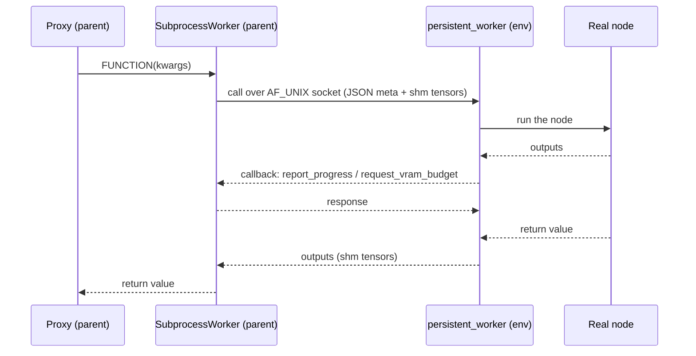

# The process boundary

*Once [`register_nodes()`](register-nodes.md) has built the proxies, every node
execution crosses a process boundary. This page is what happens on that
crossing: the shape of one call, how tensors travel, and the import rules each
side lives under.*

## What crosses the boundary

Everything that moves between the parent and a pack's processes, in one list.
Details for each follow on this page or where linked.

1. **The worker program itself** -- as source text into a temp dir, never
   installed ([ADR-0006](adr/0006-worker-crosses-the-boundary-as-source-text.md)).
2. **The metadata scan** -- a scan script out, a JSON payload file back:
   node schemas, `ROUTES`, folder registrations, dynamic-combo journal
   ([register_nodes()](register-nodes.md)).
3. **Spawn configuration** -- env vars: the socket address, a per-spawn auth
   secret, accelerator/serializer/debug settings ([table below](#the-spawn-time-channel)).
4. **A ComfyUI state snapshot at startup** -- the parent's `sys.path` and its
   entire resolved `folder_paths` state (input/output/user dirs, the models
   search-path registry), pushed as the first config frame.
5. **Node calls** -- request/response JSON over the socket; V1 nodes also ship
   the proxy instance's `self_state` dict.
6. **Tensors and bulk data** -- the [serialization ladder](#tensor-serialization-ladder):
   CUDA IPC, pool-FD passing, shared memory, memfd, pickle, inline JSON.
7. **Callbacks during a call** -- `report_progress` (whose *reply* is the
   user-interrupt channel) and `request_vram_budget` (whose reply carries true
   device-free bytes).
8. **Model events and eviction commands** -- every response can piggyback
   newly-CUDA-resident models; the parent sends `model_to_device` /
   `model_partial_load` / `model_partial_unload` from inside ComfyUI's
   eviction loop ([comfy-env's approach to memory management](memory-approach.md)).
9. **HTTP requests** -- a pack's `ROUTES` become real endpoints on ComfyUI's
   server; the parent forwards the JSON body to the worker and maps the
   status back ([ADR-0029](adr/0029-parent-as-switchboard.md)).
10. **Shared-memory lifetime acks** -- a one-way `consumed` frame per call
    releases the worker's tensor keepers
    ([ADR-0032](adr/0032-shm-lifetime-consumed-ack.md)).
11. **All pack output** -- the worker replaces `print` and hooks logging, so
    every line crosses the socket as a `log` frame and reprints as
    `[worker:<name>]`; only C-level stderr is inherited directly.
12. **Health traffic** -- idle-only ping/pong (the pong reports un-acked
    keeper counts), plus a spawn-time canary echoing `torch_version` and the
    CUDA device UUID (mismatch demotes GPU zero-copy).
13. **Crash evidence** -- exit code decoded to a signal name, the
    faulthandler and worker-debug log files read back by the parent, and
    pids embedded in socket filenames so the next startup can reap stale
    workers, sockets, and temp dirs ([ADR-0019](adr/0019-worker-lifecycle.md)).

## One node execution

A call travels parent → worker and back; progress and VRAM-budget
callbacks flow the other way *during* the call.

## What each side may import

- **`_persistent_worker.py` is never imported by the parent.** It crosses the
  boundary as *source text*: read from `workers/subprocess.py` and materialized
  into a temp dir for the isolated interpreter
  ([ADR-0006](adr/0006-worker-crosses-the-boundary-as-source-text.md)). The
  parent therefore always ships the worker source it was released with, so
  parent/worker version skew is structurally impossible.
- **`_ipc_shared.py` exists on both sides.** It is deliberately stdlib-only at
  module scope and is copied next to the worker script, so the worker can
  `import _ipc_shared` without comfy-env being installed in its env.
- **`SubprocessModelPatcher` is the only module that imports ComfyUI at module
  scope** -- worker-resident models participate in ComfyUI's VRAM accounting
  through it (see [comfy-env's approach to memory management](memory-approach.md)).

## Tensor serialization ladder

Results and inputs cross the boundary via the first applicable strategy
([ADR-0005](adr/0005-tiered-tensor-serialization.md)):

| # | Strategy | Wire type | Mechanism | Copies | Constraints |
|---|----------|-----------|-----------|--------|-------------|
| 1 | CUDA IPC | `CudaIPC` | `reduce_tensor()` / `rebuild_cuda_tensor()` | zero-copy GPU | Linux only; **dark on a stock ComfyUI** -- unsupported under `cudaMallocAsync`, which ComfyUI enables by default ([Zero-copy CUDA transfer](zero-copy-ipc.md)) |
| 2 | Pool IPC | `PoolIPC` | `cudaMemPoolExportPointer` + FD passing | zero-copy GPU | **experimental, default-off, Linux only** ([ADR-0030](adr/0030-gpu-platform-floors.md)); the mechanism that replaces it is measured in [Zero-copy CUDA transfer](zero-copy-ipc.md) |
| 3 | Torch shared memory | `TensorRef` | `file_system` strategy (/dev/shm), or `file_descriptor` read through `/proc/<pid>/fd/<N>` | zero-copy CPU | |
| 4 | NumPy | -- | converted to torch tensor, then #3 | zero-copy CPU | |
| 5 | Pickle (last resort) | -- | pickled into a `SharedMemory` or memfd block | 1 copy | unregistered types (pack types belong in [`[types]` declarations](adr/0015-declared-wire-types.md)); unpicklable values raise a named error |
| 6 | Primitives | -- | inline in the JSON message | -- | small values |

!!! note "The `cudaMallocAsync` situation"
    ComfyUI sets `PYTORCH_CUDA_ALLOC_CONF=backend:cudaMallocAsync`, which
    breaks legacy CUDA IPC (`reduce_tensor()` raises). The `_probe_cuda_ipc()`
    checks on both sides now exercise `reduce_tensor()` itself and **fail
    closed** (a historical version tested only `Event` + allocation and
    could misreport -- fixed, see
    [ADR-0005](adr/0005-tiered-tensor-serialization.md)); the canary
    handshake additionally verifies the production path per worker at
    startup. Pool IPC (strategy 2) is the zero-copy path under
    `cudaMallocAsync`; until it is default-on the ladder falls back to
    CPU shared memory.

## The spawn-time channel

Workers cannot import comfy_env -- the worker program crosses the boundary
as source text ([ADR-0006](adr/0006-worker-crosses-the-boundary-as-source-text.md)),
and the isolated venv has no comfy_env installed. So when the parent spawns
a worker, **environment variables are the configuration channel**: argv by
another name, set per worker, carrying data rather than toggles.

| Env var | set by | consumed by |
|---|---|---|
| `COMFY_ENV_IPC_ADDR` | worker spawn | the socket rendezvous: `abstract://` (Linux), `unix://` (macOS), `tcp://127.0.0.1:` (Windows fallback). Env rather than argv on purpose -- argv is world-readable |
| `COMFY_ENV_IPC_AUTHKEY` | worker spawn, fresh per spawn | the worker's **first frame** must echo this 64-hex secret; the parent also checks the connecting peer's uid (SO_PEERCRED) before speaking the protocol ([ADR-0033](adr/0033-local-ipc-authentication.md)) |
| `COMFY_ENV_ACCEL_PKGS` | `register_nodes()` from `[cuda].packages` | metadata scan's top-level-import check ([accelerator rule](accelerators.md)) |
| `COMFY_ENV_SERIALIZER_FILES` | `register_nodes()` from `[types]` custom entries (`serialization.py` paths) | worker startup, to load custom type serializers ([ADR-0015](adr/0015-declared-wire-types.md)) |
| `COMFY_ENV_PROVIDED` | metadata scan spawn | path to the parent's `provided.py`, loaded by file path in the scan child (comfy-env is not installed there) so `input_files()` works |
| `COMFY_ENV_PARENT_CUDA_IPC` | worker spawn, from a parent-side probe | whether the parent can *import* CUDA IPC handles; `0` disables worker-side export (the pair property behind the `cudaMallocAsync` note above) |
| `COMFY_CPU` | worker spawn, from ComfyUI's `--cpu` | the worker's `comfy.cli_args` |
| `COMFYUI_BASE`, `COMFYUI_USER_DIR` | worker/scan spawn | ComfyUI source dir for `sys.path`; Desktop-app user-data dir for `folder_paths` |
| `COMFYUI_ISOLATION_WORKER=1` | every worker/scan spawn | reentry guard: a worker never isolates again |
| `COMFY_ENV_POOL_IPC`, `COMFY_ENV_DEBUG_*` | settings | pool-IPC opt-in and debug categories, parsed by the worker directly |

None of these are user settings: set what you need in
[the settings reference](settings.md) and the parent forwards the right
things. The spawn also *shapes* the environment: `PYTHONPATH` /
`PYTHONSTARTUP` / `PYTHONUSERBASE` / `PYTHONHOME` are scrubbed and
`PYTHONNOUSERSITE=1` set, so nothing from the host Python leaks into the
worker's import space; platform library paths (`LD_LIBRARY_PATH`,
`DYLD_FALLBACK_LIBRARY_PATH`, win32 `PATH`) are set instead.

Right after the socket handshake, one **config frame** crosses before any
call: the parent's `sys.path` and its entire resolved `folder_paths` state --
input/output/temp/user directories and the whole models search-path registry
-- so the worker's `folder_paths` answers match the parent's. The worker
replies `ready`, optionally passes a CUDA mem-pool file descriptor
(SCM_RIGHTS), and answers a canary echo that carries its `torch_version` and
CUDA device UUID -- a mismatch demotes GPU zero-copy for that worker.

`COMFY_TEST_MOCK_PACKAGES` is the comfy-test harness's variable
(interpreted by comfy-env at import; see the accelerator page for its
planned retirement).

## The channels a single call doesn't show

- **HTTP routes.** A module-level `ROUTES` list, collected at scan time,
  becomes real aiohttp handlers on ComfyUI's own server. A request's JSON
  body crosses to the worker as a module call; the handler's dict comes back
  as the response, with `_status` mapped to the HTTP status
  ([ADR-0029](adr/0029-parent-as-switchboard.md), example in
  [register_nodes()](register-nodes.md)).
- **Model events, inbound.** The worker hooks `nn.Module.to()`/`.cuda()`
  globally, and any response frame -- including errors and route replies --
  can piggyback `_new_models`: id, size, kind, device for each model that
  landed on CUDA. The parent drains this into `SubprocessModelPatcher`s
  registered in ComfyUI's `current_loaded_models`.
- **Eviction commands, outbound.** From inside ComfyUI's `free_memory` loop,
  the patcher sends `model_to_device` / `model_partial_load` /
  `model_partial_unload`; replies report the bytes actually moved. These
  frames are answered even while the worker is blocked waiting on its own
  callback, so eviction cannot deadlock against a running node
  ([comfy-env's approach to memory management](memory-approach.md)).
- **Interrupts.** There is no cancel frame. A user interrupt raises inside
  the parent's `report_progress` handler and travels back as the *error
  reply to the worker's own callback*, which the worker converts to an
  interruption of the running node.
- **The `consumed` ack.** After the parent has fully read a reply, it sends
  one-way `{"type": "consumed", call_id}`; the worker then releases the
  tensor/shm keepers backing that reply. The TTL sweep is only the crash
  fallback ([ADR-0032](adr/0032-shm-lifetime-consumed-ack.md)).
- **Pack output.** The worker replaces `builtins.print` and installs a
  root-logger handler, so every print and log record crosses as an
  unsolicited `log` frame and reprints as `[worker:<name>]`. C-level output
  does not cross: native stdout goes to DEVNULL, native stderr is inherited.
- **Health.** Workers idle for more than 60 s get a `ping`; the `pong`
  reports how many un-acked keepers they still hold.

## Crash and teardown

Teardown is a `shutdown` frame, a 5 s grace, then `kill()`; the worker's
temp dir is removed. A crash leaves evidence the parent reads back: the
exit code (decoded to a signal name, Windows NTSTATUS included), the tail
of the worker's faulthandler dump and debug log (`$TMPDIR/comfy_worker_*`
-- the faulthandler basename is a shared constant because it drifted once),
and the watchdog's periodic all-thread stack dumps when enabled. Worker
socket filenames embed the owning pid, so the *next* startup can reap what
a crashed parent left behind: dead-owner sockets, orphaned worker
processes, unused temp dirs ([ADR-0019](adr/0019-worker-lifecycle.md)).
A restarted worker gets a new generation; stale patchers from the old one
are quarantined as already-offloaded rather than evicted.
