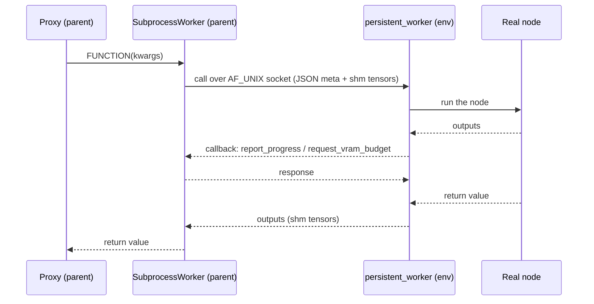

# The process boundary

*Once [`register_nodes()`](register-nodes.md) has built the proxies, every node
execution crosses a process boundary. This page is what happens on that
crossing: the shape of one call, how tensors travel, and the import rules each
side lives under.*

## One node execution

A call travels parent → worker and back; progress and VRAM-budget
callbacks flow the other way *during* the call.

## What each side may import

- **`_persistent_worker.py` is never imported by the parent.** It crosses the
  boundary as *source text*: read from `workers/subprocess.py` and materialized
  into a temp dir for the isolated interpreter
  ([ADR-0006](adr/0006-worker-crosses-the-boundary-as-source-text.md)). The
  parent therefore always ships the worker source it was released with, so
  parent/worker version skew is structurally impossible.
- **`_ipc_shared.py` exists on both sides.** It is deliberately stdlib-only at
  module scope and is copied next to the worker script, so the worker can
  `import _ipc_shared` without comfy-env being installed in its env.
- **`SubprocessModelPatcher` is the only module that imports ComfyUI at module
  scope** -- worker-resident models participate in ComfyUI's VRAM accounting
  through it (see [Sharing one GPU](sharing-one-gpu.md)).

## Tensor serialization ladder

Results and inputs cross the boundary via the first applicable strategy
([ADR-0005](adr/0005-tiered-tensor-serialization.md)):

| # | Strategy | Wire type | Mechanism | Copies | Constraints |
|---|----------|-----------|-----------|--------|-------------|
| 1 | CUDA IPC | `CudaIPC` | `reduce_tensor()` / `rebuild_cuda_tensor()` | zero-copy GPU | Linux only; broken under `cudaMallocAsync` |
| 2 | Pool IPC | `PoolIPC` | `cudaMemPoolExportPointer` + FD passing | zero-copy GPU | **experimental, default-off, Linux only** ([ADR-0030](adr/0030-gpu-platform-floors.md)) |
| 3 | Torch shared memory | `TensorRef` | `file_system` strategy (/dev/shm) | zero-copy CPU | |
| 4 | NumPy | -- | converted to torch tensor, then #3 | zero-copy CPU | |
| 5 | Pickle (last resort) | -- | pickled into a `SharedMemory` block | 1 copy | unregistered types (pack types belong in [`[types]` declarations](adr/0015-declared-wire-types.md)); unpicklable values raise a named error |
| 6 | Primitives | -- | inline in the JSON message | -- | small values |

!!! note "The `cudaMallocAsync` situation"
    ComfyUI sets `PYTORCH_CUDA_ALLOC_CONF=backend:cudaMallocAsync`, which
    breaks legacy CUDA IPC (`reduce_tensor()` raises). The `_probe_cuda_ipc()`
    checks on both sides now exercise `reduce_tensor()` itself and **fail
    closed** (a historical version tested only `Event` + allocation and
    could misreport -- fixed, see
    [ADR-0005](adr/0005-tiered-tensor-serialization.md)); the canary
    handshake additionally verifies the production path per worker at
    startup. Pool IPC (strategy 2) is the zero-copy path under
    `cudaMallocAsync`; until it is default-on the ladder falls back to
    CPU shared memory.

