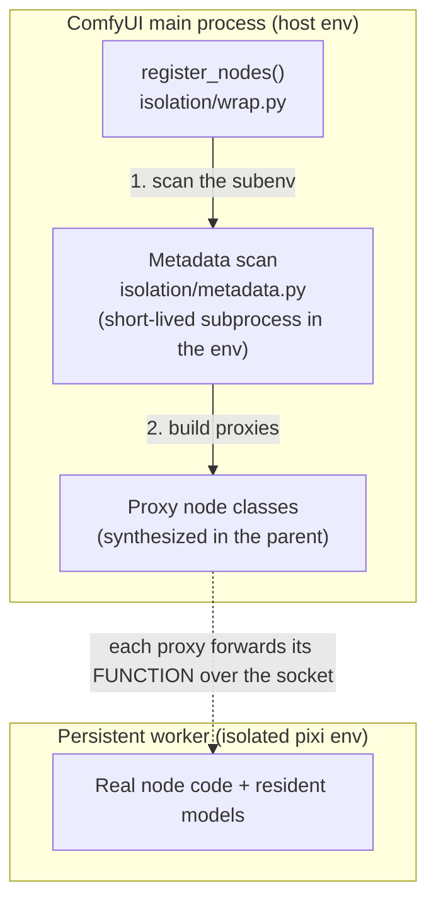

# `register_nodes()`

```python
# __init__.py
from comfy_env import register_nodes
NODE_CLASS_MAPPINGS, NODE_DISPLAY_NAME_MAPPINGS = register_nodes()
```

The **runtime** entry point.

At startup, ComfyUI imports the pack's `__init__.py` and reads `NODE_CLASS_MAPPINGS`.

Comfy env's nodes cannot be literally instantiated into the main enviornment because it may lack the necessary dependencies, so `register_nodes()` **proxy classes** are created for every nodepack that we can bind to an isolated env, and ComfyUI cannot tell the
difference.

## What it does



Proxies are built once at `register_nodes()` by the short-lived metadata scan;
the persistent worker is a separate, long-lived process (one per env,
auto-restarted on crash).

Step by step:

1. **Reap stale workers** possibly left over from a previous crashed run.
2. **Discover isolation dirs**: `<nodes_package>/comfy-env.toml` or `<nodes_package>/<subdir>/`, the two
   shapes the runtime binder can bind.
3. **Every isolation dir** gets a **metadata scan**: a short-lived subprocess runs
   *inside the isolation env*, imports the node modules there, and writes
   out their metadata as JSON: `INPUT_TYPES`, `RETURN_TYPES`, `FUNCTION`,
   v3 schemas, dynamic option lists (model dropdowns). The parent never
   imports node code
   ([ADR-0001](adr/0001-process-isolation-via-persistent-subprocess-workers.md)).
   Scans are cached keyed by content hash, so unchanged packs skip the
   subprocess on later launches.
4. **Proxy classes are synthesized** from that metadata with the standard
   node shape. When ComfyUI executes one, the call is forwarded to a
   **persistent worker** for that env, spawned on first use, kept alive
   across executions (so we don't have to reimport torch every time), auto-restarted on crash, torn
   down at exit. Tensors cross the boundary via the
   [serialization ladder](process-boundary.md#tensor-serialization-ladder).
5. **Proxied API endpoints are registered.** A pack cannot hang routes off
   `PromptServer` itself -- the server does not exist in its process -- so it
   declares them, module-level, next to its nodes:

    ```python
    ROUTES = [
        {"method": "POST", "path": "/geompack/upload", "handler": "upload_mesh"},
    ]

    def upload_mesh(body: dict) -> dict:
        # runs in the ISOLATION worker -- your env, your deps, your models
        return {"ok": True}   # or {"_status": 400, "error": "..."} for non-200
    ```

    The metadata scan collects `ROUTES` from the package module and every
    imported submodule (`metadata.py:301-310`), and `register_nodes()`
    registers a forwarding handler on the parent's server for each
    (`_register_proxy_routes`, `pool.py:359`): the endpoint answers on
    ComfyUI's own server, the JSON body crosses to the worker over IPC, and
    the handler's dict comes back as the response.

    The contract is
    JSON-in/JSON-out -- a raw multipart upload needs base64-in-JSON or a
    parent-side route. Real example: ComfyUI-SAM3's
    `/sam3/interactive_segment_one`.

6. **`INPUT_TYPES`** is mirrored to host. See [dynamic combos](dynamic-combos.md).

7. **Everything else**: directories without a config, or with a config but
   no materialized env is imported normally in-process, and their
   mappings merged into the same return value.