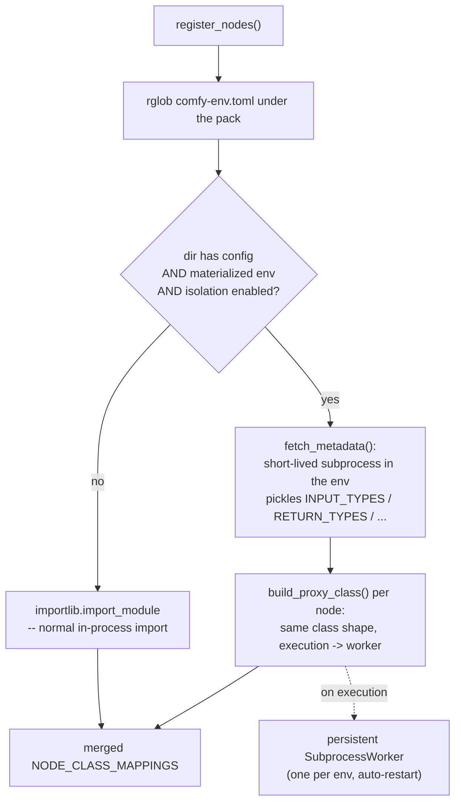

# `register_nodes()`

```python
# __init__.py
from comfy_env import register_nodes
NODE_CLASS_MAPPINGS, NODE_DISPLAY_NAME_MAPPINGS = register_nodes()
```

The **runtime** entry point. ComfyUI imports the pack's `__init__.py` at
startup and reads `NODE_CLASS_MAPPINGS`; `register_nodes()` produces those
mappings -- importing normal nodes in-process and synthesizing **proxy
classes** for isolated ones, so ComfyUI cannot tell the difference.

Source: `src/comfy_env/isolation/wrap.py:701`. Signature:
`register_nodes(nodes_package="nodes") -> (mappings, display_names)` -- the
only knob is the name of the nodes subpackage, and the caller's package is
again inferred from the stack.

## What it does



Step by step:

1. **Reap stale workers** left over from a previous crashed run.
2. **Discover isolation dirs**: every directory under the pack with a
   `comfy-env.toml` *and* a materialized env in the workspace. Per-env
   `[env_vars]` from the TOML are collected, plus `COMFYUI_BASE` (and
   `COMFYUI_USER_DIR` on the Desktop app) so workers can find ComfyUI.
3. **Isolation dirs** get a **metadata scan**: a short-lived subprocess runs
   *inside the isolation env*, imports the node modules there, and pickles
   out their metadata -- `INPUT_TYPES`, `RETURN_TYPES`, `FUNCTION`,
   v3 schemas, dynamic option lists (model dropdowns). The parent never
   imports node code
   ([ADR-0001](adr/0001-process-isolation-via-persistent-subprocess-workers.md)).
   Scans are cached keyed by content hash, so unchanged packs skip the
   subprocess on later launches.
4. **Proxy classes are synthesized** from that metadata with the standard
   node shape. When ComfyUI executes one, the call is forwarded to a
   **persistent worker** for that env -- spawned on first use, kept alive
   across executions (models stay resident), auto-restarted on crash, torn
   down at exit. Tensors cross the boundary via the
   [serialization ladder](index.md#tensor-serialization-ladder).
5. **Everything else** -- directories without a config, or with a config but
   no materialized env -- is imported normally in-process, and their
   mappings merged into the same return value.

## Degradation and flags

- **Missing env** -> in-process import with a log line; ComfyUI still boots
  ([ADR-0008](adr/0008-graceful-degradation-everywhere.md)). If
  `COMFY_ENV_AUTO_INSTALL` is on (default **off** -- installs take
  minutes), `register_nodes()` first tries to materialize the env at
  startup, guarded by a file lock against concurrent launches.
- **`COMFY_ENV_ISOLATE=0`** (or `[settings] isolate = false` in the TOML)
  -> everything is imported in-process, proxies never built.
- Per-node `[settings]` are propagated to workers as env vars
  (`SETTINGS_KEY_MAP`), so flags like `pool_ipc` or a VRAM budget can be
  set per pack.
- Worker-resident GPU models are bridged into ComfyUI's VRAM manager via
  `SubprocessModelPatcher`, and workers call back into the parent for
  progress reporting and VRAM budget negotiation.
