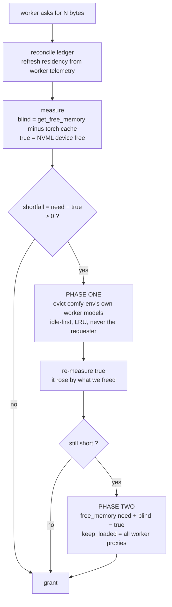

## ComfyUI background

The aim of comfy-env is to be completely invisible to ComfyUI, to let it manage VRAM as it already does across processes.
ComfyUI manages VRAM and RAM extensively, including models, whatever.
The rest of this page assumes that the user is already familiar with this crucial context.

**[If you're not, please read this page first](comfyui-memory.md)**.

Two processes, one card, one pool of VRAM, and neither can see the other's
allocations. This page explains how ComfyUI decides what to evict, what
breaks when half the models live in a subprocess, what Windows actually
does underneath, and the design that follows from those facts.

It is written to be read start to finish before any of it is built.

---

## The short answer: it is not foolproof

Asked plainly — is there a way to mirror ComfyUI's memory management
exactly? No. Not on Windows, and not with the interfaces available to us.

What *is* achievable is narrower and worth stating precisely:

- **The eviction target can be made exact.** There is a one-line
  substitution that makes ComfyUI's own arithmetic compute the right
  number, in both of the regimes Windows puts us in. This part is solid
  and provable, not a heuristic.
- **The decision about *which* models to evict can be made correct** by
  splitting it in two: comfy-env decides about its own models, ComfyUI
  decides about its own. Neither can do the other's half.
- **The measurement can be made honest** — the number we act on today is
  wrong in three separate ways, all fixable.

And what stays broken no matter what we build:

- We cannot see memory a pack allocates outside PyTorch.
- We cannot detect the failure this whole system exists to prevent.
- A third process can invalidate our measurement between taking it and
  acting on it.

Those are in [What this does not fix](#what-this-does-not-fix). Read that
section before treating any of this as finished.

---

## Part 1 — How ComfyUI decides

Everything ComfyUI knows about resident models is one module-level list:

```python
current_loaded_models = []   # comfy/model_management.py
```

When something needs room, it calls `free_memory(memory_required, device)`.
Stripped to its bones (`model_management.py:863-894`):

```python
def free_memory(memory_required, device, keep_loaded=[], ...):
    can_unload = []
    for i in range(len(current_loaded_models) - 1, -1, -1):
        shift_model = current_loaded_models[i]
        if device is None or shift_model.device == device:
            if shift_model not in keep_loaded and not shift_model.is_dead():
                can_unload.append((-shift_model.model_offloaded_memory(),
                                   sys.getrefcount(shift_model.model),
                                   shift_model.model_memory(), i))
                shift_model.currently_used = False

    for x in sorted(can_unload):
        i = x[-1]
        memory_to_free = memory_required - get_free_memory(device)   # :883
        if memory_to_free > 0 and current_loaded_models[i].model_unload(memory_to_free):
            unloaded_model.append(i)
```

Three properties matter, and every design decision downstream follows from
them.

**It is a feedback loop, and `get_free_memory` is its progress meter.**
`memory_to_free` is recomputed *inside* the loop, once per candidate. Evict
something, free memory goes up, the remaining shortfall goes down, and when
it reaches zero the `> 0` guard stops the loop. That is how it evicts the
*minimum* rather than everything.

**Eviction escalates.** `model_unload` (`:806-815`) first asks the model to
give back only what was asked:

```python
if memory_to_free < self.model.loaded_size():
    freed = self.model.partially_unload(self.model.offload_device, memory_to_free)
    if freed >= memory_to_free:
        return False          # enough — keep the model registered
self.model.detach(unpatch_weights)
return True                   # full unload — caller pops it from the list
```

A short return is a designed signal, not a failure: it escalates to a full
detach. Note the guard — when `memory_to_free >= loaded_size()`, the partial
path is skipped entirely and the model goes straight to `detach()`.

**Victims are sorted by how much is already offloaded.** The first sort term
is `-model_offloaded_memory()`, i.e. `model_size() - loaded_size()`. Models
that are *already* mostly on the CPU are evicted **first**, because they are
the cheapest to finish evicting. Hold on to that; it becomes a problem later.

---

## Part 2 — What a subprocess breaks

comfy-env runs each node pack in its own process with its own environment.
When a pack loads a model, the weights land on the GPU — but in *that*
process. ComfyUI's ledger knows nothing about them.

So comfy-env creates a stand-in. For each worker-resident model, a
`SubprocessModelPatcher` is inserted into the parent's
`current_loaded_models`. It holds no weights. It answers questions about
size and residency, and forwards eviction requests over IPC to the worker,
which performs the real unload.

The intent is that worker models become ordinary citizens of ComfyUI's
eviction logic. The reality is two blind spots.

**Blind spot one: the progress meter doesn't move — on Windows.** When
ComfyUI evicts a worker model, real VRAM is genuinely freed, in the worker's
process. Whether the parent notices depends on the platform, because its
free number has two independent parts:

```python
mem_free_total = mem_free_cuda + (mem_reserved - mem_active)   # :1776-1778
```

The right-hand term is the *parent's own* allocator cache. A worker freeing
memory never moves it, on any platform. The left-hand term comes from
`mem_get_info` — and on Linux that is device-wide free, so a worker's frees
**do** show up there. On Windows they do not (Part 3).

So on Linux the feedback loop works and the loop terminates correctly. On
Windows the signal is severed for exactly the models comfy-env added: it
evicts one, sees no progress, evicts the next, sees no progress, and keeps
going until the candidate list is empty.

**Blind spot two: on Windows the meter cannot see the worker at all**, even
before any eviction. This is the deeper one, and it needs its own section.

### What about RAM?

ComfyUI manages host memory too, and comfy-env does not mirror that half at
all.

Eviction does not delete a model — it moves it to `offload_device`, i.e. CPU
RAM. VRAM pressure therefore converts into RAM pressure, which is why
`free_memory` takes `ram_required` and `pins_required` alongside
`memory_required` (`:863`), why `get_free_memory` on a CPU device returns
`psutil.virtual_memory().available` (`:1745`), and why there is a separate
pinned-memory budget (`ensure_pin_budget`, `free_pins`) with Windows-specific
swap-pressure logic (`:701-711`). Pinned memory is page-locked and cannot be
swapped by the OS, so an unbounded pin pool starves the whole machine.

comfy-env's proxy answers `is_dynamic() → False`, which deliberately excludes
it from every pin and RAM-eviction path. That is the right call today — those
paths assume a real patcher holding real weights.

**The RAM half degrades more gracefully than the VRAM half, and for an
instructive reason.** `ensure_pin_budget` measures against
`psutil.virtual_memory().available`, which is *system-wide*: it already
counts memory our workers hold. So when workers consume host RAM, ComfyUI's
pin budget shrinks on its own and it pins less. The honest, shared
measurement does the coordination for free — precisely what `mem_get_info`
fails to do for VRAM on Windows.

What remains is narrower: ComfyUI cannot tell that some of that consumed RAM
is worker model weights which *could* be released, so it can never ask for
them back — it can only back off itself. Failing toward under-pinning is the
safe direction, so this is a limitation rather than a bug, and nothing in
this document addresses it.

---

## Part 3 — What Windows actually does

`get_free_memory` derives its device term from `torch.cuda.mem_get_info`.
On Linux that is device-wide free memory. On Windows it is not.

Measured on an RTX 4060 Ti 16 GB, driver 581.57, WDDM, torch 2.8.0+cu128 —
one sibling process growing while an observer polls:

| sibling holds | observer's `mem_get_info` free | `nvidia-smi` free |
|--------------:|-------------------------------:|------------------:|
| 2,560 MB | 15,221 MB | 13,107 MB |
| 7,168 MB | 15,221 MB | 8,499 MB |
| 11,264 MB | 15,221 MB | 4,403 MB |
| 14,336 MB | **15,188 MB** | **1,331 MB** |

The card is down to 1.3 GB physically free and the observer still believes
it has 15 GB.

**What the number actually is.** `mem_get_info` on WDDM reports the calling
process's *VidMm commitment budget*. It debits 1:1 for that process's own
allocations — exact to the megabyte across 0→6 GiB of self-allocation — but
is blind to other processes until the video memory manager re-partitions
budgets. And re-partitioning is triggered by **process and context lifecycle
events, not by memory pressure**: in the run above, a *third* process
starting up and allocating 50 MB was enough to move the number, while 14 GB
of sibling growth was not.

Two fixed biases fall out of this, both reproduced:

- While the budget is pinned, the reported free is **583 MB below** true
  device free (four reproductions, invariant, independent of the caller's
  own usage).
- Just after re-partitioning, it is roughly **533 MB above** it.

**And the failure is silent, and lands on someone else.** This is the
finding that reframes the whole problem. A process that over-allocates on
WDDM is not punished:

| | before | after the parent took 12 GiB |
|---|---:|---:|
| parent's own bandwidth | — | **244.6 GB/s** |
| sibling's bandwidth | 237.2 GB/s | **4.5 GB/s** |

The parent allocated 8 GiB with 109 MB physically free, at full speed, with
no OOM and no slowdown. The *sibling* collapsed by 53×, because VidMm
demand-paged its working set out to system RAM.

Three consequences, and they are design constraints rather than preferences:

1. **There is no local signal.** No exception, no slow path, no counter.
   Invisible to the allocator, to `mem_get_info`, and to NVML — which
   returns `NOT_AVAILABLE` for per-process memory on every PID under WDDM,
   including the caller's own.
2. **Therefore "allocate optimistically and back off on failure" is
   impossible here.** There is nothing to catch. This also means ComfyUI's
   own OOM-recovery path is dead code on Windows.
3. **Errors must be one-sided.** Under-admitting costs a bounded, visible
   reload. Over-admitting costs a 53× collapse in a *different* process,
   which the user experiences as "ComfyUI is randomly slow" with nothing in
   any log.

---

## Part 4 — The one line that makes the target exact

Given a number that lies, the instinct is to correct it. That instinct is
wrong, and the right move is smaller.

We want ComfyUI to free the real shortfall:

```
want_to_free  =  need − true_free
```

ComfyUI computes, at `:883`:

```
memory_to_free  =  memory_required − get_free_memory(device)
```

We do not control `get_free_memory`. We control exactly one thing:
`memory_required`. Set the two equal and solve:

```
memory_required  =  need + (blind_free − true_free)
```

**`blind_free` cancels.** That term is not an estimate of anything — it is a
*change of variables*. Whatever `get_free_memory` returns, ComfyUI ends up
targeting `need − true_free`.

This is why it holds in both Windows regimes, which is the part that trips
people up:

| regime | `blind` | `true` | term | ComfyUI targets |
|---|---:|---:|---:|---|
| budget pinned | 15,221 MB | 1,331 MB | +13.9 GB | `need − 1,331 MB` ✓ |
| after re-partition | ≈ true + 533 MB | true | +533 MB | `need − true` ✓ |

When the term "collapses" from 13.9 GB to 533 MB, it collapses *because
`blind` became honest*. The compensation shrinks by exactly as much as the
thing it was compensating for. There is no regime where this term is wrong.

### Where it does break

Three things, all real, all in the current code:

**1. Clamping it at zero.** `offset = max(0, blind − true)` destroys the
cancellation in exactly the regime where `blind` legitimately sits *below*
`true` — which, per the 583 MB bias, is every idle moment. The term must be
allowed to go negative.

**2. The parent's own cache rides along.** `get_free_memory` is not raw
driver free:

```python
mem_free_torch = mem_reserved - mem_active
mem_free_total = mem_free_cuda + mem_free_torch      # :1776-1778
```

Those cached-but-unused blocks are reusable, so ComfyUI is right to count
them. NVML does not. So the term carries the parent's reclaimable cache and
evicts live models to cover memory that `empty_cache()` would return for
free. The fix is arithmetic, not a flush: `get_free_memory(dev,
torch_free_too=True)` hands back `mem_free_torch` to subtract. Calling
`soft_empty_cache()` instead would also work but costs a full device
synchronize plus allocator teardown on every budget request — and its
`force` argument is ignored on the CUDA path, so there is no cheap mode.

**3. Worker models inside the loop.** No choice of `memory_required` fixes
blind spot one. The loop re-derives its target from a meter that does not
move when a worker frees memory. That is structural, and it is what the next
section is for.

---

## Part 5 — The design

Split the decision. comfy-env owns its models; ComfyUI owns its own. Neither
can do the other's half, and today we ask ComfyUI to do both.



**Phase one — our models, our policy.** comfy-env evicts worker models
itself, from its own ledger, measuring true free between steps so it stops
at the minimum. This is also the only place a sensible policy can be
expressed: comfy-env knows which worker is idle and which was used last.
ComfyUI cannot know that — its sort key is size and refcount, and refcount is
a constant for a proxy object.

**Phase two — ComfyUI's models only.** `free_memory` already accepts
`keep_loaded`, and applies it *before* building the candidate list
(`:874`), so passing every worker proxy removes them from consideration
entirely. Now every victim is parent-local, every eviction moves `blind` and
`true` together 1:1, the progress meter works, and the loop terminates at
the minimum.

`keep_loaded` is therefore **mandatory, not an optimization**. It is what
restores the feedback loop.

One trap: membership uses `LoadedModel.__eq__`, which is
`self.model is other.model` — and `.model` is a weakref deref. If a patcher
gets collected, both sides deref to `None`, `None is None` is `True`, and an
unrelated model is silently kept. The keep list must hold strong references.

---

## Part 6 — What is broken today

Everything below is verified against source, and all of it is live.

| # | Defect | Where | Effect |
|---|---|---|---|
| 1 | Proxies are registered as CUDA-resident while holding nothing | `pool.py:589-615` | `LoadedModel.device` is set to `load_device`, so a CPU-side model is a candidate on the GPU. It has the largest `offloaded_memory`, sorts **first**, skips `partially_unload`, is detached and popped — freeing **zero bytes** and burning a victim slot |
| 2 | Popped proxies can never come back | `pool.py:575`, `_persistent_worker.py:1175,1200` | Registration skips ids already known, and the worker dedupes on `id(module)` forever. Once ComfyUI pops a proxy — which any host load or `unload_all_models` does — that VRAM is invisible and unevictable for the life of the process |
| 3 | `detach(unpatch_all=False)` does a full offload | `model_patcher.py:237-245` | Upstream means it as bookkeeping — it skips `unpatch_model` and leaves weights on the GPU. `load_models_gpu` calls it on **every already-loaded model** (`:958`). We ship the model to CPU and reload it. Reachable with no comfy-env involvement at all via `controlnet.py:282-284` |
| 4 | `partially_load` inverts the lowvram sentinel | `model_patcher.py:199-200` | ComfyUI maps `0 → 1e32`, so the only small value that arrives is `0.1`, meaning *load almost nothing*. `int(0.1) == 0` hits `if want <= 0: want = self.size` and we load the **entire model** — precisely when the card is full |
| 5 | The offset is clamped at zero | `pool.py:283` | Reverts to uncompensated behaviour for every worker load below the 583 MB bias |
| 6 | The offset carries the parent's torch cache | `pool.py:275-283` | Evicts live host models to cover reclaimable cache |
| 7 | Two admission answers, ~20× apart | `pool.py:277-283` | NVML yields ≈533 MB where the ledger fallback yields ≈11.6 GB on the same machine at the same instant. Which one runs depends on whether `import pynvml` succeeds — and it never does, because `pynvml` is declared nowhere and installed nowhere |
| 8 | Every budget request spawns `nvidia-smi` twice | `pool.py:277,337` | ~35 ms each. In-process `ctypes` into `nvml.dll` measures 0.002 ms and needs no dependency at all |
| 9 | The drift canary has never run | `tests/test_model_patcher_surface.py` | No `pytest.mark.comfyui`, so `pytest -m comfyui` never collects it; it reads `COMFYUI_BASE`/`COMFYUI_PATH` while CI exports `COMFYUI_DIR`; and it falls back to a hardcoded developer path. Green on one machine, skipped everywhere else |
| 10 | `_worker_generation` is documented but never read | `model_patcher.py:80-83,109` | The docstring credits it with stale-patcher safety that does not exist. `_worker_gone()` checks only `is_alive()`, which is true for a *respawned* worker — and worker model ids restart from zero, so a stale proxy can address a different model |

Defects 3 and 4 are the two that cost real time on every run. Defects 1 and
2 are the ones that silently get worse the longer a session lasts.

---

## Part 7 — Order of work

Each step is independently shippable and leaves the tree better than it
found it.

1. **Registration and orphan repair** (defects 1, 2). Re-insert a
   `LoadedModel` when a patcher exists but has been popped; stop registering
   zero-resident proxies as GPU-resident; let a worker re-announce a module
   it already reported. Everything else degrades without this.
2. **Honour `unpatch_all=False`** (defect 3), bundled with a real generation
   check (defect 10) — the two interact, because `detach` is currently the
   only thing that heals a stale proxy.
3. **Drop the lowvram clamp** (defect 4).
4. **Fix the measurement** (defects 5, 6): delete the clamp, subtract
   `mem_free_torch` arithmetically.
5. **In-process NVML via ctypes** (defects 7, 8): one init, cached handle,
   resolved by UUID rather than device index.
6. **Make the canary run** (defect 9).
7. **Two-phase admission** — phase one plus `keep_loaded`, per Part 5.
8. **Worker telemetry** — the worker reports instantaneous
   `torch.cuda.memory_reserved()` on frames it already sends, replacing two
   guessed constants. Never the high-water mark: it hit 15.2 GB transiently
   in measurement, and a high-water mark never decays.

---

## What this does not fix

Stated plainly, because the rest of this page is confident and these are the
places it should not be.

**We cannot see memory allocated outside PyTorch.** A worker's
`memory_reserved()` is blind to raw driver allocations — measured, 1,536 MB
allocated via `cuMemAlloc` moved the accounting gap by 1,536 MB with
`memory_reserved()` unchanged. Blender/Cycles, TensorRT, cuPy and NVENC all
allocate this way. Device-wide NVML *does* see it, so admission stays
correct; but comfy-env cannot attribute it to a worker, and therefore cannot
ask anyone to release it. Under pressure the only models we can evict remain
the ones we can see.

**We cannot detect the failure we are preventing.** Part 3's 53× collapse
happens in another process, with no signal available to us. Every decision
here is argued from a model validated by measurements taken *outside* the
running system. No test can prove the absence of this failure.

**A third process can invalidate the measurement mid-flight.** The
substitution in Part 4 is exact at the instant it is sampled. ComfyUI
re-reads `get_free_memory` on every loop iteration, and any unrelated
process creating a CUDA context re-partitions VidMm — 50 MB was enough.
Between our sample and ComfyUI's next iteration, the term can go stale.
There is no fix from inside comfy-env.

**The first load of each worker is a guess.** Step 8 replaces constants with
measured ratios, but the measurement needs a completed load to exist.

**Multi-GPU is untouched.** Everything routes through the singular
`get_torch_device()`. This work adds one more device-0 assumption to unwind
later.

**Host RAM is not addressed.** Worker models offload into the worker's own
RAM, outside ComfyUI's `ram_required` / pinned-memory accounting. This is
less dangerous than the VRAM equivalent — the pin budget measures against a
system-wide `psutil` figure that already sees worker RAM, so it backs off on
its own — but ComfyUI can never ask a worker to release host memory, only
decline to pin more itself.

**Cross-worker eviction still has a lock-ordering hazard.** Phase one does
targeted IPC to sibling workers from inside a budget callback. Snapshotting
the patcher dict and staying clear of the pool lock are necessary but not
sufficient; a real single-flight or ordered-lock discipline is still owed.

---

## Where to go next

This page is the plain-language version.
[**ADR-0036**](adr/0036-mirroring-comfyui-memory-management.md) is the precise
one, and it is self-contained: Part 1 describes upstream's memory manager in
full — what it tracks, how eviction and loading work, how free memory is
measured per device and per OS, the RAM and pinned-memory budgets, the flags,
and the upstream reading list — Part 2 covers what the process boundary
breaks, and Part 3 is the decision.

One thing from those worth repeating here. **If upstream ever makes
`get_free_memory` WDDM-aware** — which
[PR #11845](https://github.com/Comfy-Org/ComfyUI/pull/11845) proposes — the
substitution in Part 4 becomes a *double* correction and has to be removed.
That is the single upstream change most likely to break this design, and it is
what the drift canary exists to catch.

## Related records

- [ADR-0025](adr/0025-vram-co-management.md) — the original co-management
  protocol
- [ADR-0034](adr/0034-admission-by-arithmetic.md) — admission by arithmetic
  (contains claims this page corrects)
- [ADR-0035](adr/0035-duck-typed-model-proxy.md) — the duck-typed proxy
- [ADR-0024](adr/0024-upstream-interface-contract.md) — what we would ask
  upstream for, if asking were possible
