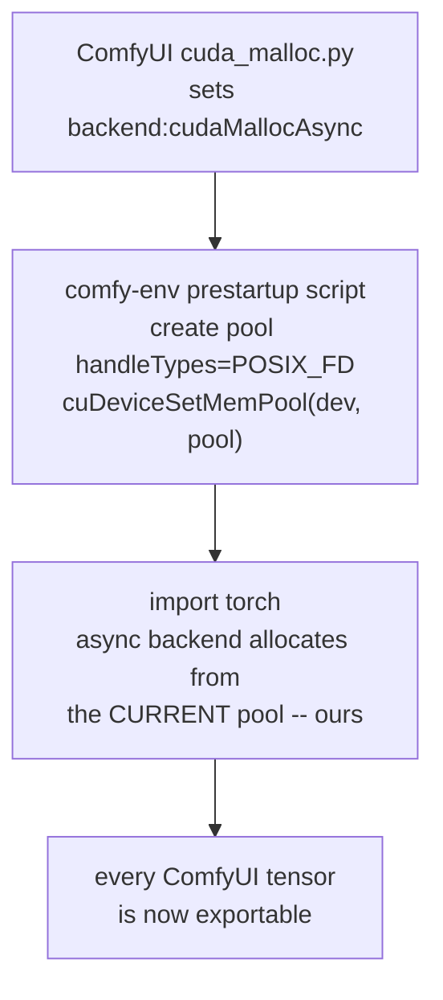

# Zero-copy CUDA transfer

*How a worker can hand a GPU tensor to ComfyUI without copying it, while
ComfyUI keeps the allocator it chose for itself. Measured, not theorised
-- the scripts are in `research/pool-ipc/` in the comfy-env repo.*

## The problem in one paragraph

ComfyUI switches PyTorch to the **stream-ordered allocator** at startup
(`cuda_malloc.py` sets `PYTORCH_CUDA_ALLOC_CONF=backend:cudaMallocAsync`
on any CUDA build of torch 2.0+, excluding a blacklist of old cards).
Legacy CUDA IPC -- `cudaIpcGetMemHandle`, which is what
`torch.multiprocessing` uses and what the ladder's `CudaIPC` rung is
built on -- **does not work with that allocator**. Torch says so
outright: *"cudaMallocAsync does not yet support getIpcDevPtr."* So on a
stock ComfyUI install the top rung of the
[serialization ladder](process-boundary.md#tensor-serialization-ladder) is dark,
and every GPU tensor crossing the boundary is copied through host
memory.

That copy is not just slow, it is a **capacity** problem. A 16 GiB
tensor moving between two processes on a 24 GiB card needs the source
and the destination resident at once. It does not fit. Chunked staging
does not help: the destination must still be fully allocated. Only true
zero-copy makes the transfer possible at all.

## The mechanism: swap the pool, keep the backend

The async backend allocates with plain `cudaMallocAsync(ptr, size,
stream)`, which draws from **whatever memory pool is current for the
device**. Torch never calls `cudaDeviceSetMemPool` or
`cudaDeviceGetMemPool` -- verified by reading
`c10/cuda/CUDAMallocAsyncAllocator.cpp` in torch 2.8.

A device's *default* pool can never be shared: its properties are fixed
at creation with `handleTypes = NONE` and are immutable. But nothing
stops us creating our own pool with
`handleTypes = POSIX_FILE_DESCRIPTOR` and making it current **before
torch is imported** -- which is exactly what a pack's prestartup script
can do, since ComfyUI runs prestartup scripts after `cuda_malloc.py`
picks the backend and before torch is loaded.



The swap is invisible to torch. It boots normally, keeps the
`cudaMallocAsync` backend, and every tensor it allocates comes from our
pool -- confirmed with `cuPointerGetAttribute`. No torch patching, no
allocator replacement, no change to ComfyUI's own choice.

## The transfer protocol: the parent allocates, the worker fills

The obvious design -- worker allocates the result, parent imports it --
is the one [ADR-0030](adr/0030-gpu-platform-floors.md)
demoted as unsound: the parent ends up holding a foreign pointer whose
lifetime it does not control, and CUDA requires the **importer** to free
before the exporter does.

Inverting it removes the problem instead of managing it:

1. The parent exports its pool's FD to each worker once, at startup,
   over `SCM_RIGHTS`. No `pidfd_getfd`, no ptrace permissions.
2. **Inputs** are already pool allocations, so the parent exports each
   tensor's pointer and the worker imports and reads it directly.
3. **Results**: the worker reports the shape and dtype it is about to
   produce, the parent allocates the result tensor *from its own pool*
   with `torch.empty()`, exports that pointer, and the worker writes the
   result **into it in place**.

The parent's result is therefore an ordinary refcounted `torch.Tensor`
-- not a wrapper around foreign memory -- and the mandated free order
falls out for free, because the worker's import is always released
before the parent drops the tensor.

### The ownership contract

ADR-0030 required this in writing before any zero-copy path could
default on. It is an extension of the existing
[consumed-ack](adr/0032-shm-lifetime-consumed-ack.md) discipline with
two CUDA events:

```
EXPORT -> READY-event -> IMPORT -> WRITE -> DONE-event -> UNIMPORT -> ACK -> RELEASE
```

- **ready-gate**: the parent records an interprocess event after
  allocating; the worker waits on it before touching the memory. CUDA
  forbids the importer touching memory before the exporting allocation
  has completed.
- **done-gate**: the worker records a write-complete event, frees its
  import, and acks. The parent makes its consumer streams wait on that
  event, and drops its Python reference only after the ack.

The ack must gate on **GPU work completion**, never on CPU receipt.
`cudaFreeAsync` returns bytes to the pool, and the next allocation can
hand the same bytes out; gating on the event is what prevents a reader
seeing memory that has already been recycled.

Because the parent owns every allocation, it is also the broker: if a
worker dies mid-transfer the driver releases its imports at process
exit, and the parent simply fails the job. No third process, no
orphaned mappings.

## What was measured

RTX 3090 (GA102, 24576 MiB), driver 580.126.20, Linux 6.8,
torch 2.8.0+cu128. `research/pool-ipc/verify_pool_swap.py` walks the
whole chain and passes: the swap survives torch init, pointer export
works on plain torch tensors, a torch-free child reads the parent's
tensor with no copy and writes into it in place, the parent sees the
write, interprocess events work under the async backend, and teardown in
importer-first order is clean.

Pointer import costs about **1.25 ms/GiB**, linear in size. A 4 GiB
tensor crosses in five milliseconds without being copied.

!!! warning "Export the pool handle before exporting any pointer"
    `cuMemPoolExportPointer()` returns `CUDA_ERROR_INVALID_VALUE` for
    every allocation until `cuMemPoolExportToShareableHandle()` has been
    called on that pool. This ordering requirement is not documented
    anywhere in the CUDA programming guide or API reference, and the
    error code gives no hint. Export the pool's FD once at startup.

### The allocator statistics go quiet

Torch's statistics plumbing -- `getDeviceStats`, `emptyCache`,
`resetPeakStats` -- queries the device's **default** pool, while
allocations now come from ours. So in a swapped process
`torch.cuda.memory_allocated()` and `memory_reserved()` read 0 and
`empty_cache()` becomes a no-op.

ComfyUI itself is unaffected. `model_management.py` computes free VRAM
as `torch.cuda.mem_get_info()` -- a device-level query, unaffected by
pools -- plus a `reserved - active` correction for torch's cached
blocks. With the swap that correction term becomes zero rather than
wrong, so ComfyUI's accounting stays correct, just without the
cached-block bonus. Third-party VRAM monitors that read
`memory_allocated()` directly will report nonsense, which is why the
swap is opt-in and logs a line naming itself when it happens.

## The driver bug: 5248 MiB

`cuMemPoolImportPointer()` **segfaults the importing process** for any
single allocation larger than 5248 MiB.

| allocation | result |
|---|---|
| 4096 MiB | imports in 5.2 ms |
| 5120 MiB | imports in 6.6 ms |
| **5248 MiB** | **imports in 6.6 ms -- last good size** |
| **5264 MiB** | **SIGSEGV in the importer** |
| 6144 MiB and up | SIGSEGV |

The fault is a NULL dereference at a struct offset
(`si_addr=0xd4`, `SEGV_MAPERR`) three frames below
`cuMemPoolImportPointer` inside `libcuda`. It is not host OOM (27 GiB
free), not device OOM, not stack exhaustion (tested with a 512 MiB
thread stack and `ulimit -s unlimited`), not a 2^32 boundary, and every
NVIDIA ioctl returns success right up to the fault. An audit of
`open-gpu-kernel-modules` at the matching tag found no size threshold
that could explain it, which places the bug in closed-source `libcuda`.

**The limit is per allocation, not cumulative.** Four separate 4096 MiB
allocations from the same pool -- 16 GiB in total -- all import into one
worker successfully. So a payload made of many sub-5 GiB tensors is
entirely unaffected, which covers essentially all real ComfyUI traffic.
A single tensor above the threshold needs the copy path, or a VMM-based
arena that maps several smaller physical handles into one contiguous
address range.

No prior report of this bug exists: the NVIDIA developer forums return
zero topics for the API name, GitHub has eight issues mentioning it
worldwide and none about crashes, the 570/575/580 release notes never
touch mempool IPC, and no major framework calls the API at all. NVIDIA's
own `streamOrderedAllocationIPC` sample uses a 64 MiB buffer -- two
orders of magnitude below the threshold -- which is the likely reason it
went unnoticed. `research/pool-ipc/NVIDIA-BUG-REPORT.md` is the writeup;
`repro_mempool_import_segv.py` is a standalone repro that runs on a
stock system Python with no CUDA toolkit and no packages installed.

## Platform matrix

| platform | path | directions |
|---|---|---|
| Linux, native | pool swap, pointer export, interprocess events | both |
| Windows, WDDM | **unprobed.** WIN32 pool export may work -- pools ride the same VMM substrate and the API surface exists -- but NVIDIA's own pool-IPC sample is Linux-only and torch hard-errors on Win32 IPC. Fallback: a worker-side VMM arena (`cuMemCreate` + `DuplicateHandle`). Sync needs a shared fence rather than `cudaIpcGetEventHandle`, which is Linux-only. | worker to parent at minimum |
| WSL2 | excluded -- no interprocess events | none |
| anywhere | pinned host memory on the shm segment ([ADR-0030](adr/0030-gpu-platform-floors.md)) stays the floor. It is a latency fix and cannot make a 16 GiB tensor fit on a 24 GiB card. | both |

`research/pool-ipc/wddm_pool_probe.py` decides the Windows row. It needs
a WDDM machine and stock Python; it prints a verdict.

## What is not built yet

This page documents a verified mechanism, not a shipped feature. Still
open: the prestartup script and its opt-in switch, the per-worker FD
handshake, the shape-first RPC for the result inversion, the event
plumbing, the size guard at 5248 MiB with fallback to the copy path, and
a canary battery ([ADR-0027](adr/0027-testing-and-verification.md)) that
proves the whole contract per worker at startup.

The vehicle should be NVIDIA's own `cuda-python` package rather than
hand-rolled ctypes: `cuda.core` to create the pool and
`cuda.bindings.driver` for the driver-API calls, so NVIDIA carries the
ABI. Never bind `cudart` -- torch links its own copy statically.

Upstream, three asks follow from this page and belong in the
[loan book](adr/0024-upstream-interface-contract.md): torch should
implement `shareIpcHandle`/`getIpcDevPtr` for the async backend via
`cudaMemPoolExportPointer` (its own error message has invited that issue
for five years and nobody has filed it), torch's statistics should query
the current pool rather than the default one, and ComfyUI's
`cuda_malloc.py` -- which already chooses the backend -- could offer an
optional shareable-pool flag, which would serve pyisolate as well, since
its CUDA-IPC path is dark under the async allocator for exactly the same
reason ours was.
