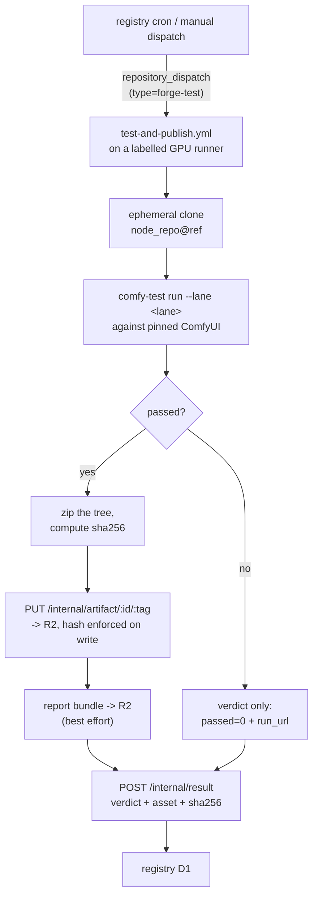

# comfy-forge-ci

[comfy-forge-ci](https://github.com/Comfy-Forge/comfy-forge-ci) is the bridge
between the [registry](../comfy-forge-registry/index.md), which decides *what* should be tested, and
the self-hosted GPU runners, which are the only things that can actually answer
the question.

!!! abstract "The aim"
    Take a node pack at a specific commit, install it on a **real GPU** the way a
    user would, see whether its nodes register, and publish a verdict that is
    honest about which machine it came from.

## Why this cannot run on hosted CI

The whole premise of the registry is that a verdict is tied to a lane, and half
the lanes mean a real GPU. GitHub's hosted runners have no NVIDIA hardware, so they
can confirm that a package *downloads* and can be *imported against CPU torch* —
which is exactly the class of confidence that was already failing users.

The failures Forge exists to catch only appear when real CUDA is present:

- a kernel compiled for `sm_86` on a card that is `sm_120`
- a wheel built against torch 2.8 loading into a 2.11 process
- a CUDA 12.6 runtime pulled into a CUDA 13.0 environment
- an extension that imports fine and then dies on first kernel launch

None of those are visible without a device. So the runners are physical machines
with GPUs, enrolled against this repo by label.

!!! note "Verdicts come only from operator-owned runners"
    Every runner is one the Forge operator enrolled. This is a deliberate limit
    on how fast the catalogue can grow, and it is load-bearing: a verdict is a
    claim that *someone ran this and it worked*, and that claim is only worth
    what the machine behind it is worth.

    Community-donated runners would widen hardware coverage a lot, and are the
    obvious direction. They are not in the current design because a donated
    runner can report `passed` without running anything, and because testing
    third-party code means executing arbitrary code on a volunteer's machine.
    Both problems are solvable; neither is solved by simply accepting the
    results.

## The flow



Six steps, and the ordering of the last three is the part that matters.

### 1. Ephemeral clone

The node repo is cloned at an exact ref and discarded when the job ends. Nothing
persists between runs. A test that passes because of state left by a previous
test is not a test.

### 2. `comfy-test run`

[comfy-test](../comfy-test/index.md) does the actual work: build the isolated
environment, install the pack, and check that its nodes register. The lane id
(`linux-cuda`, `windows-portable-cuda`) selects how that environment is built,
and the ComfyUI version under test is pinned rather than floating — a verdict
that does not name the ComfyUI it ran against is not a verdict.

The gate is deliberately a floor — *does this install and do its nodes appear* —
not a correctness review. A pack can pass and still produce bad images. What it
cannot do is pass while being uninstallable.

### 3. Package into a hashed zip

The tested tree is zipped and sha256'd. **This is the artifact, and its hash is
the link between "what was tested" and "what gets installed."**

### 4. Publish on pass only

The zip is `PUT` to the registry's `/internal/artifact/:id/:tag` with the hash in
an `X-Sha256` header, and lands in the `comfy-forge-artifacts` R2 bucket. The
Worker passes that hash to R2, which **rejects the write if the bytes disagree** —
so a mismatched upload never becomes a servable artifact.

A failing run publishes **no artifact**. The registry gets a verdict row saying
it failed in that lane on that ComfyUI, and the pack is simply not offered there.

This asymmetry is the design. There is no "install it anyway" path, because the
whole product is *not being offered things that will not work*. A pack that fails
on Windows and passes on Linux is a Linux pack, and Windows users never see it.

### 5. Report to R2, best effort

The full comfy-test report bundle is uploaded for debugging. Best effort, because
a storage hiccup must not turn a real pass into a lost verdict. The report is a
convenience; the verdict is the product.

### 6. Post the verdict

`scripts/forge_publish.py` POSTs to `/internal/result` with a bearer token
shared with the Worker. The payload carries the lane and ComfyUI version, the pass/fail, the
hardware it ran on, the artifact URL and hash, and the CI run URL — so any
verdict can be traced back to the exact run that produced it.

## What a verdict is worth

A row in `results` asserts a narrow, checkable thing:

> In **this lane**, against **this ComfyUI version**, **this exact commit** of
> this pack installed and its nodes registered — on **this hardware**, in
> **this CI run**, producing an artifact with **this hash**.

Every clause is recorded. The provenance JSON — GPU, CUDA, torch, Python — and `run_url` exist so that when
a user reports "it says tested but it broke for me", the question "tested on
what, exactly?" has an answer. Those are recorded, not filtered on: see
[why torch and CUDA are not in the key](../comfy-forge-registry/index.md#the-data-model).

## Trigger surface

Two ways in, one code path:

- **`repository_dispatch(type=forge-test)`** — the registry, on discovering a
  release with no verdict for a lane / ComfyUI version it cares about. The loop that
  makes the catalogue maintain itself.
- **`workflow_dispatch`** — a human, for backfill and debugging:

```bash
gh workflow run test-and-publish.yml -R Comfy-Forge/comfy-forge-ci \
  -f node_repo=PozzettiAndrea/ComfyUI-GeometryPack \
  -f ref=v1.0.0 \
  -f lane=linux-cuda \
  -f comfyui_version=0.3.60 \
  -f runner_label=comfy-forge-linux
```

## Where the pieces live

| what | where | why there |
|---|---|---|
| tested zips | R2 `comfy-forge-artifacts` | hash enforced on write; served through the registry, so revocation and the download path are one thing |
| report bundles | R2 `comfy-forge-reports` | large, rarely read, cheap to keep |
| verdicts | registry D1 | small, queried on every client request |

!!! warning "The workflow has not caught up with this"
    `test-and-publish.yml` still uploads to `Comfy-Forge/artifacts` **GitHub
    Releases** (`ARTIFACTS_REPO`, `ARTIFACTS_PAT`, and an `asset_url` of
    `releases/download/<tag>/node.zip`), which is the older design. The registry
    has since grown an `ARTIFACTS` R2 binding and a `PUT /internal/artifact`
    route, and serves downloads itself.

    Until the workflow is switched over, the two halves disagree about where a
    tested zip lives — and the `Comfy-Forge/artifacts` repo is empty, which is
    consistent with nothing having gone through the old path recently.

Note that this is a **different call from [cuda-wheels](../cuda-wheels/index.md)**,
which does use Releases-as-storage. That is the right answer there: ~14k wheels at
hundreds of MB each, served for free over GitHub's CDN, with no revocation story
needed because a wheel filename is already a precise identity. Node pack zips are
megabytes rather than gigabytes, and they *do* need revocation — which is what
tips the decision the other way.

## Related

- [comfy-forge-registry](../comfy-forge-registry/index.md) — what decides, and what stores the verdict
- [comfy-test](../comfy-test/index.md) — the gate this runs
- [ComfyUI-ForgeManager](../comfyui-forgemanager/index.md) — what consumes the result
