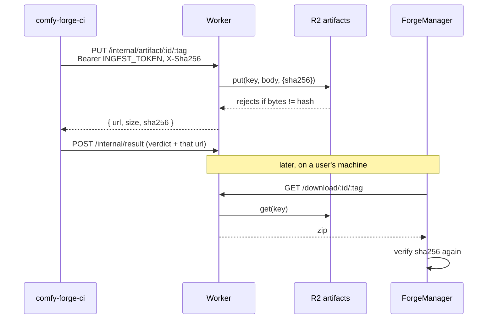
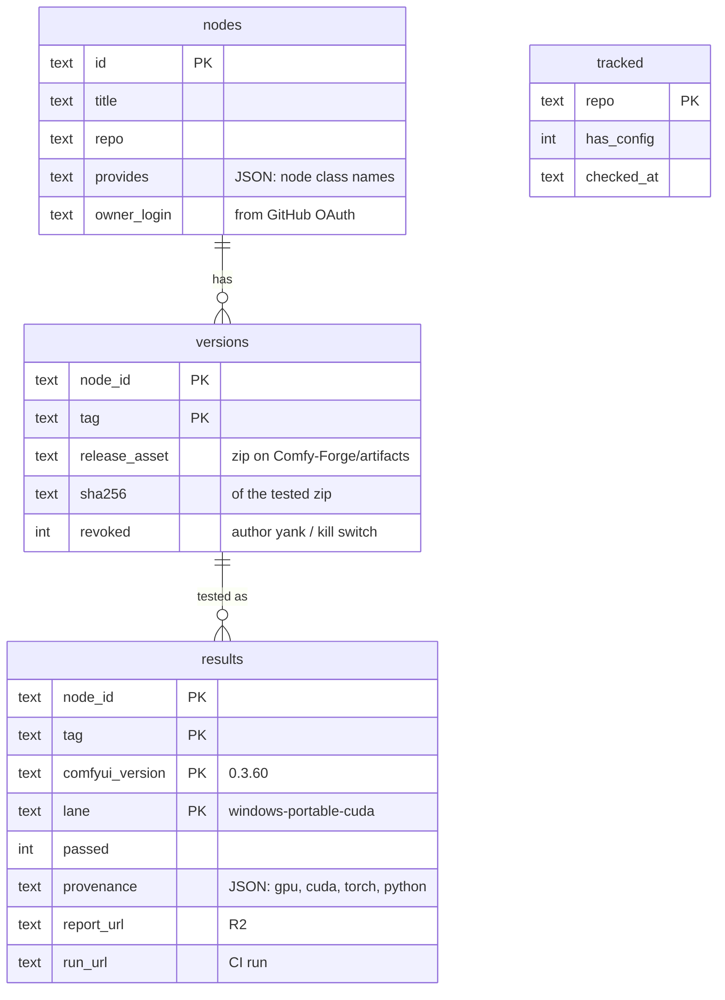
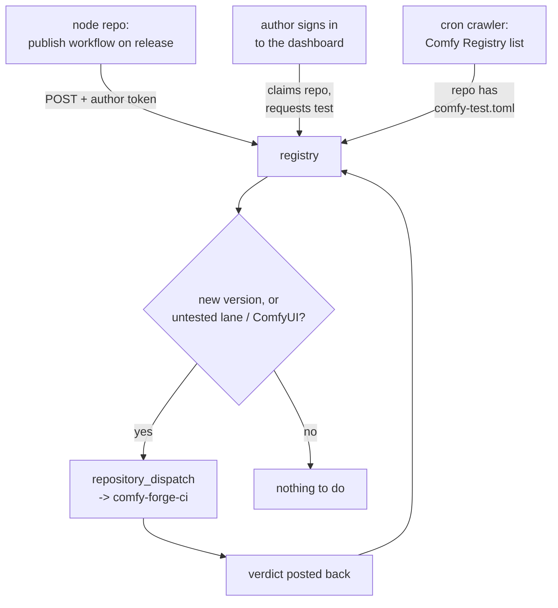

# comfy-forge-registry

[comfy-forge-registry](https://github.com/Comfy-Forge/comfy-forge-registry) is the
index of node packs that have been **tested on real hardware against a specific
ComfyUI version, in a specific lane**, and the record of which combinations each
one passed.

!!! abstract "The aim"
    Answer one question, honestly, before anything is installed: **"has this exact
    version of this node pack been run against my ComfyUI, the way I run it — and
    did it work?"** Not "does it exist", not "is it popular" — did it run.

    And then: **"can I see the results?"** Every verdict links to the report
    bundle and the CI run that produced it. A pass you cannot inspect is a
    marketing claim.

## Why a second registry

The [Comfy Registry](https://registry.comfy.org) answers *what exists*. It lists
packs, versions and dependencies, and that is a genuinely useful thing to have.

What it cannot tell you is whether a pack works **on your machine**. A node pack
is not portable in the way a pure-Python package is: it drags in compiled CUDA
extensions, a torch version, a C++ ABI, and a GPU architecture assumption. A pack
that is perfect on Linux + CUDA 12.8 can be broken on Windows + CUDA 13.0 for
reasons the author never sees, because the author has one machine.

The usual result is that "install failed" becomes the user's problem to debug —
and the debugging requires knowing what an ABI is.

Forge takes the opposite position: **an untested combination is not offered.** The
registry does not list a pack for a combination it has not been run on. If you
run the Windows portable bundle on ComfyUI 0.3.60 and nobody has tested that
pack there, the client simply does not show it to you. That is a smaller catalogue and a much larger
proportion of it works.

## The shape

No VPS, no always-on server. The whole backend is edge functions plus two
storage primitives:

| piece | role |
|---|---|
| **Cloudflare Worker** | the whole API — routing, auth, ingest, downloads |
| **D1** (SQLite) | the facts: nodes, versions, verdicts |
| **R2** ×2 | the bytes: tested zips, and report bundles |

Public source, secrets live in Worker secrets. The reason for this shape is
mundane and load-bearing: a registry that costs money to keep running is a
registry that eventually stops running. This one idles at zero.

The **website is not here.** `comfy-forge.org` is a separate static site
([comfy-forge-site](https://github.com/Comfy-Forge/comfy-forge-site), Cloudflare
Pages); this Worker is `api.comfy-forge.org` and does one job. They used to be
one deployment, which meant a copy change redeployed the API.

Exactly what goes in which store is [below](#storage-what-lives-where).

## Storage: what lives where

Three stores, and the split is deliberate: **D1 holds facts, R2 holds bytes.**

| store | holds | keyed by |
|---|---|---|
| **D1** | nodes, versions, verdicts | relational |
| **R2** `comfy-forge-artifacts` | the tested zips | `artifacts/<id>/<tag>.zip` |
| **R2** `comfy-forge-reports` | report bundles, author icons | `reports/<node>/<ver>/<lane>/`, `icons/<id>.png` |

A D1 row never contains a payload — it carries a `sha256`, a `report_url`, and
enough identity to construct a download path. The database stays small enough to
answer a client query at the edge, which is the only thing on the critical path
of an install.

### How a zip gets in, and out



**The hash is enforced twice, on opposite sides.** On write, the Worker passes
the declared hash to R2 as `opts.sha256`, and R2 refuses the PUT if the streamed
bytes disagree — so a corrupted or substituted upload never becomes a servable
artifact. On read, the client checks the same hash after download, covering the
path between R2 and the user. Neither check alone would be enough: the first
cannot see transport corruption, the second is running on a machine you do not
control.

CI records **the URL the registry returns**, never one it assembles itself. That
sounds pedantic until the two sides disagree about where artifacts live — which
is exactly what happened when the zips moved from GitHub Releases to R2 and the
workflow kept writing `releases/download/...` URLs into verdict rows.

### Why the registry hosts the bytes at all

It would be cheaper to point at someone else's storage. Two reasons not to:

**Revocation has to be enforceable.** `versions.revoked` is a kill switch. If the
bytes sit behind a public URL the registry does not control, revoking a version
removes it from listings while the URL keeps serving — and anything holding that
link keeps installing the thing you pulled. Serving through `/download/:id/:tag`
is what makes the flag mean *stop*, rather than *hide*.

**The hash chain needs a chokepoint.** Enforcing "what was tested is what is
served" requires a moment where the bytes are checked against a hash by something
neither the author nor the user controls. The PUT is that moment.

!!! note "cuda-wheels makes the opposite call, on purpose"
    [cuda-wheels](../cuda-wheels/index.md) stores wheels as GitHub Release
    assets, and that is right *there*: ~14k artifacts at hundreds of MB, served
    over a free CDN, with a wheel filename that is already a precise identity —
    no revocation story to lose. Node pack zips are megabytes and do need
    revoking. Same operator, different payload, different answer.

## The data model

Four tables, and the interesting one is `results`.



**A verdict is `(node, version, ComfyUI version, lane)`.** This is the whole
point of the registry, and it is why `results` has a four-column primary key: a
pack that passed at `v1.2.0` against ComfyUI 0.3.60 on `linux-cuda` tells you
nothing about `v1.3.0`, nothing about ComfyUI 0.3.75, and nothing about the
Windows portable bundle.

**Torch and CUDA versions are deliberately NOT in the key.** They are recorded as
provenance — what the run happened to execute on — and nothing filters by them.

The reason is that [comfy-env](../comfy-env/index.md) owns them. Each pack is
installed into its own isolated environment whose torch and CUDA wheels are
resolved *for the machine it lands on*, against the
[cuda-wheels](../cuda-wheels/index.md) index, or the install fails loudly naming
the package. So the host's CUDA version does not decide whether a pack works; it
decides which wheel gets fetched, and that is a solved problem one layer down.
Keying verdicts on it would re-litigate that at a coarser granularity, multiply
the matrix by every CUDA line the farm ships, and leave almost every cell empty.

What *does* break a pack between two machines that both have working CUDA is
**ComfyUI itself** — `INPUT_TYPES`, the execution model, the frontend contract —
and **how ComfyUI was installed**, which is what a lane encodes.

**A version records the sha256 of the tested zip.** The artifact the client
installs is byte-identical to the artifact that passed, or it is not the same
artifact. Testing a tree and then shipping a different tree is the failure mode
this column exists to make impossible.

**`revoked` is a kill switch, not a delete.** An author can yank a bad version,
and an operator can too. History is preserved — the verdict still says it passed,
because it did; the flag says do not serve it.

## How a pack gets in

Three entry points, in order of how much the author has to care.



### 1. A publish action in the repo (primary)

The same shape node authors already use for the Comfy Registry. Their repos
typically carry:

```yaml
- uses: Comfy-Org/publish-node-action@v1
  with:
    personal_access_token: ${{ secrets.REGISTRY_ACCESS_TOKEN }}
```

The Forge equivalent is a sibling step that registers the release with
`api.comfy-forge.org` and enqueues it for testing. The author adds one step to a
workflow they already have, and every subsequent release is tested without
further thought. **This is the intended default path.**

### 2. The dashboard

GitHub OAuth, then claim your repo and request a test. Backed by `/auth/*`,
`/me`, and `/my/nodepacks`. This is for authors who would rather click than
commit a workflow file, and it is also where icons are uploaded and versions are
revoked.

### 3. The crawler (backfill)

A cron pass reads the Comfy Registry's node list and checks each candidate repo
for a `comfy-test.toml` on its default branch. A repo carrying that file has
opted in to the Forge recipe, and gets tracked.

This exists so the catalogue is not empty on day one and does not depend on every
author noticing Forge. It is deliberately bounded — a small batch per run,
least-recently-checked first — because it is competing with GitHub's rate limits
from inside a Worker's CPU budget.

!!! note "Discovery is not dispatch"
    Finding a repo and testing it are separate. The crawler's job ends at
    "this repo is tracked"; deciding that a tracked repo has a release with no
    verdict for some (ComfyUI version, lane), and firing the test, is the step that
    closes the loop into [comfy-forge-ci](../comfy-forge-ci/index.md).

## The API

Read paths are public and cacheable; write paths are authenticated; ingest is
token-gated and only ever called by CI.

| route | who | purpose |
|---|---|---|
| `GET /catalog` | public | the browsable index |
| `GET /nodepacks?comfyui=&lane=` | public | **server-filtered** to one (ComfyUI version, lane), slim, `ETag`/304 |
| `GET /nodepack/:id` | public | full detail: every version, every verdict, links to reports |
| `GET /authors`, `GET /author/:id` | public | who publishes what |
| `GET /download/:id/:tag` | public | **serves** the tested zip from R2 |
| `GET /icon/:id` | public | author-uploaded icon from R2 |
| `GET /auth/login`, `/auth/callback`, `/auth/logout` | author | GitHub OAuth |
| `GET /me`, `GET /my/nodepacks` | author | session + owned packs |
| `POST /nodepacks/:id/icon` | author | icon upload |
| `POST /nodepacks/:id/versions/:tag/revoke` | author / admin | the kill switch |
| `PUT /internal/artifact/:id/:tag` | CI only | upload the tested zip (hash-checked) |
| `POST /internal/result` | CI only | record a verdict |
| `POST /internal/scan` | cron | run a discovery pass |
| `GET /health` | anyone | liveness |

**The filter belongs on the server.** `?comfyui=0.3.60&lane=windows-portable-cuda`
returns only what passed there. The client is not handed the full catalogue and
asked to filter it, because then the client owns the compatibility rules — and the
client is the piece most likely to be out of date. One place decides what
"compatible" means.

### Lane, not platform

A **lane** is comfy-test's unit: *OS x accelerator x ComfyUI install method* —
`linux-cuda`, `windows-portable-cuda`, `macos-desktop`. Ten of them, defined in
[comfy-test's lane registry](../comfy-test/lanes.md), which is the source of
truth; the registry does not maintain a second taxonomy.

comfy-test deliberately reserves the word *platform* for what `sys.platform` and
wheel tags mean (`win_amd64`, `manylinux_2_28_x86_64`) — only one component of a
lane. The registry uses the same vocabulary, so a verdict here and a run over
there name the same thing.

The install method matters as much as the OS, which is why it is in the key: the
Windows portable bundle has an embedded Python, no `.git`, and an unpacked rather
than installed tree, so a pack that assumes a writable `site-packages` or a git
checkout fails there and nowhere else.

!!! note "A lane says `cuda`, not `cuda12.8`"
    The accelerator is part of the lane because CPU and GPU are qualitatively
    different runs. The CUDA *version* is not, for the reason above: comfy-env
    resolves it per machine. `linux-cuda` means "tested on a real NVIDIA GPU",
    and the provenance record says which one.

## What the registry is not

- **Not a build farm.** Compiled CUDA wheels come from
  [cuda-wheels](../cuda-wheels/index.md); the registry indexes *node packs*, and
  a node pack's CUDA dependencies are resolved by
  [comfy-env](../comfy-env/index.md) against that wheel index.
- **Not a mirror.** Source of truth for the code stays with the author's repo.
  Forge stores the *tested zip* — a snapshot with a hash, so what was tested is
  what is served. It is not a general file host and it does not keep untested
  versions.
- **Not a judge of quality.** "Passed" means it installed and its nodes
  registered in that lane, on that ComfyUI. It is a floor, not a review.

## Related

- [comfy-forge-ci](../comfy-forge-ci/index.md) — what actually runs the tests
- [ComfyUI-ForgeManager](../comfyui-forgemanager/index.md) — the client that consumes this index
- [cuda-wheels](../cuda-wheels/index.md) — the prebuilt CUDA wheel index
