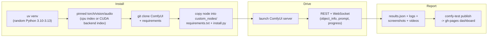

# comfy-test

[comfy-test](https://github.com/PozzettiAndrea/comfy-test) is **installation
testing infrastructure for ComfyUI custom nodes**. It does two things, the way
a real user would:

1. **Installs the node pack** -- fresh venv, git-cloned ComfyUI, real server
   (or the portable bundle / Desktop app, depending on the lane).
2. **Drives real workflows against it** -- queues your workflow JSON on the
   running server and checks it actually executes.
3. **Produces a results gallery** -- an HTML report with per-platform
   screenshots of each workflow running, so you see it working, not just a
   green check.

...across the platform matrix ComfyUI users actually have:

| Install method | Linux | macOS | Windows |
|---|---|---|---|
| **Server** (git-cloned ComfyUI) | CPU · CUDA | CPU (MPS) | CPU · CUDA |
| **Portable** (embedded Python bundle) | -- | -- | CPU · CUDA |
| **Desktop** (Electron app) | -- | CPU | CPU · CUDA |

Ten lanes in all. `--` marks a combination that isn't a real way to run
ComfyUI: no Linux Portable or Desktop, and no macOS CUDA (Apple Silicon has
none -- the server lane uses MPS instead). Accelerators are named concretely:
**CPU** and **CUDA** today, with **ROCm** and other accelerators reserved in
the registry for when runners are wired. See
[Platforms and lanes](lanes.md) for the full per-lane breakdown.

Adoption is three files in the node repo:

1. `comfy-test.toml` -- config
2. `.github/workflows/test-install.yml` -- one `uses:
   PozzettiAndrea/comfy-test/.github/workflows/test-matrix.yml@main` line
3. `workflows/test.json` -- a minimal ComfyUI workflow using the nodes,
   exported from ComfyUI

## What a run does

Tests are **levels**, each depending on the previous. The default set is
1, 3-4, 6-8, 10; levels 2, 5 and 11 are opt-in. Full detail, including
what each level can and cannot catch, is in
[Test levels](levels.md).

| # | Level | What it checks |
|---|-------|----------------|
| 1 | `syntax` | Project structure, CP1252 compatibility, forbidden patterns (static) |
| 2 | `coverage` (opt-in) | Every registered node is used by at least one bundled workflow (static) |
| 3 | `install` | The full uv-venv + ComfyUI + node install above |
| 4 | `registration` | Server starts; no import errors; nodes appear in `/object_info` |
| 5 | `javascript` (opt-in) | Frontend JS touches nothing it does not own ([ADR-0014](adr/0014-javascript-isolation-is-static.md)) |
| 6 | `instantiation` | Each node's constructor runs |
| 7 | `static_capture` | Workflows screenshot without executing |
| 8 | `validation` | Three tiers: schema, graph, introspection |
| 9 | `execution_light` | Full workflow execution, one screenshot each, no per-frame video |
| 10 | `execution` | Full workflow execution + outputs + per-frame video |
| 11 | `custom` (opt-in) | Node-supplied hook (`[test] custom = "tests/my_check.py"`) against the live server |

Results land as `results.json` (per-workflow status, durations, RAM/VRAM
peaks, hardware, a deep-link back to the GHA run, and a **provenance** block
recording what actually produced the run) plus session/server logs,
screenshots, and videos. `comfy-test publish` pushes them to the node repo's
`gh-pages` as a **dashboard**: branch switcher -> platform tabs ->
per-workflow cards with media and logs
([ADR-0015](adr/0015-publish-is-a-separate-job.md)).

!!! warning "A green cell does not always mean 'installs cleanly'"

    Hosted CPU lanes **attach** to an environment the CI workflow prebuilt
    and cached; on those lanes the `install` level is effectively a no-op.
    CUDA lanes, local runs and Desktop lanes build fresh. Each run records
    which path it took in `provenance.install_mode` -- see
    [ADR-0003](adr/0003-two-install-paths-attach-and-fresh.md) and
    [Reproducibility](reproducibility.md), which also covers the randomly
    sampled Python version and the unpinned ComfyUI clone.

## The platform matrix

The single source of truth is `platforms/registry.py`: a platform is an
**(os x backend x kind)** target.

| id | kind | runs on |
|----|------|---------|
| linux-cpu, windows-cpu, macos-cpu | server | GitHub-hosted runners |
| windows-portable-cpu | portable | GitHub-hosted |
| windows-desktop, macos-desktop | desktop | GitHub-hosted |
| linux-cuda, windows-cuda | server | self-hosted, docker |
| windows-portable-cuda | portable | self-hosted, docker |
| windows-desktop-cuda | desktop | self-hosted, Hyper-V VM / Sandbox |

(`rocm` is a valid backend token in the registry; no runner is wired yet. No
macos-cuda -- Apple Silicon has no CUDA.)

The three **kinds** differ substantially:

- **server** -- uv venv, cloned ComfyUI, `main.py --listen` (macOS omits
  `--cpu` so MPS gets picked).
- **portable** -- downloads and 7z-extracts the official Windows portable
  bundle and tests against its `python_embeded` interpreter.
- **desktop** -- installs the actual ComfyUI Desktop (Electron) app, launches
  it with a remote-debugging port, and drives the real UI over CDP with
  Playwright -- including installing the node through the in-app Manager.

## GPU lanes: docker, VM, and Sandbox

CUDA testing needs real GPUs, so those lanes are dispatch-only on
self-hosted runners:

- **linux-cuda / windows-cuda / windows-portable-cuda** run inside
  containers (`comfy-test docker run`): NVIDIA Container Toolkit on Linux,
  process-isolation with GPU device mapping on Windows.
- **windows-desktop-cuda** is the hard one: Electron needs an interactive
  desktop session *and* CUDA -- Windows containers can provide neither
  (Session 0 isolation; no `--device` under Hyper-V isolation). The answer
  is a **Hyper-V baseline VM** with the GPU DDA-attached: restore a clean
  snapshot, run the test via a GHA runner registered inside the VM, revert
  -- "same isolation contract as `docker run --rm`, ~60s overhead", the same
  pattern Comfy-Org's own desktop E2E tests use. The `comfy-test vm`
  subcommand formalizes the lifecycle: `build` (one-time host setup, optionally
  fully unattended Windows install), `snapshot`, `restore`, `gpu attach/detach`,
  `share` (SMB share that survives snapshot restores).
- **Windows Sandbox** (`comfy-test sandbox`) is the emerging successor for
  that lane: GPU-PV maps the host driver store into a pristine disposable
  guest -- no image build, no snapshots, no GPU dismount.

## CI architecture

The heavy lifting all lives in the Python package; the GitHub workflows are
thin:

- `test-matrix.yml` -- reusable workflow consumer repos call; fans out the
  hosted CPU lanes on push/PR.
- `dispatch-test.yml` -- one reusable workflow for *every* platform,
  including the self-hosted GPU lanes; test jobs just
  `pip install --upgrade comfy-test`, invoke `comfy-test run`, and upload
  the results artifact; a separate `publish` job pushes to gh-pages (so a
  flaky publish can be re-run without re-running the slow test).
- [comfy-ci](https://github.com/PozzettiAndrea/comfy-ci) -- a thin dispatcher
  repo whose only job is to be the entry point self-hosted GPU runners are
  enrolled against; its `test-cpu.yml` / `test-cuda.yml` are
  workflow_dispatch shims that call `dispatch-test.yml` by tag.

## Relationship to comfy-env

comfy-test knows about [comfy-env](../comfy-env/index.md) as an optional
peer, not a dependency: it reads `comfy-env.toml` for declared `[cuda]`
packages and `comfy-env-root.toml` for `[node_reqs]`, sets
`COMFY_ENV_CUDA_VERSION` so wheel resolution works on CPU-only CI, probes
comfy-env's workspace to see which CUDA packages actually materialized (and
mocks the ones that didn't, since CUDA imports fail without a GPU), and logs
the installed comfy-env version alongside its own in every run.
