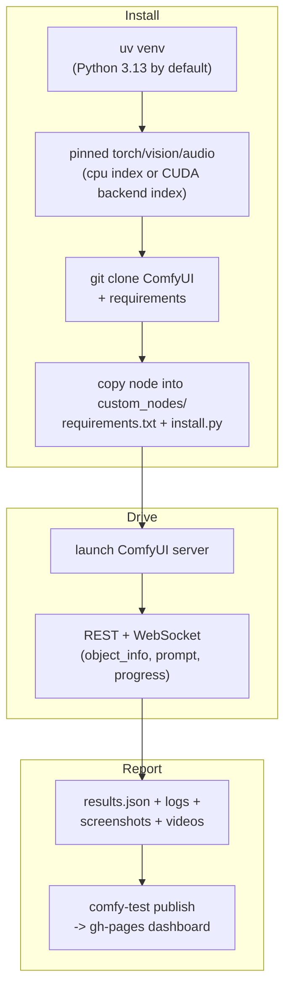

# What a run does

*(This example uses Linux, but it works the same on the other OSes.)*

`comfy-test run <owner/repo>` (a GitHub link) on a Linux **git-cloned** lane
does what a real user does, from scratch:

- Build a clean environment
- Install a real ComfyUI and the custom node pack at `owner/repo` into it
- Boot the real server
- Take a video while driving your example workflows against it



A run writes a whole directory, not a single file. The path is always
three levels -- **run / branch / lane** -- because every consumer
(`publish`, the dashboard) assumes that shape
([ADR-0016](adr/0016-run-output-is-namespaced-run-branch-lane.md)):

```text
<logs>/<pack>-<YYYYMMDD-HHMM>/<branch>/<os>-<install-method>-<backend>/
├── results.json          per-workflow status, durations, RAM/VRAM peaks,
│                         hardware, a deep-link back to the GHA run, and a
│                         provenance block recording what produced the run
├── models.json           models the run touched
├── session.log           the comfy-test run itself
├── server.log            ComfyUI's own stdout/stderr
├── crash_dump.log        written only if the server died
├── comfy-test.toml       a copy of the config that was actually used
├── logs/
│   ├── <workflow>.log            per-workflow log slice
│   ├── <workflow>_console.log    browser console for that workflow
│   └── <workflow>_resources.csv  RAM/VRAM/CPU samples over the run
├── screenshots/
│   ├── <workflow>.png            static capture (level 7)
│   └── <workflow>_executed.png   final frame after execution
└── videos/
    └── <workflow>/
        ├── driver.mp4    the canvas recording the report plays
        └── metadata.json frame timings + log offsets
```

Where the tree is written, and what the run prints along the way, is
controlled by environment variables -- see the
[settings reference](settings.md).

!!! warning "Not every lane does all of this"
    The sequence above is the **fresh** path: local runs and dispatch/CUDA
    lanes. Hosted CPU lanes **attach** instead -- CI prebuilds the venv,
    ComfyUI and your pack behind a cache and hands comfy-test a live server, so
    the install steps are skipped and install errors are suppressed. A green
    cell there means *"your pack works in a prebuilt environment"*, not
    *"your pack installs cleanly"*.

    Every run records which path it took in `provenance.install_mode`. See
    [ADR-0003](adr/0003-two-install-paths-attach-and-fresh.md) and
    [Reproducibility](reproducibility.md).


## The checks it runs

Everything above is the *scaffolding*. What actually gets asserted is a ladder
of **13 levels**, seven of which run by default. They execute in a fixed order,
but do not all depend on the previous one -- each declares the resources it
needs and the engine pulls in whatever provides them.

| # | Level | Default | |
|---|---|---|---|
| 1 | [`syntax`](levels/syntax.md) | yes | static source checks |
| 2 | [`coverage`](levels/coverage.md) | no | registered nodes vs workflows |
| 3 | [`warnings`](levels/warnings.md) | no | layout antipatterns (report-only) |
| 4 | [`hazards`](levels/hazards.md) | no | in-process behaviour (report-only) |
| 5 | [`install`](levels/install.md) | yes | builds the environment |
| 6 | [`registration`](levels/registration.md) | yes | server boots, pack imports |
| 7 | [`javascript`](levels/javascript.md) | no | frontend isolation lint |
| 8 | [`instantiation`](levels/instantiation.md) | yes | node constructors run |
| 9 | [`static_capture`](levels/static_capture.md) | yes | workflows render |
| 10 | [`validation`](levels/validation.md) | yes | schema, graph, introspection |
| 11 | [`execution_light`](levels/execution_light.md) | no | execute, one screenshot |
| 12 | [`execution`](levels/execution.md) | yes | execute, canvas video |
| 13 | [`custom`](levels/custom.md) | no | your own hook |

Full detail -- the resource model, what each level can and cannot catch, and
how `--level` selects them -- is in [the ladder](levels.md).
