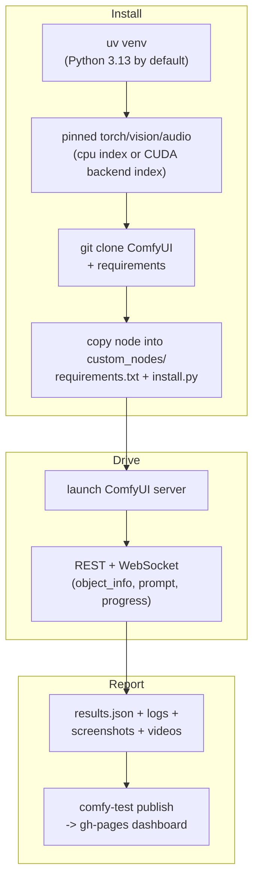

# What a run does

*(This example uses Linux, but it works the same on the other OSes.)*

`comfy-test run <owner/repo>` does what a real user does, from scratch. In
order:

**Build the environment** (`install` level)

1. **`uv venv --python <version>`** in a scratch work directory, isolated from
   the system Python. The interpreter is 3.13 unless `python_version` says
   otherwise.
2. **Pin the torch family first** -- `torch`, `torchvision` and `torchaudio`
   installed as a known-aligned triple, from the CPU index or the CUDA backend
   index. ComfyUI asks for all three by bare name with no version, and the
   three are ABI-coupled, so this has to be decided rather than resolved. It
   happens *before* anything else so the later requirements installs see it
   satisfied and never upgrade it -- the other order produced a real skew
   (torch 2.12+cu130 against torchaudio 2.11+cu128). Full reasoning:
   [torch, torchvision and torchaudio](torch-triple.md).
3. **`git clone --depth 1` ComfyUI**, at `comfyui_version` if you pinned a tag
   or branch, else HEAD.
4. **Install ComfyUI's own `requirements.txt`** into the venv.
5. **Put your pack in `custom_nodes/`.** A local directory is *copied* (minus
   `.git` and anything your `.gitignore` names); a repo link is shallow-cloned.
6. **Run your pack's install steps** -- `requirements.txt` first, then
   `install.py`, matching the order ComfyUI-Manager uses. `install.py` runs with
   the venv's interpreter and its exit code is logged, not fatal.
7. **Clone the peer packs** your `comfy-env.toml` declares in `[node_packs]`,
   plus the validation helper the `validation` level needs.

**Boot it** (`registration` level)

8. **Launch `main.py --listen 127.0.0.1 --port <port>`** as a real subprocess,
   with `--cpu` unless CUDA is enabled (macOS omits it so MPS is selected).
9. **Wait for readiness** -- poll until the server answers, then wait a further
   20 seconds, because it responds before its nodes have finished loading. If
   the process dies instead, the last 50 lines of its output are the error.
10. **Scan the startup log for import errors**, then read `/object_info` to
    learn which nodes actually registered.

**Drive it** (`execution` level, per workflow)

11. **Open a real browser** at the server, load the workflow JSON into
    `window.app`, fit the graph to view and close any panels.
12. **Start recording**, then validate the graph and queue it.
13. **Capture the canvas at 5 fps** while it executes, watching the WebSocket
    for completion, errors, and per-node progress. A sustained 30-second
    WebSocket disconnect is treated as a server crash.
14. **Encode `driver.mp4`** with real timing, take a final full-quality PNG
    once previews have rendered, and write the logs, resource samples and
    `results.json`.

!!! note "Two videos: the install, and the execution"
    `driver.mp4` covers **execution only**. Recording starts at the **pre-run
    graph** -- browser open, workflow loaded, nothing queued yet -- and that
    frame is held across the validate-and-queue window so the video does not
    jump-cut into execution. It cannot cover steps 1-10: the capture is browser
    screenshots, and until the server is up there is no page to point a camera
    at.

    Steps 1-10 get their own video, `videos/install/driver.mp4`, which appears
    in the report beside the per-workflow ones. By default it is rendered from
    `install.jsonl` -- the timed event stream, chapter markers and all -- so it
    works on every lane including the CUDA containers, where there is no
    desktop to record. Set `COMFY_TEST_INSTALL_VIDEO=x11` on Linux for a real
    screen recording instead, or `off` for neither. See
    [Settings](settings.md#filming-the-install).

    The **resource monitor does start earlier**, before the browser navigates,
    which is why the RAM/VRAM graph is offset back onto the video's timeline
    rather than sharing its clock.



A run writes a whole directory, not a single file. The path is always
three levels -- **run / branch / lane** -- because every consumer
(`publish`, the dashboard) assumes that shape
([ADR-0016](adr/0016-run-output-is-namespaced-run-branch-lane.md)):

```text
<logs>/<pack>-<YYYYMMDD-HHMM>/<branch>/<os>-<install-method>-<backend>/
├── results.json          per-workflow status, durations, RAM/VRAM peaks,
│                         hardware, a deep-link back to the GHA run, and a
│                         provenance block recording what produced the run
├── models.json           models the run touched
├── install.jsonl         the install phase as a replayable event stream
├── session.log           the comfy-test run itself
├── server.log            ComfyUI's own stdout/stderr
├── crash_dump.log        written only if the server died
├── comfy-test.toml       a copy of the config that was actually used
├── logs/
│   ├── <workflow>.log            per-workflow log slice
│   ├── <workflow>_console.log    browser console for that workflow
│   └── <workflow>_resources.csv  RAM/VRAM/CPU samples over the run
├── screenshots/
│   ├── <workflow>.png            static capture (level 7)
│   └── <workflow>_executed.png   final frame after execution
└── videos/
    └── <workflow>/
        ├── driver.mp4    the canvas recording the report plays
        └── metadata.json frame timings + log offsets
```

Where the tree is written, and what the run prints along the way, is
controlled by environment variables -- see the
[settings reference](settings.md).

## Two recordings, two media

A run produces **two** playable artifacts, and they are deliberately different
formats because they record different things.

| | `videos/<workflow>/driver.mp4` | `install.jsonl` |
|---|---|---|
| Covers | one workflow executing | the whole install phase |
| Medium | video, canvas at 5 fps | timestamped event stream, replayed as a terminal |
| Size | megabytes | tens of kilobytes |
| Searchable | no | **yes** -- grep it, Ctrl-F it, copy from it |

The canvas is **genuinely visual** -- nodes lighting up, previews appearing --
so there is no smaller honest way to record it. The install phase is
**already text**: rasterising it into frames and encoding an mp4 would cost
more, lose the ability to copy a traceback out of a failed install, and gain
nothing. So it is kept as data and rendered at play time.

The replay panel in the report gives you play/pause, a scrub bar, a speed
control, and **chapter buttons**. The chapters matter: steps 1-4 above are CI
scaffolding a user never performs (uv venv, torch pin, cloning ComfyUI), while
the *install the node pack* chapter onwards is exactly what a person does by
hand -- `git clone`, `pip install -r requirements.txt`, `python install.py`.
Jump to that chapter and the recording doubles as an install guide.

!!! note "The install replay is written even when the run fails"
    It is emitted in the run's `finally` block, so a crashed install still
    leaves a complete, greppable record -- which is the case it is most useful
    for.

!!! warning "Not every lane does all of this"
    The sequence above is the **fresh** path: local runs and dispatch/CUDA
    lanes. Hosted CPU lanes **attach** instead -- CI prebuilds the venv,
    ComfyUI and your pack behind a cache and hands comfy-test a live server, so
    the install steps are skipped and install errors are suppressed. A green
    cell there means *"your pack works in a prebuilt environment"*, not
    *"your pack installs cleanly"*.

    Every run records which path it took in `provenance.install_mode`. See
    [ADR-0003](adr/0003-two-install-paths-attach-and-fresh.md) and
    [Reproducibility](reproducibility.md).


## The checks it runs

Everything above is the *scaffolding*. What actually gets asserted is a ladder
of **13 levels**, seven of which run by default. They execute in a fixed order,
but do not all depend on the previous one -- each declares the resources it
needs and the engine pulls in whatever provides them.

| # | Level | Default | |
|---|---|---|---|
| 1 | [`syntax`](levels/syntax.md) | yes | static source checks |
| 2 | [`coverage`](levels/coverage.md) | no | registered nodes vs workflows |
| 3 | [`warnings`](levels/warnings.md) | no | layout antipatterns (report-only) |
| 4 | [`hazards`](levels/hazards.md) | no | in-process behaviour (report-only) |
| 5 | [`install`](levels/install.md) | yes | builds the environment |
| 6 | [`registration`](levels/registration.md) | yes | server boots, pack imports |
| 7 | [`javascript`](levels/javascript.md) | no | frontend isolation lint |
| 8 | [`instantiation`](levels/instantiation.md) | yes | node constructors run |
| 9 | [`static_capture`](levels/static_capture.md) | yes | workflows render |
| 10 | [`validation`](levels/validation.md) | yes | schema, graph, introspection |
| 11 | [`execution_light`](levels/execution_light.md) | no | execute, one screenshot |
| 12 | [`execution`](levels/execution.md) | yes | execute, canvas video |
| 13 | [`custom`](levels/custom.md) | no | your own hook |

Full detail -- the resource model, what each level can and cannot catch, and
how `[test] levels` selects them -- is in [the ladder](levels.md).
