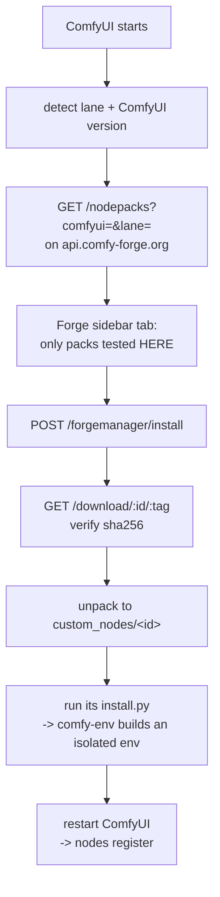

# ComfyUI-ForgeManager

[ComfyUI-ForgeManager](https://github.com/Comfy-Forge/ComfyUI-ForgeManager) is the
client end of Forge: a ComfyUI extension that shows you the node packs which have
been **tested against your ComfyUI version, in your lane**, and installs them
isolated via [comfy-env](../comfy-env/index.md).

!!! abstract "The aim"
    Make the install button honest. If a pack is listed, it has been run against
    your ComfyUI version, installed the way you installed yours, and it worked.
    If that combination was never tested, you do not see it — rather than seeing
    it, installing it, and discovering the problem yourself.

    And every listing links to the report and the CI run behind it, so "tested"
    is a claim you can check rather than one you have to trust.

## The problem it solves

The default install experience is: browse a catalogue that describes what exists,
pick something, install it into ComfyUI's single shared Python environment, and
find out afterwards.

**Many things can go wrong**:

Even assuming a "virgin" environment:

- The node pack might have been written for an older version of ComfyUI
- The node has been created by someone on Linux and never been tested on Windows at all, or vice versa
- The node pack might require CUDA and the user is on Mac/has no GPU
- It might break something that was already installed. Everything shares one
environment, so a pack that needs `transformers==4.49` and a pack that needs
`>=4.54` cannot coexist. Installing the second silently degrades the first.

Forge addresses these issues by only listing node packs that have been tested for a user's exact:
- ComfyUI version
- Operating system
- Available accelerators

And only listing either:

- **Completely isolated** node packs using comfy-env
- Dependency-less packs (no requirements.txt, host env not touched at all)

## How it works

### Detection first

Before anything is listed, the extension works out what this install actually is:
its **lane** — operating system, whether there is a usable GPU, and how ComfyUI
was installed (server checkout, Windows portable bundle, desktop app) — and the
**ComfyUI version** it is running. Those two become the query.

It does not ask about your CUDA or torch version, because those are not what a
verdict is keyed on: [comfy-env](../comfy-env/index.md) resolves them per pack,
per machine. What it needs to know is which ComfyUI you are on and how you
installed it.

The filtering happens **server-side** — the client sends `?os=windows&cuda=12.8`
and receives only what passed there. The client never downloads the full
catalogue and filters it locally, because that would put the compatibility rules
in the piece that is hardest to update. One place owns what "compatible" means,
and it is not the thing installed on ten thousand machines.

### Install is a pinned, hashed fetch

Installing does not clone a repo at whatever `main` happens to be. It downloads
the **exact zip that passed the test** from `GET /download/:id/:tag`, and checks
its sha256.

This is the link that makes a verdict mean anything:
[comfy-forge-ci](../comfy-forge-ci/index.md) tested a tree and uploaded it under
its hash, R2 refused the write unless the bytes matched, the registry serves it,
and the client checks the hash again on arrival. If the bytes differ, it is not
the artifact that was tested and it is not installed.

Going through the registry rather than straight to a storage URL is also what
makes `revoked` real: a yanked version stops being downloadable, instead of
merely disappearing from a listing while its URL keeps working.

### Then comfy-env takes over

Once unpacked, the pack's own `install.py` runs, and if it is comfy-env-aware it
builds an **isolated environment** for that pack — its own torch, its own
dependencies, its own CUDA wheels resolved against
[cuda-wheels](../cuda-wheels/index.md).

This is why installing one pack cannot break another, and it is the reason Forge
is worth having rather than just being a filtered list.

## Routes

The backend mounts on ComfyUI's own server:

| route | what |
|---|---|
| `GET /forgemanager/platform` | detected lane + ComfyUI version for this install |
| `GET /forgemanager/nodes` | index entries tested-passing here |
| `POST /forgemanager/missing` | given graph node types: which are unregistered, and which tested packs provide them |
| `POST /forgemanager/install` | download the pinned zip, verify sha256, unpack, run `install.py` |
| `POST /forgemanager/update` / `update_all` | move to a newer tested version |
| `POST /forgemanager/uninstall` | remove `custom_nodes/<id>` |
| `POST /forgemanager/restart` | restart so (un)installed packs register |

### The missing-nodes flow

`POST /forgemanager/missing` is the one worth calling out. You open somebody
else's workflow, and it references node types this install does not have. Instead
of a wall of red boxes and a search, the client asks: *which of these types are
unregistered, and which tested packs provide them?*

This is what `nodes.provides` in the registry exists for — each pack records the
node class names it registers, so the question is a lookup rather than a guess.
The answer is filtered to your lane and ComfyUI version like everything else, so it will not
offer you a pack that cannot run here.

## Security

!!! warning "Every mutating route is loopback-only and CSRF-guarded"
    ComfyUI's server frequently ends up reachable beyond localhost — on a LAN, or
    tunnelled. These routes install code and restart the process, so they are
    restricted to loopback and CSRF-guarded regardless of how the server is
    exposed.

    Install is a code-execution primitive: it fetches an archive, unpacks it into
    `custom_nodes/`, and runs its `install.py`. That must never be reachable from
    a page the user did not open themselves.

The sha256 check is the other half. The registry says which bytes were tested;
the client refuses anything else.

## Status

The UI, the routes and the install path exist. The index is currently a local
mock (`forgemanager/mock_index.json`), with `index.fetch_nodes()` as the seam
where the real registry plugs in — so the client can be developed against a
stable fixture while the registry and the test fleet fill up behind it.

## Related

- [comfy-forge-registry](../comfy-forge-registry/index.md) — the index this consumes
- [comfy-forge-ci](../comfy-forge-ci/index.md) — what produces the verdicts
- [comfy-env](../comfy-env/index.md) — the isolation this delegates to
