# The build process

From a YAML config to a wheel a resolver can find: what runs, where it
lands, and what to check when it breaks.

## What happens after a build?

```mermaid
flowchart LR
    subgraph declare["1. Declare"]
        yml["packages/<name>.yml<br/>source repo+tag, patches,<br/>deps, arch lists, sharding"]
        defaults["packages/_defaults.yml<br/>shared cuda x torch x python grid,<br/>arch-list policy"]
        patch["patches/<name>.py<br/>pre-build source patches"]
    end
    subgraph plan["2. Plan"]
        gen["scripts/generate_matrix.py<br/>expand configs into job matrices"]
        skip["subtract: already-built wheels<br/>+ phantom combos"]
    end
    subgraph build["3. Build"]
        gha["build.yml on GHA<br/>ubuntu-22.04 / windows-2022<br/>(or self-hosted homelab runners)"]
        rel["one rolling GitHub Release per pkg:<br/><pkg>-latest holds every wheel"]
    end
    subgraph publish["4. Publish"]
        idx["scripts/generate_index.py<br/>PEP 503 static index (v2 + v1 shim)<br/>+ dashboard"]
        pages["GitHub Pages<br/>(orphan branch deploy)"]
    end
    declare --> gen
    gen --> skip --> gha --> rel
    rel -->|"Releases API is the<br/>source of truth"| idx --> pages

    consumer["comfy-env resolver"]
    pages -->|"scrape index, install by direct URL"| consumer
    rel -.->|"fallback: Releases API<br/>(different routing edge)"| consumer
```



## What do the wheel names mean?

```
<pkg>-<version>+cu<CCC>torch<M.m>-cp<PY>-cp<PY>-<platform>.whl

flash_attn-2.8.3+cu124torch2.4-cp311-cp311-win_amd64.whl
gsplat-1.5.3+cu124torch2.4-cp310-cp310-manylinux_2_34_x86_64....whl
```

- The local version tag `+cu128torch2.9` **encodes the CUDA/torch combo** (v2
  keeps the dot in the torch version; the v1 index stripped it and survives as
  a compat shim).
- The wheel's internal `METADATA` version is **patched to match the filename**
  so pip/uv see a consistent version
  ([CW-ADR-0004](adr/0004-combo-encoded-versions-and-metadata-patching.md)).
- Linux wheels go through **`auditwheel repair`** to `manylinux_2_35`,
  excluding libcuda/libtorch -- those must come from the host.
- Builds pin exactly `torch==<ver>+cu<short>` from PyTorch's own index, so every
  wheel is **tied to a torch family** -- the same pin comfy-env replicates into
  its generated environments.

## A build failed. What do I check?

| Question | Command |
|---|---|
| What is declared but not built? | `python scripts/gap_analysis.py -v` |
| ...ignoring a torch release still rolling out? | `python scripts/gap_analysis.py --exclude-torch 2.11` |
| Do the wheels contain the architectures they claim? | `python scripts/audit_wheel_archs.py --package <name>` |
| Are filenames and versions consistent? | `python scripts/check_wheels.py` |

!!! warning "One known false positive"
    `audit_wheel_archs.py` scans for architecture markers inside the compiled
    binary. Packages built with `-Xfatbin -compress-all` store their cubins
    compressed and the scan cannot see through that -- they report as MISMATCH
    with an empty SASS list. **Confirm with `cuobjdump` before believing it:**

    ```bash
    cuobjdump --list-elf <extracted .so or .pyd> | grep -o 'sm_[0-9]*' | sort -u
    ```

If a failure is clustered by CUDA version rather than scattered, suspect the
**arch list** -- the cu124 and cu126 default lists start at sm_50, and older
GPU architectures lack primitives newer code assumes (see the `diso` /
`atomicAdd` case in [What combos do we compile for?](coverage.md#what-combos-do-we-compile-for)).

### What if a compile takes longer than 6 hours?

Builds default to GHA-hosted runners; a `runner` input switches to self-hosted
homelab machines. Long CUDA compiles get three escape hatches
([CW-ADR-0006](adr/0006-fitting-cuda-compiles-into-hosted-ci.md)):

1. **Disk freeing** -- the runner's dotnet/android/ghc/swift images are deleted
   up front.
2. **Sharding** (`sharding: N`) -- N jobs each compile a subset of `.cu` files
   and upload object tarballs; a link-only job assembles the wheel.
3. **Sequential checkpointing** (`sequential_checkpoint: <seconds>`) --
   **a prototype today.** The compile runs under `timeout`; on expiry the
   entire `source/` tree is tarred as an artifact -- sources *and* `build/`
   together, in PAX format so nanosecond mtimes survive and ninja's restat
   check still works -- and a chained job (`_chain_link.yml`) resumes it.

    !!! warning "Two links, so one resume"
        Only `link-0` and `link-1` are wired per platform
        (`build.yml`), so checkpointing currently buys **a single**
        continuation, not an open-ended ladder. The `link-0..9` "10-job
        ladder" described in the workflow comments does not exist yet; a
        compile needing more than two slots still will not finish.

