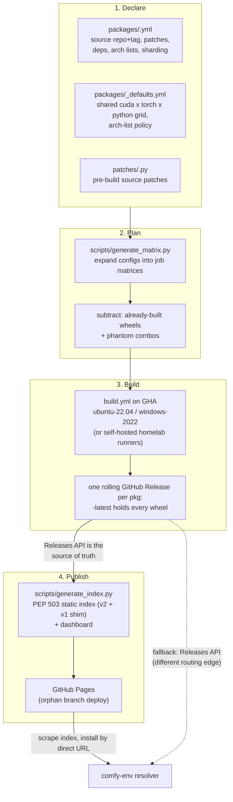

# The build process

From a YAML config to a wheel a resolver can find: what runs, where it
lands, and what to check when it breaks.

## Where do the files live?

```text
cuda-wheels/
├── packages/            WHAT to build -- one YAML per package
│   ├── _defaults.yml       the shared cell grid (GENERATED from the PCWM)
│   ├── _arch_policy.yml    arch policy + exceptions, read at BUILD time (CW-ADR-0012)
│   ├── flash_attn.yml      per-package config: source repo, tag, build knobs
│   ├── nvdiffrast.yml      ...
│   ├── ...
│   └── README.md           authoritative "how to add a package" reference
│
├── patches/             HOW to fix it -- edits to the upstream source so it
│                        compiles here; one Python script per package
│   ├── flash_attn.py       runs on the checked-out source before building
│   ├── pytorch3d.py        ...
│   └── ...
│
├── scripts/             the machinery
│   ├── generate_matrix.py           configs  -> CI job matrix
│   ├── derive_defaults.py           PCWM + arch policy -> _defaults.yml
│   ├── phantom_combos.json          cells upstream never shipped (GENERATED)
│   ├── torch_watch.py               daily upstream-combo watcher (reports)
│   ├── fetch_torch_matrix.py        WHICH (cuda, torch, py, os) combos exist
│   ├── fetch_pytorch_arch_lists.py  WHICH sm_XX arches torch built inside one
│   ├── generate_index.py            releases -> PEP 503 index
│   ├── generate_dashboard.py        releases -> dashboard page
│   ├── patch_wheel_version.py       align wheel METADATA with its filename
│   ├── gap_analysis.py              declared vs published: what is missing
│   ├── audit_wheel_archs.py         verify compiled SASS archs in each wheel
│   └── check_wheels.py              naming/version sanity checks
│
├── .github/
│   ├── workflows/
│   │   ├── build.yml                the build entry point (workflow_dispatch)
│   │   ├── _chain_link*.yml         resume a 6h-capped compile (prototype)
│   │   ├── update-index.yml         regenerate + deploy the index on push
│   │   ├── torch-matrix.yml         regenerate the PCWM page (no deploy)
│   │   ├── torch-watch.yml          daily: report new upstream combos
│   │   └── get-sources.yml          publish patched sources for inspection
│   └── actions/
│       ├── setup-cuda/              install + cache a CUDA toolkit
│       ├── setup-build-env/         python, torch, build deps
│       └── build-wheel/             checkout, patch, compile, repair, rename
│
├── docs/                the published GitHub Pages site (PEP 503 index)
├── notes/packages.md    per-package quirks and constraints
└── README.md
```

Two rules keep this tidy, and both are load-bearing:

- **`packages/` is declarative.** A package is data, never a shell script
  ([CW-ADR-0001](adr/0001-declarative-package-configs.md)).
- **`patches/` is the only place source is modified**, as an idempotent Python
  script. Upstream source is never forked to fix a build.

## How does a package become build jobs?

Five steps, each **subtracting** from the one before:

| # | Step | Source | Result |
|---|---|---|---|
| 1 | **Upstream truth** | `fetch_torch_matrix.py` scrapes PyTorch's wheel index | every combo torch actually shipped |
| 2 | **The shared grid** | `packages/_defaults.yml` | 21 `(cuda, torch)` pairings = **190 combos** |
| 3 | **Package overrides** | the package's own `combinations`, `platforms`, `min_pytorch`, `arch_list_by_cuda` | a narrowed grid, if declared |
| 4 | **Minus phantom combos** | curated denylist ([CW-ADR-0007](adr/0007-phantom-combos-denylist.md)) | −11 that upstream never shipped = **179 buildable** |
| 5 | **Minus already built** | `generate_matrix.py` queries the rolling release | only the missing combos |

!!! note "The arithmetic is stable; the numbers are not"
    190 and 179 are today's values. They move whenever PyTorch adds a
    CUDA/torch pairing or a Python version. What does not change is the
    shape: **declared, minus never-shipped, minus already-built.**

Step 5 is what makes builds **resumable and incremental**. Re-dispatching a
package builds only what is missing; a fully built package produces an empty
matrix. `--overwrite` skips the check.

The shared grid looks like this -- most packages define no matrix of their own
and simply inherit it:

```yaml
combinations:
  - cuda: "12.8"
    pytorch: "2.8.0"
    python_versions: ["3.10", "3.11", "3.12", "3.13"]
    arch_list: "7.0;7.5;8.0;8.6;9.0+PTX;10.0;12.0+PTX"
platforms: ["linux", "windows"]
```

## What happens after a build?

!!! info ""
    *The index deploy at the end of this pipeline is **opt-in** (a build
    dispatched with `update_index=true`): by default a build run cannot
    touch the live index. Wheels land in the rolling release immediately;
    the index catches up on the next **Update Index** run (push to main or
    manual dispatch).*




## What do the wheel names mean?

```
<pkg>-<version>+cu<CCC>torch<M.m>-cp<PY>-cp<PY>-<platform>.whl

flash_attn-2.8.3+cu124torch2.4-cp311-cp311-win_amd64.whl
gsplat-1.5.3+cu124torch2.4-cp310-cp310-manylinux_2_34_x86_64....whl
```

- The local version tag `+cu128torch2.9` **encodes the CUDA/torch combo** (v2
  keeps the dot in the torch version; the v1 index stripped it and survives as
  a compat shim).
- The wheel's internal `METADATA` version is **patched to match the filename**
  so pip/uv see a consistent version
  ([CW-ADR-0004](adr/0004-combo-encoded-versions-and-metadata-patching.md)).
- Linux wheels go through **`auditwheel repair`** to `manylinux_2_35`,
  excluding libcuda/libtorch -- those must come from the host.
- Builds pin exactly `torch==<ver>+cu<short>` from PyTorch's own index, so every
  wheel is **tied to a torch family** -- the same pin comfy-env replicates into
  its generated environments.

## A build failed. What do I check?

| Question | Command |
|---|---|
| What is declared but not built? | `python scripts/gap_analysis.py -v` |
| ...ignoring a torch release still rolling out? | `python scripts/gap_analysis.py --exclude-torch 2.11` |
| Do the wheels contain the architectures they claim? | `python scripts/audit_wheel_archs.py --package <name>` |
| Are filenames and versions consistent? | `python scripts/check_wheels.py` |

!!! warning "One known false positive"
    `audit_wheel_archs.py` scans for architecture markers inside the compiled
    binary. Packages built with `-Xfatbin -compress-all` store their cubins
    compressed and the scan cannot see through that -- they report as MISMATCH
    with an empty SASS list. **Confirm with `cuobjdump` before believing it:**

    ```bash
    cuobjdump --list-elf <extracted .so or .pyd> | grep -o 'sm_[0-9]*' | sort -u
    ```

If a failure is clustered by CUDA version rather than scattered, suspect the
**arch list** -- the cu124 and cu126 default lists start at sm_50, and older
GPU architectures lack primitives newer code assumes (see the `diso` /
`atomicAdd` case in [What combos do we compile for?](coverage.md#what-combos-do-we-compile-for)).

### What if a compile takes longer than 6 hours?

Builds default to GHA-hosted runners; a `runner` input switches to
self-hosted homelab machines. Long CUDA compiles get three escape hatches
([CW-ADR-0006](adr/0006-fitting-cuda-compiles-into-hosted-ci.md)):

1. **Disk freeing** -- the runner's dotnet/android/ghc/swift images are
   deleted up front.
2. **Sharding (`sharding: N`)** -- the primary fix, and since
   [CW-ADR-0014](adr/0014-zero-shim-sharding.md) a one-line opt-in: a
   wrapper in the nvcc seat hash-partitions translation units across N
   jobs; shards hand off their **compiler cache** (not the build tree);
   the link job unions the caches, replays the build as hits, links one
   ordinary fat wheel, and **fails loudly below a 90% hit rate**. A
   flash-attention cell at `sharding: 4` is four ~80-minute jobs plus a
   minutes-long link. Windows uses the older generic source-list
   injection with `.obj` handling and `LINK=/FORCE:UNRESOLVED` at shard
   stage.
3. **Sequential checkpointing (`sequential_checkpoint: <seconds>`)** --
   a prototype: the compile runs under `timeout`; on expiry the build
   tree is tarred to an artifact and a chained job resumes it.

!!! warning "Two links, so one resume"
    Only link-0 and link-1 are wired per platform (`build.yml`), so
    checkpointing currently buys a single continuation. The link-0..9
    "10-job ladder" described in the workflow comments does not exist
    yet; a compile needing more than two slots still will not finish.

Three caps to know, all discovered the hard way:

- **6 hours per job** on GitHub-hosted runners, immovable.
- **A hidden default of 6 hours everywhere else too**: GitHub sets
  `timeout-minutes: 360` by default *even on self-hosted runners*. The
  build jobs set `timeout-minutes: 2880` so the homelab actually gets its
  long-job capability.
- **24 hours maximum queue wait** -- a job queued longer is discarded.
  Don't dispatch more than the runner pool clears in a day.
- **256 entries per job matrix** -- cells x shards per dispatch must stay
  under it; an oversized matrix fails the run *with every listed job
  green*, because the offending job is never created. Slice full-grid
  overwrites of sharded packages with the cuda/pytorch/python filters.

## How do I add a package?

A YAML config, plus a Python patch script if the source needs fixing:

```yaml
# packages/flash_attn.yml
name: flash_attn
source_repo: Dao-AILab/flash-attention
source_tag: v2.8.3
patch_script: patches/flash_attn.py
extra_deps: psutil
nvcc_flags: -diag-suppress 221
arch_list_by_cuda:
  '12.4': 8.0 9.0+PTX
  '12.8': 8.0 9.0 10.0 12.0+PTX
```

Then dispatch it -- **narrow first**, to prove the recipe on one combination
before opening it to the whole grid:

```bash
gh workflow run build.yml -f package=flash_attn -f cuda=12.8 -f pytorch=2.8
gh workflow run build.yml -f package=flash_attn        # full grid
```

!!! warning "The package list is an enum"
    `build.yml` declares `package` as a `choice` input. A new package **must be
    added to that list** or dispatch is rejected.

### Config fields

| Field | Purpose |
|---|---|
| `source_repo` / `source_tag` | where the source comes from. **Pin a commit or tag** -- a floating `main` means the wheels in one release need not come from the same source |
| `build_subdir` | build from a subdirectory, for extensions inside a larger repo |
| `patch_script` | Python run against the checked-out source before building |
| `clone_recursive` | clone submodules |
| `extra_deps` | extra pip build dependencies |
| `nvcc_flags` | appended to the nvcc command line |
| `arch_list` / `arch_list_by_cuda` | override the inherited GPU architectures |
| `min_pytorch` | floor, for packages that do not support older torch |
| `sharding: N` | split one cell's compile across N parallel jobs + a link job — the **entire** opt-in on Linux ([CW-ADR-0014](adr/0014-zero-shim-sharding.md)); see [the 6-hour cap](#what-if-a-compile-takes-longer-than-6-hours) |
| `sequential_checkpoint` | timeout-and-resume chain (prototype, 2 links) — see [the 6-hour cap](#what-if-a-compile-takes-longer-than-6-hours) |
| `links_torch: false` | package never links libtorch: built once per (cuda, python, platform), listed under every torch ([CW-ADR-0011](adr/0011-torch-independent-packages.md)) |

`packages/README.md` is the authoritative reference; `notes/packages.md`
collects per-package quirks.
