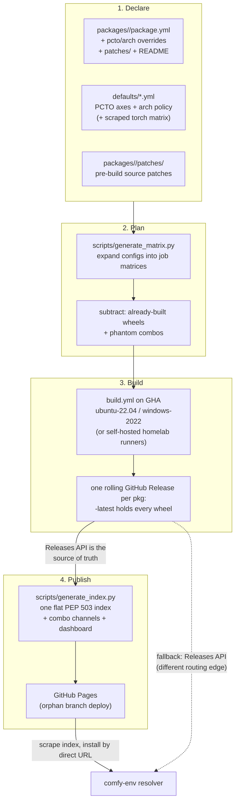

# The build process

From a YAML config to a wheel a resolver can find: what runs, where it
lands, and what to check when it breaks.

## Where do the files live?

```text
cuda-wheels/                          (the Comfy-Forge line's layout)
├── defaults/            WHAT the farm builds, farm-wide
│   ├── python_cuda_torch_os_policy.yml  the PCTO axes: owned policy
│   │                                    (platforms, python bounds,
│   │                                    supported_cudas, defaults) + the
│   │                                    GENERATED combinations rows
│   ├── arch_policy.yml                  the owned arch policy + exceptions,
│   │                                    read at BUILD time (CW-ADR-0012)
│   ├── scraped_torch_matrix.json        what upstream ships (the committed
│   │                                    PCWM snapshot -- derivation input)
│   ├── phantom_combos.json              cells upstream never shipped
│   │                                    (GENERATED by derive_defaults.py)
├── packages/            one FOLDER per package = the complete unit
│   ├── flash_attn/
│   │   ├── package.yml          source repo, tag, build knobs
│   │   ├── arch_override.yml    arch_list / arch_list_by_cuda (optional)
│   │   └── patches/             pre-build source patches (optional)
│   ├── natten/
│   │   ├── package.yml
│   │   ├── pcto_override.yml    build_matrix / min_pytorch / links_torch
│   │   ├── arch_override.yml
│   │   ├── patches/natten.py
│   │   └── README.md            this package's quirks (rendered in-folder)
│   └── ...                      one folder per package
│
├── scripts/             the machinery
│   ├── package_loader.py            ONE loader: folders + overrides ->
│   │                                the same flat config dict everywhere
│   ├── generate_matrix.py           configs  -> CI job matrix
│   ├── derive_defaults.py           scraped matrix + policy -> generated rows
│   ├── torch_watch.py               daily upstream-combo watcher (reports)
│   ├── fetch_torch_matrix.py        scrape upstream / render the matrix page
│   ├── generate_index.py            releases -> PEP 503 index (into _site/)
│   ├── generate_dashboard.py        releases -> dashboard page
│   └── audit.py                     one audit command, three lenses:
│                                    --gaps / --naming / --archs
│
├── .github/
│   ├── workflows/
│   │   ├── build.yml                the build entry point (workflow_dispatch)
│   │   ├── _chain_link.yml          one sequential-checkpoint chain link
│   │   ├── _chain_link_windows.yml  its Windows twin (win_amd64, PS host)
│   │   ├── update-index.yml         build _site/ + deploy to gh-pages
│   │   ├── torch-matrix.yml         refresh the PCWM snapshot + dry-run
│   │   │                            the grid derivation (issue on rot)
│   │   ├── torch-watch.yml          daily: report new upstream combos
│   │   └── get-sources.yml          publish patched sources for inspection
│   └── actions/
│       ├── setup-cuda/              install + cache a CUDA toolkit
│       ├── setup-build-env/         python, torch, build deps
│       └── build-wheel/             checkout, patch, compile, repair, rename
│
└── README.md
```

Every file in that tree is real -- follow the examples instead of
imagining them:

| Kind | Live example |
|---|---|
| `package.yml` | [flash_attn](https://github.com/Comfy-Forge/cuda-wheels/blob/main/packages/flash_attn/package.yml) (plain) · [llama_cpp_python](https://github.com/Comfy-Forge/cuda-wheels/blob/main/packages/llama_cpp_python/package.yml) (torch-free, checkpointed) |
| `pcto_override.yml` | [natten](https://github.com/Comfy-Forge/cuda-wheels/blob/main/packages/natten/pcto_override.yml) (min_pytorch) · [vllm](https://github.com/Comfy-Forge/cuda-wheels/blob/main/packages/vllm/pcto_override.yml) (own build_matrix) |
| `arch_override.yml` | [sageattention](https://github.com/Comfy-Forge/cuda-wheels/blob/main/packages/sageattention/arch_override.yml) (the sm_89/FP8 essay) · [pyg_lib](https://github.com/Comfy-Forge/cuda-wheels/blob/main/packages/pyg_lib/arch_override.yml) (per-CUDA floors) |
| a patch | [natten.py](https://github.com/Comfy-Forge/cuda-wheels/blob/main/packages/natten/patches/natten.py) (env-var injection) · [drtk.py](https://github.com/Comfy-Forge/cuda-wheels/blob/main/packages/drtk/patches/drtk.py) (MSVC flags) |
| a package `README.md` | [natten](https://github.com/Comfy-Forge/cuda-wheels/blob/main/packages/natten/README.md) · [diso](https://github.com/Comfy-Forge/cuda-wheels/blob/main/packages/diso/README.md) (why *no* override) |
| the defaults | [python_cuda_torch_os_policy.yml](https://github.com/Comfy-Forge/cuda-wheels/blob/main/defaults/python_cuda_torch_os_policy.yml) · [arch_policy.yml](https://github.com/Comfy-Forge/cuda-wheels/blob/main/defaults/arch_policy.yml) · [defaults/README.md](https://github.com/Comfy-Forge/cuda-wheels/blob/main/defaults/README.md) |

**The website is not in main.** The PEP 503 index, dashboard and matrix
page are built into `_site/` at deploy time and exist only on the
`gh-pages` branch; the shorter-index guard compares against a checkout of
the live branch, and the matrix page renders from the committed
`scraped_torch_matrix.json` without touching upstream.


Two rules keep this tidy, and both are load-bearing:

- **`packages/` is declarative.** A package is data, never a shell script
  ([CW-ADR-0001](adr/0001-declarative-package-configs.md)).
- **A package's `patches/` is the only place source is modified**, as
  idempotent Python scripts co-located with the config. Upstream source is
  never forked to fix a build.

## How does a package become build jobs?

Five steps, each **subtracting** from the one before:

| # | Step | Source | Result |
|---|---|---|---|
| 1 | **Upstream truth** | `fetch_torch_matrix.py` scrapes PyTorch's wheel index | every combo torch actually shipped |
| 2 | **The shared grid** | `defaults/python_cuda_torch_os_policy.yml` | 21 `(cuda, torch)` pairings = **190 combos** |
| 3 | **Package overrides** | the package's own `combinations`, `platforms`, `min_pytorch`, `arch_list_by_cuda` | a narrowed grid, if declared |
| 4 | **Minus phantom combos** | curated denylist ([CW-ADR-0007](adr/0007-phantom-combos-denylist.md)) | −11 that upstream never shipped = **179 buildable** |
| 5 | **Minus already built** | `generate_matrix.py` queries the rolling release | only the missing combos |

!!! note "The arithmetic is stable; the numbers are not"
    190 and 179 are today's values. They move whenever PyTorch adds a
    CUDA/torch pairing or a Python version. What does not change is the
    shape: **declared, minus never-shipped, minus already-built.**

Step 5 is what makes builds **resumable and incremental**. Re-dispatching a
package builds only what is missing; a fully built package produces an empty
matrix. `--overwrite` skips the check.

The shared grid looks like this -- most packages define no matrix of their own
and simply inherit it:

```yaml
combinations:
  - cuda: "12.8"
    pytorch: "2.8.0"
    python_versions: ["3.10", "3.11", "3.12", "3.13"]
    arch_list: "7.0;7.5;8.0;8.6;9.0+PTX;10.0;12.0+PTX"
platforms: ["linux", "windows"]
```

## What happens after a build?

!!! info ""
    *The index deploy at the end of this pipeline is **opt-in** (a build
    dispatched with `update_index=true`): by default a build run cannot
    touch the live index. Wheels land in the rolling release immediately;
    the index catches up on the next **Update Index** run (push to main or
    manual dispatch).*




## What do the wheel names mean?

```
<pkg>-<version>+cu<CCC>torch<M.m>-cp<PY>-cp<PY>-<platform>.whl

flash_attn-2.8.3+cu124torch2.4-cp311-cp311-win_amd64.whl
gsplat-1.5.3+cu124torch2.4-cp310-cp310-manylinux_2_34_x86_64....whl
```

- The local version tag `+cu128torch2.9` **encodes the CUDA/torch combo**.
  (The old farm's index also served dot-stripped `torch29` names as a "v1"
  compat shim; the Comfy-Forge line serves one index with real filenames
  only.)
- The wheel's internal `METADATA` version is **patched to match the filename**
  so pip/uv see a consistent version
  ([CW-ADR-0004](adr/0004-combo-encoded-versions-and-metadata-patching.md)).
- Linux wheels go through **`auditwheel repair`** to `manylinux_2_35`,
  excluding libcuda/libtorch -- those must come from the host.
- Builds pin exactly `torch==<ver>+cu<short>` from PyTorch's own index, so every
  wheel is **tied to a torch family** -- the same pin comfy-env replicates into
  its generated environments.

## A build failed. What do I check?

| Question | Command |
|---|---|
| What is declared but not built? | `python scripts/audit.py --gaps -v` |
| ...ignoring a torch release still rolling out? | `python scripts/audit.py --gaps --exclude-torch 2.11` |
| Do the wheels contain the architectures they claim? | `python scripts/audit.py --archs --package <name>` |
| Are filenames and versions consistent? | `python scripts/audit.py --naming` |
| Everything at once | `python scripts/audit.py --all` |

!!! warning "One known blind spot"
    `audit.py --archs` scans for architecture markers inside the compiled
    binary. nvcc compresses device code by default from CUDA 12.8 (and some
    packages pass `-Xfatbin -compress-all` explicitly), so the scan may find
    nothing at all -- such wheels report as UNVERIFIED, not MISMATCH.
    **Confirm with `cuobjdump` before drawing conclusions:**

    ```bash
    cuobjdump --list-elf <extracted .so or .pyd> | grep -o 'sm_[0-9]*' | sort -u
    ```

If a failure is clustered by CUDA version rather than scattered, suspect the
**arch list** -- the cu124 and cu126 default lists start at sm_50, and older
GPU architectures lack primitives newer code assumes (see the `diso` /
`atomicAdd` case in [What combos do we compile for?](coverage.md#what-combos-do-we-compile-for)).

### What if a compile takes longer than 6 hours?

Builds default to GHA-hosted runners; a `runner` input switches to
self-hosted homelab machines. Long CUDA compiles get three escape hatches
([CW-ADR-0006](adr/0006-fitting-cuda-compiles-into-hosted-ci.md)):

1. **Disk freeing** -- the runner's dotnet/android/ghc/swift images are
   deleted up front.
2. **Sharding (`sharding: N`)** -- the primary fix, and since
   [CW-ADR-0014](adr/0014-zero-shim-sharding.md) a one-line opt-in: a
   wrapper in the nvcc seat hash-partitions translation units across N
   jobs; shards hand off their **compiler cache** (not the build tree);
   the link job unions the caches, replays the build as hits, links one
   ordinary fat wheel, and **fails loudly below a 90% hit rate**. A
   flash-attention cell at `sharding: 4` is four ~80-minute jobs plus a
   minutes-long link. Windows uses the older generic source-list
   injection with `.obj` handling and `LINK=/FORCE:UNRESOLVED` at shard
   stage.
3. **Sequential checkpointing (`sequential_checkpoint: <seconds>`)** --
   for builds sharding cannot touch: the compile runs under `timeout`;
   on expiry the ENTIRE source tree (PAX tar, nanosecond mtimes -- ninja's
   restat check demands them) goes to an artifact and the next chain link
   restores it and continues. Both platforms are wired: `build.yml`
   carries **6 links per platform** (`_chain_link.yml` /
   `_chain_link_windows.yml`), and the two users -- flashinfer and
   llama_cpp_python -- checkpoint every **3 hours**, so a chain can
   absorb up to 18h of compile. A finished chain skips its remaining
   links at zero cost.

!!! note "Sharding vs checkpointing — how to choose"
    Sharding intercepts the flat `.cu` list inside torch's
    `cpp_extension` build, so it only works for packages that build
    through that path. CMake/ninja trees (flashinfer's AOT cache,
    llama_cpp_python's GGML build) are opaque to the shim -- but their
    incremental state is exactly what makes checkpoint/resume reliable.
    Rule of thumb: cpp_extension -> `sharding: N`; CMake/ninja that
    exceeds 6h -> `sequential_checkpoint`.

Three caps to know, all discovered the hard way:

- **6 hours per job** on GitHub-hosted runners, immovable.
- **A hidden default of 6 hours everywhere else too**: GitHub sets
  `timeout-minutes: 360` by default *even on self-hosted runners*. The
  build jobs set `timeout-minutes: 2880` so the homelab actually gets its
  long-job capability.
- **24 hours maximum queue wait** -- a job queued longer is discarded.
  Don't dispatch more than the runner pool clears in a day.
- **256 entries per job matrix** -- cells x shards per dispatch must stay
  under it; an oversized matrix fails the run *with every listed job
  green*, because the offending job is never created. Slice full-grid
  overwrites of sharded packages with the cuda/pytorch/python filters.

## How do I add a package?

A folder under `packages/`, holding a `package.yml` plus optional override
files and patches:

```yaml
# packages/flash_attn/package.yml
name: flash_attn
links_torch: true   # REQUIRED: the loader hard-errors if undeclared
source_repo: Dao-AILab/flash-attention
source_tag: v2.8.3
patch_script: packages/flash_attn/patches/flash_attn.py
extra_deps: psutil
nvcc_flags: -diag-suppress 221
```

```yaml
# packages/flash_attn/arch_override.yml  (optional)
arch_list_by_cuda:
  '12.4': 8.0 9.0+PTX
  '12.8': 8.0 9.0 10.0 12.0+PTX
```

!!! warning "The loader enforces two contracts"
    `package_loader.py` refuses (hard error, not a warning) any package
    that **does not declare `links_torch`**, and any package carrying a
    `pcto_override.yml` or `arch_override.yml` **without a `README.md`
    that explains the override** (an `## Overrides` section). Every
    deviation from `defaults/` must say why.

Then dispatch it -- **narrow first**, to prove the recipe on one combination
before opening it to the whole grid:

```bash
gh workflow run build.yml -f package=flash_attn -f cuda=12.8 -f pytorch=2.8
gh workflow run build.yml -f package=flash_attn        # full grid
```

!!! warning "The package list is an enum"
    `build.yml` declares `package` as a `choice` input. A new package **must be
    added to that list** or dispatch is rejected.

### Config fields

| Field | Purpose |
|---|---|
| `source_repo` / `source_tag` | where the source comes from. **Pin a commit or tag** -- a floating `main` means the wheels in one release need not come from the same source |
| `build_subdir` | build from a subdirectory, for extensions inside a larger repo |
| `patch_script` | Python run against the checked-out source before building |
| `clone_recursive` | clone submodules |
| `extra_deps` | extra pip build dependencies |
| `nvcc_flags` | appended to the nvcc command line |
| `arch_list` / `arch_list_by_cuda` | in `arch_override.yml`: override the inherited GPU architectures |
| `min_pytorch` | in `pcto_override.yml`: floor, for packages that do not support older torch |
| `sharding: N` | split one cell's compile across N parallel jobs + a link job — the **entire** opt-in on Linux ([CW-ADR-0014](adr/0014-zero-shim-sharding.md)); see [the 6-hour cap](#what-if-a-compile-takes-longer-than-6-hours) |
| `sequential_checkpoint` | timeout-and-resume chain, 6 links per platform (flashinfer/llama_cpp use 10800 = 3h links) — see [the 6-hour cap](#what-if-a-compile-takes-longer-than-6-hours) |
| `links_torch` | **required.** `false` = never links libtorch: built once per (cuda, python, platform), listed under every torch ([CW-ADR-0011](adr/0011-torch-independent-packages.md)) |

`packages/README.md` is the authoritative reference; each package folder's `README.md`
collects per-package quirks.
