# cuda-wheels

[cuda-wheels](https://github.com/PozzettiAndrea/cuda-wheels) is a **prebuilt
CUDA wheel farm**: "Pre-built CUDA Python wheels for ML/3D packages that are
painful to compile from source" -- flash-attn, nvdiffrast, pytorch3d, gsplat,
sageattention, spconv and friends. Wheels are compiled across the
python x torch x CUDA x OS matrix on GitHub Actions, stored in GitHub
Releases, and served as a PEP 503 pip index from GitHub Pages.

Links: [Package Index v2](https://pozzettiandrea.github.io/cuda-wheels/v2/) ·
[Dashboard](https://pozzettiandrea.github.io/cuda-wheels/dashboard/) ·
[Install Helper](https://pozzettiandrea.github.io/cuda-wheels/dashboard/install.html) ·
[Full Build Matrix](https://pozzettiandrea.github.io/cuda-wheels/matrix/)

**Scale** (current snapshot): ~39 package configs, ~27 packages published,
**3,400+ wheels**. The shared grid covers CUDA 12.4-13.0, torch 2.4-2.11
(22 valid cuda/torch pairings), Python 3.10-3.14, Linux + Windows.

## The pipeline

```mermaid
flowchart LR
    subgraph declare["1. Declare"]
        yml["packages/&lt;name&gt;.yml<br/>source repo+tag, patches,<br/>deps, arch lists, sharding"]
        defaults["packages/_defaults.yml<br/>shared cuda x torch x python grid,<br/>arch-list policy"]
        patch["patches/&lt;name&gt;.py<br/>pre-build source patches"]
    end
    subgraph plan["2. Plan"]
        gen["scripts/generate_matrix.py<br/>expand configs into job matrices"]
        skip["subtract: already-built wheels<br/>(Releases API) + phantom combos<br/>(upstream torch never shipped)"]
    end
    subgraph build["3. Build"]
        gha["build.yml on GHA<br/>ubuntu-22.04 / windows-2022<br/>(or self-hosted homelab runners)"]
        rel["one rolling GitHub Release per pkg:<br/>&lt;pkg&gt;-latest holds every wheel"]
    end
    subgraph publish["4. Publish"]
        idx["scripts/generate_index.py<br/>PEP 503 static index (v2 + v1 shim)<br/>+ dashboard"]
        pages["GitHub Pages<br/>(orphan branch deploy)"]
    end
    declare --> gen
    gen --> skip --> gha --> rel
    rel -->|"Releases API is the<br/>source of truth"| idx --> pages

    consumer["comfy-env resolver"]
    pages -->|"scrape index, install by direct URL"| consumer
    rel -.->|"fallback: Releases API<br/>(different routing edge)"| consumer
```

Four stages, each with a clear file owner:



## Declaring a package

A package is a declarative YAML config plus an optional Python patch script
-- no per-package shell scripts:

```yaml
# packages/flash_attn.yml
name: flash_attn
source_repo: Dao-AILab/flash-attention
source_tag: v2.8.3
patch_script: patches/flash_attn.py
extra_deps: psutil
nvcc_flags: -diag-suppress 221
arch_list_by_cuda:
  '12.4': 8.0 9.0+PTX
  '12.8': 8.0 9.0 10.0 12.0+PTX
```

`packages/README.md` in the repo is the authoritative "how to add a package"
reference; `notes/packages.md` collects per-package quirks and constraints.

**GPU arch-list policy:** each combo's `arch_list` mirrors PyTorch's official
`build_cuda.sh` for that release, with one deliberate override -- `+PTX` is
always added to the highest base architecture so wheels stay JIT-compatible
with future GPUs even after PyTorch rotates `+PTX` off a maturing toolchain.

## Fitting CUDA compiles into GitHub's 6-hour cap

Builds default to GHA-hosted runners (a `runner` input switches to
self-hosted `[self-hosted, linux, cuda]` / `[self-hosted, windows]`
homelab machines). Multi-hour CUDA compiles get three escape hatches:

1. **Disk freeing** -- the runner's dotnet/android/ghc/swift images are
   deleted up front.
2. **Sharding** (`sharding: N`) -- N jobs each compile a subset of `.cu`
   files and upload object tarballs; a link-only job assembles the wheel.
3. **Sequential checkpointing** (`sequential_checkpoint: <seconds>`) -- the
   compile runs under `timeout`; on expiry the whole `build/` tree is
   uploaded as an artifact and a chained follow-up job
   (`_chain_link.yml`) resumes where it left off.

## Wheel naming and versioning

```
<pkg>-<version>+cu<CCC>torch<M.m>-cp<PY>-cp<PY>-<platform>.whl

flash_attn-2.8.3+cu124torch2.4-cp311-cp311-win_amd64.whl
gsplat-1.5.3+cu124torch2.4-cp310-cp310-manylinux_2_34_x86_64....whl
```

- The local version tag `+cu128torch2.9` encodes the CUDA/torch combo (v2
  keeps the dot in the torch version; the v1 index stripped it and survives
  as a compat shim).
- The wheel's internal `METADATA` version is **patched to match the
  filename** (`scripts/patch_wheel_version.py` rewrites `Version:`, renames
  `.dist-info`, rebuilds `RECORD` hashes) so pip/uv see a consistent version.
- Linux wheels go through `auditwheel repair` to `manylinux_2_35`, excluding
  libcuda/libtorch (those must come from the host).
- Builds pin exactly `torch==<ver>+cu<short>` from PyTorch's own index, so
  every wheel is tied to a torch family -- the same family pin comfy-env
  replicates into its generated environments.

## How comfy-env consumes it

comfy-env does not use `--index-url`: its resolver
(`comfy_env/packages/cuda_wheels.py`) **scrapes the v2 index HTML** for the
package, filters by `+cu<short>torch<M.m>`, `cp<PY>` and platform tags
(preferring manylinux), and installs the matched wheel **by direct
GitHub-Releases URL** with `--no-deps` -- or inlines that URL into the
generated pixi manifest.

Resilience, in order:

1. Requests carry a real User-Agent (`comfy-env/<version>`) and retry with
   backoff -- corporate proxies and AV products RST `Python-urllib`.
2. If GitHub Pages is unreachable end-to-end, the resolver falls back to the
   **GitHub Releases API** (`api.github.com`) -- a different routing edge
   that often works when the Pages CDN is blocked -- and applies the same
   filename filters.
3. Combo selection is two-tier: try the host's exact
   (python, cuda, torch) first; if any needed package lacks a wheel for it,
   fall back to a known-good combo (currently cu12.8 / torch 2.8).

A registry seam (`WHEEL_INDEX_REGISTRY`) already exists on the consumer side
so a future ROCm index is one dict entry
([the accelerator-agnostic note](../comfy-env/index.md#cuda-prebuilt-wheels-and-conda-packages)).
