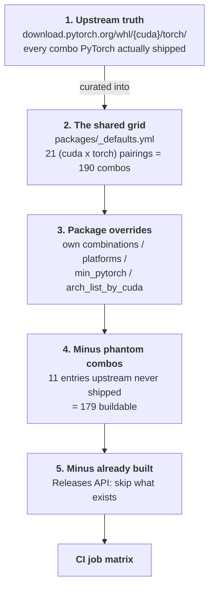

# cuda-wheels

[cuda-wheels](https://github.com/PozzettiAndrea/cuda-wheels) is a **prebuilt
CUDA wheel farm**.

Its purpose, in one sentence:

!!! abstract "The aim"
    Build every package that is painful to compile from source, **for every
    version combination PyTorch ships for a given accelerator**, cheaply and
    on repeat -- so that installing them is a download instead of a compile.

"Every combination" is the important half. A CUDA extension is not portable
across Python versions, torch versions, CUDA versions or operating systems: it
must be compiled against the exact `(python, torch, cuda, os)` the user is
running. Upstream projects typically publish either nothing or one lucky
combination, so everyone else compiles from source -- twenty minutes to several
hours, a working CUDA toolkit, and on Windows a Visual Studio install.

This repository does that compiling once, in CI, across the whole grid, and
publishes the results as an ordinary pip index.

## The problem in concrete terms

Take a node pack that needs `nvdiffrast`, `pytorch3d`, `flash-attn` and
`spconv`. Without prebuilt wheels, installing it means four source builds, each
needing `nvcc`, each able to fail in its own way. That is the single largest
cause of "this node pack won't install" -- and it is why the farm exists:
[comfy-env](../comfy-env/index.md) creates an isolated environment per node
pack, and those environments have to be fillable **without a compiler on the
user's machine**.

So the consumer story is the design constraint. A pack declares what it needs:

```toml
# nodes/comfy-env.toml
[cuda]
packages = ["nvdiffrast", "pytorch3d", "flash_attn", "spconv"]
```

and comfy-env resolves those names against this index for the user's exact
`(python, torch, cuda, os)`. No `nvcc`, no Visual Studio, no waiting.

## Scale

A snapshot, not a fixed target -- the farm grows as packages and torch releases
are added:

| | |
|---|---|
| package configs | **43** (plus `_defaults.yml`) |
| packages published | **40** |
| wheels published | **~5,800** |
| grid per package | **179** buildable combos |
| coverage | CUDA 12.4-13.0 x torch 2.4-2.11 x Python 3.10-3.14 x {Linux, Windows} |

Links: [Package Index v2](https://pozzettiandrea.github.io/cuda-wheels/v2/) ·
[Dashboard](https://pozzettiandrea.github.io/cuda-wheels/dashboard/) ·
[Install Helper](https://pozzettiandrea.github.io/cuda-wheels/dashboard/install.html) ·
[Full Build Matrix](https://pozzettiandrea.github.io/cuda-wheels/matrix/)

Design decisions are recorded in the
[cuda-wheels ADR series](adr/index.md).

## Repository layout

```text
cuda-wheels/
├── packages/            WHAT to build -- one YAML per package
│   ├── _defaults.yml       the shared grid + arch-list policy
│   ├── nvdiffrast.yml      source repo, tag, build knobs
│   ├── flash_attn.yml
│   └── README.md           authoritative "how to add a package" reference
│
├── patches/             HOW to fix it -- one Python script per package
│   └── flash_attn.py       runs on the checked-out source before building
│
├── scripts/             the machinery
│   ├── generate_matrix.py         configs  -> CI job matrix
│   ├── fetch_torch_matrix.py      what torch actually ships (upstream truth)
│   ├── fetch_pytorch_arch_lists.py  authoritative TORCH_CUDA_ARCH_LIST
│   ├── generate_index.py          releases -> PEP 503 index
│   ├── generate_dashboard.py      releases -> dashboard page
│   ├── patch_wheel_version.py     align wheel METADATA with its filename
│   ├── gap_analysis.py            declared vs published: what is missing
│   ├── audit_wheel_archs.py       verify compiled SASS archs in each wheel
│   ├── check_wheels.py            naming/version sanity checks
│   └── inspect_all_wheels.py      cluster wheels by internal structure
│
├── .github/
│   ├── workflows/
│   │   ├── build.yml              the build entry point (workflow_dispatch)
│   │   ├── _chain_link*.yml       resume a compile that hit the 6h cap
│   │   ├── update-index.yml       regenerate + deploy the index on push
│   │   ├── get-sources.yml        publish patched sources for inspection
│   │   └── inspect-all-wheels.yml
│   └── actions/
│       ├── setup-cuda/            install + cache a CUDA toolkit
│       ├── setup-build-env/       python, torch, build deps
│       └── build-wheel/           checkout, patch, compile, repair, rename
│
├── docs/                the published GitHub Pages site (PEP 503 index)
├── notes/packages.md    per-package quirks and constraints
└── README.md
```

Two rules keep this tidy, and both are load-bearing:

- **`packages/` is declarative.** A package is data, never a shell script. See
  [CW-ADR-0001](adr/0001-declarative-package-configs.md).
- **`patches/` is the only place source is modified**, as an idempotent Python
  script. Upstream source is never forked to fix a build.

## Where the build matrix comes from

This is the heart of the repo: how a package name becomes a list of CI jobs.
Five steps, each subtracting from the one before.



**1. Upstream truth.** `fetch_torch_matrix.py` scrapes PyTorch's own wheel
index for each CUDA version and records every `(cuda, torch, python, platform)`
they actually published. This is what the
[Full Build Matrix](https://pozzettiandrea.github.io/cuda-wheels/matrix/) page
shows. Nothing can be built for a combination torch itself does not exist for.

**2. The shared grid.** `packages/_defaults.yml` curates that into the grid the
farm commits to -- currently **21 valid `(cuda, torch)` pairings**, each with
its own Python list:

```yaml
combinations:
  - cuda: "12.8"
    pytorch: "2.8.0"
    python_versions: ["3.10", "3.11", "3.12", "3.13"]
    arch_list: "7.0;7.5;8.0;8.6;9.0;10.0;12.0+PTX"
platforms: ["linux", "windows"]
```

Multiplied out, that is **190 combos** per package. Most packages define no
matrix of their own and simply inherit this.

**3. Package overrides.** A package YAML may narrow or replace it -- its own
`combinations`, a `platforms` subset, a `min_pytorch` floor, or
`arch_list_by_cuda` when it supports fewer GPU architectures than torch does.
`sageattn3` for example is Blackwell-only, so it declares `arch_list:
10.0 12.0+PTX` and a cu128+ matrix.

**4. Minus phantom combos.** Some cells look valid but were never shipped by
upstream -- there is no `torch 2.11+cu129` for Windows, for instance. These
live in a curated denylist so the farm does not endlessly retry builds that
cannot succeed ([CW-ADR-0007](adr/0007-phantom-combos-denylist.md)). 190 − 11 =
**179 buildable combos** per package.

**5. Minus already built.** `generate_matrix.py` queries the package's rolling
release and drops every combo already present. This makes builds resumable and
incremental: re-dispatching a package builds only what is missing, and a fully
built package produces an empty matrix. `--overwrite` skips this check.

### Where arch lists come from

`TORCH_CUDA_ARCH_LIST` decides which GPU architectures get compiled in, and
getting it wrong is silent -- the wheel installs and then fails at runtime on
an unlisted GPU. So it is not guessed:
`fetch_pytorch_arch_lists.py` pulls PyTorch's own
`.ci/manywheel/build_cuda.sh` at each release tag, evaluates the relevant
`case ${CUDA_VERSION}` block in bash, and reads the resulting value. That is
the authoritative answer for what a matching torch build contains.

One deliberate deviation: **`+PTX` is always appended to the highest base
architecture.** PyTorch adds `+PTX` only on the frontier toolchain and rotates
it off as toolchains mature; keeping it everywhere means the wheels stay
JIT-compatible with GPUs newer than the toolchain that built them
([CW-ADR-0005](adr/0005-shared-grid-and-arch-list-policy.md)).

## The pipeline

```mermaid
flowchart LR
    subgraph declare["1. Declare"]
        yml["packages/&lt;name&gt;.yml<br/>source repo+tag, patches,<br/>deps, arch lists, sharding"]
        defaults["packages/_defaults.yml<br/>shared cuda x torch x python grid,<br/>arch-list policy"]
        patch["patches/&lt;name&gt;.py<br/>pre-build source patches"]
    end
    subgraph plan["2. Plan"]
        gen["scripts/generate_matrix.py<br/>expand configs into job matrices"]
        skip["subtract: already-built wheels<br/>(Releases API) + phantom combos<br/>(upstream torch never shipped)"]
    end
    subgraph build["3. Build"]
        gha["build.yml on GHA<br/>ubuntu-22.04 / windows-2022<br/>(or self-hosted homelab runners)"]
        rel["one rolling GitHub Release per pkg:<br/>&lt;pkg&gt;-latest holds every wheel"]
    end
    subgraph publish["4. Publish"]
        idx["scripts/generate_index.py<br/>PEP 503 static index (v2 + v1 shim)<br/>+ dashboard"]
        pages["GitHub Pages<br/>(orphan branch deploy)"]
    end
    declare --> gen
    gen --> skip --> gha --> rel
    rel -->|"Releases API is the<br/>source of truth"| idx --> pages

    consumer["comfy-env resolver"]
    pages -->|"scrape index, install by direct URL"| consumer
    rel -.->|"fallback: Releases API<br/>(different routing edge)"| consumer
```



## Declaring a package

A package is a declarative YAML config plus an optional Python patch script --
no per-package shell scripts:

```yaml
# packages/flash_attn.yml
name: flash_attn
source_repo: Dao-AILab/flash-attention
source_tag: v2.8.3
patch_script: patches/flash_attn.py
extra_deps: psutil
nvcc_flags: -diag-suppress 221
arch_list_by_cuda:
  '12.4': 8.0 9.0+PTX
  '12.8': 8.0 9.0 10.0 12.0+PTX
```

Common fields:

| Field | Purpose |
|---|---|
| `source_repo` / `source_tag` | where the source comes from. **Pin a commit or tag** -- a floating `main` means the wheels in one release need not come from the same source |
| `build_subdir` | build from a subdirectory, for extensions that live inside a larger repo |
| `patch_script` | Python run against the checked-out source before building |
| `clone_recursive` | clone submodules |
| `extra_deps` | extra pip build dependencies |
| `nvcc_flags` | appended to the nvcc command line |
| `arch_list` / `arch_list_by_cuda` | override the inherited GPU architectures |
| `min_pytorch` | floor, for packages that do not support older torch |
| `sharding` / `sequential_checkpoint` | see the CI section below |

Then dispatch it:

```bash
gh workflow run build.yml -f package=flash_attn
gh workflow run build.yml -f package=flash_attn -f cuda=12.8 -f pytorch=2.8
```

Filters (`cuda`, `pytorch`, `python`, `platform`) narrow the matrix, which is
the normal way to prove a new recipe on one combination before opening it to
the full grid.

!!! note "The package list is an enum"
    `build.yml` declares `package` as a `choice` input, so a new package must
    be added to that list or dispatch is rejected.

`packages/README.md` in the repo is the authoritative reference;
`notes/packages.md` collects per-package quirks.

## Fitting CUDA compiles into GitHub's 6-hour cap

Builds default to GHA-hosted runners (a `runner` input switches to self-hosted
`[self-hosted, linux, cuda]` / `[self-hosted, windows]` homelab machines).
Multi-hour CUDA compiles get three escape hatches
([CW-ADR-0006](adr/0006-fitting-cuda-compiles-into-hosted-ci.md)):

1. **Disk freeing** -- the runner's dotnet/android/ghc/swift images are deleted
   up front.
2. **Sharding** (`sharding: N`) -- N jobs each compile a subset of `.cu` files
   and upload object tarballs; a link-only job assembles the wheel.
3. **Sequential checkpointing** (`sequential_checkpoint: <seconds>`) -- the
   compile runs under `timeout`; on expiry the whole `build/` tree is uploaded
   as an artifact and a chained follow-up job (`_chain_link.yml`) resumes where
   it left off.

## Wheel naming and versioning

```
<pkg>-<version>+cu<CCC>torch<M.m>-cp<PY>-cp<PY>-<platform>.whl

flash_attn-2.8.3+cu124torch2.4-cp311-cp311-win_amd64.whl
gsplat-1.5.3+cu124torch2.4-cp310-cp310-manylinux_2_34_x86_64....whl
```

- The local version tag `+cu128torch2.9` encodes the CUDA/torch combo (v2 keeps
  the dot in the torch version; the v1 index stripped it and survives as a
  compat shim).
- The wheel's internal `METADATA` version is **patched to match the filename**
  (`scripts/patch_wheel_version.py` rewrites `Version:`, renames `.dist-info`,
  rebuilds `RECORD` hashes) so pip/uv see a consistent version
  ([CW-ADR-0004](adr/0004-combo-encoded-versions-and-metadata-patching.md)).
- Linux wheels go through `auditwheel repair` to `manylinux_2_35`, excluding
  libcuda/libtorch (those must come from the host).
- Builds pin exactly `torch==<ver>+cu<short>` from PyTorch's own index, so every
  wheel is tied to a torch family -- the same family pin comfy-env replicates
  into its generated environments.

## Checking the farm's health

Four scripts answer the questions that actually come up:

| Question | Command |
|---|---|
| What is declared but not built? | `python scripts/gap_analysis.py -v` |
| ...ignoring a torch release still rolling out? | `python scripts/gap_analysis.py --exclude-torch 2.11` |
| Do the wheels contain the GPU architectures they claim? | `python scripts/audit_wheel_archs.py --package <name>` |
| Are the filenames and versions consistent? | `python scripts/check_wheels.py` |

!!! warning "One known false positive"
    `audit_wheel_archs.py` scans for architecture markers inside the compiled
    binary. Packages built with `-Xfatbin -compress-all` store their cubins
    compressed, and the scan cannot see through that -- they report as
    MISMATCH with an empty SASS list. Confirm with
    `cuobjdump --list-elf <.so|.pyd>` before believing it.

## How comfy-env consumes it

comfy-env does not use `--index-url`: its resolver
(`comfy_env/packages/cuda_wheels.py`) **scrapes the v2 index HTML** for the
package, filters by `+cu<short>torch<M.m>`, `cp<PY>` and platform tags
(preferring manylinux), and installs the matched wheel **by direct
GitHub-Releases URL** with `--no-deps` -- or inlines that URL into the generated
pixi manifest.

Resilience, in order:

1. Requests carry a real User-Agent (`comfy-env/<version>`) and retry with
   backoff -- corporate proxies and AV products RST `Python-urllib`.
2. If GitHub Pages is unreachable end-to-end, the resolver falls back to the
   **GitHub Releases API** (`api.github.com`) -- a different routing edge that
   often works when the Pages CDN is blocked -- and applies the same filename
   filters.
3. Combo selection is two-tier: try the host's exact `(python, cuda, torch)`
   first; if any needed package lacks a wheel for it, fall back to a known-good
   combo (currently cu12.8 / torch 2.8).

A registry seam (`WHEEL_INDEX_REGISTRY`) already exists on the consumer side so
a future ROCm index is one dict entry
([the accelerator-agnostic note](../comfy-env/index.md#cuda-prebuilt-wheels-and-conda-packages)).
