# cuda-wheels

[cuda-wheels](https://github.com/PozzettiAndrea/cuda-wheels) is a repo which makes use of free GitHub workers to compile popular CUDA packages like flash-attention or pytorch3d across every version combination that PyTorch itself ships, and serves them as an ordinary pip index.

!!! abstract "The aim"
    Build popular packages that are painful to compile from source, **for every
    version combination PyTorch ships for CUDA**, cheaply and on repeat -- so
    that installing them is a download instead of a compile.

**Live pages:** [Package Index v2](https://pozzettiandrea.github.io/cuda-wheels/v2/) ·
[Dashboard](https://pozzettiandrea.github.io/cuda-wheels/dashboard/) ·
[Install Helper](https://pozzettiandrea.github.io/cuda-wheels/dashboard/install.html) ·
[Full Build Matrix](https://pozzettiandrea.github.io/cuda-wheels/matrix/)

Design decisions live in the [ADR series](adr/index.md); the ways upstream
surprised us are collected in [Upstream quirks](upstream-quirks.md).

## Why can't I just pip install flash-attention?

Worth stating plainly, because it is easy to forget: **C++ and CUDA, unlike
Python, have to be compiled.** A pure-Python package ships `.py` files that
any machine can run as they are.

C++ must first be turned into machine code
**ahead of time, for one specific target** -- and it then only runs where the
assumptions it was built under still hold.

## What assumptions are made when the binary is compiled?

A compiled binary is a **set of promises about the machine it will land on**.
Source code asks for nothing, but a binary says *"I assume a GPU of this
generation, a driver at least this new, this exact Python, and this exact version of my dependencies (often torch)"*

Ship it somewhere one promise does not hold and it fails -- sometimes at
install, sometimes at import, sometimes only when the node finally runs.

There are six, and **each broken promise has its own famous error message**.

flash-attention's kernels are **CUDA C++** -- `.cu` files, a C++ dialect with
device-side extensions. They do not go through gcc or MSVC but through
**`nvcc`**, NVIDIA's proprietary compiler, shipped as part of the versioned
CUDA Toolkit -- and it only does half the job: **host** (CPU) code is handed
off to the platform C++ compiler, while `nvcc` keeps the **device** code.

### 1. "Your GPU speaks my instruction set"

GPUs have instruction sets like CPUs do, except NVIDIA changes theirs *every
generation*: Turing is `sm_75`, Ampere `sm_80`/`sm_86`, Ada `sm_89`, Hopper
`sm_90`, Blackwell `sm_100`/`sm_120`.

`nvcc` emits **SASS** -- real machine code -- separately for *each*
architecture it is asked for, and stuffs them all into one file (a
**fatbinary**). That is why these wheels are so large: the same kernels,
compiled half a dozen times over.

There is an escape hatch. `nvcc` can also emit **PTX**, a portable
intermediate -- think bytecode for GPUs. If a card is newer than anything
baked in, the **driver** JIT-compiles the PTX at runtime: slow first launch,
cached afterwards. That is what a trailing `+PTX` in an arch list buys --
forward compatibility with cards that did not exist when the wheel was built.

!!! failure "`no kernel image is available for execution on the device`"
    "I carry machine code for six GPUs, yours is not one of them, and there
    was no PTX to fall back on."

### 2. "Your driver is new enough"

**"CUDA" is two different products wearing one name**, and the difference is
the most confused point in this whole area.

- **The driver** ships with your GPU driver (`libcuda.so`, `nvcuda.dll`). It
  is the layer that lets the CPU boss the GPU around: allocate VRAM, upload
  data, launch kernels, wait for results. Nothing reaches the GPU without
  going through it, and it is what `nvidia-smi` reports.
- **The CUDA Toolkit** is a developer SDK: `nvcc`, cuBLAS, cuDNN, and the
  *runtime* library `libcudart`. This is what code is **built against**.

The consequence surprises people: **you do not need the CUDA Toolkit installed
to run torch.** Pip-installed torch bundles its own runtime
(`nvidia-cuda-runtime-cu12` and friends), so the toolkit is a *build-time*
dependency only. That is the entire premise of this repo -- it compiles here
so that nobody downstream installs `nvcc`.

So the only thing constraining the machine that *runs* a wheel is the driver,
and since CUDA 11 the rule is **minor version compatibility**: anything built
against any 12.x runs on any driver supporting 12.0. Real floors exist only at
major versions.

| Built against | Driver required |
|---|---|
| CUDA 12.x | R525 or newer |
| CUDA 13.x | R580 or newer |

A `cu128` wheel therefore runs perfectly well on an R535 driver.

!!! question "Then why does anyone update CUDA?"
    Four real reasons, none of them "a wheel demanded it":

    1. **A new GPU does not work on an old driver at all** -- Blackwell needs
       a driver that has heard of Blackwell.
    2. **Crossing a major version** -- 12.x to 13.x is a genuine driver floor.
    3. **Targeting new architectures at build time** -- `nvcc` 12.4 cannot
       emit `sm_100` however nicely you ask; that needs 12.8 or newer.
    4. **Speed** -- newer cuBLAS/cuDNN kernels make the same silicon faster.

!!! failure "`CUDA driver version is insufficient for CUDA runtime version`"
    The driver is older than the runtime the binary was built against.

### 3. "You are running exactly this Python"

CUDA is not callable from Python on its own. What ships is a **C++ shim** that
Python can import and that forwards into the kernels -- and that shim is
compiled against **one specific CPython's** internals: struct layouts,
function tables, reference-counting macros.

CPython changes those between *minor* versions, which makes 3.11 and 3.12 as
incompatible as two different operating systems. The `cp312` in the filename
is not a preference but a hard filter: pip will not even offer that wheel to
a 3.11.

!!! failure "`undefined symbol: PyUnicode_...`"
    More often you never get that far -- pip just reports **no matching
    distribution**, which is the same problem caught earlier.

### 4. "You have exactly this torch"

Very few CUDA packages here are standalone; nearly all are **PyTorch
extensions** that `#include` torch's C++ headers and link `libtorch`, compiled
against torch's actual C++ classes.

C++ has no stable ABI, and PyTorch publishes **no stable C++ ABI** across
releases: class layouts shift, inlined code changes, mangled symbol names
change. An extension built against 2.8 is calling into a `libtorch` that no
longer exists in 2.9. It also compounds -- torch itself is built per CUDA
version, so the extension inherits **torch's version and torch's CUDA version
at once**.

!!! failure "`undefined symbol: _ZN3c104impl...`"
    That mangled name is the tell. It means a torch ABI mismatch specifically,
    not a Python one.

### 5. "Your CPU speaks my instruction set"

Remember that `nvcc` only did half the job. The **host** half -- the C++ that
allocates memory, checks arguments and launches the kernels -- is ordinary CPU
machine code, and it is compiled for one instruction set.

x86-64 and arm64 are different machine languages, as mutually unintelligible
as `sm_75` and `sm_90`. An x86-64 build does not execute on an ARM chip at
all -- there is no PTX-style JIT to save you here.

That is not a hypothetical for CUDA: **Jetson, Grace Hopper and GB200 are
aarch64 machines with NVIDIA GPUs attached.** A wheel can be perfectly correct
about the GPU and still be unloadable because the CPU is the wrong kind.

!!! failure "`... is not a supported wheel on this platform.`"
    pip comparing the filename's tag against your interpreter's own and
    refusing before anything is unpacked.

### 6. "Your OS is the one I was built for"

Same host code, second assumption. `.so` versus `.pyd`. The Itanium C++ ABI
that gcc and clang follow versus MSVC's, which mangle names and pass arguments
differently. Different system libraries entirely. **A Linux build cannot load
on Windows on byte-identical hardware.**

On Linux there is a floor as well as a name: a binary linked against glibc
2.35 will not start on a distro shipping 2.31. `auditwheel` bundles what it
safely can and stamps whatever floor it could not avoid -- often as a dual
tag, e.g. `manylinux_2_34_x86_64.manylinux_2_35_x86_64`.

Both promises land in the same field of the filename:

```text
...-cp312-cp312-win_amd64.whl                 Windows          + x86-64
...-cp312-cp312-manylinux_2_35_x86_64.whl     Linux glibc 2.35 + x86-64
```

!!! failure "`libc.so.6: version 'GLIBC_2.35' not found`"
    The tag matched well enough for pip to install it, and the loader
    disagreed. The glibc floor is the one part of this promise that pip cannot
    fully check up front.

!!! info "What this farm covers"
    Every wheel here is **x86-64**, built on `ubuntu-22.04` and
    `windows-2022`. There are no aarch64 builds, so ARM CUDA hosts (Jetson,
    Grace Hopper) are out of scope today -- and macOS never appears at all,
    since Apple Silicon has no CUDA.

!!! note "torch or PyTorch?"
    Both, for different things. **PyTorch** is the project. **`torch`** is the
    package you `pip install` and `import`. **`libtorch`** is the C++ library
    the extension actually links against. The short import name is inherited
    from **Torch**, the Lua framework PyTorch grew out of -- the "Py" was added
    to the project name, never to the module.

What comes out is one `.so` / `.pyd` bound to all of it at once:

| Bound to | Because |
|---|---|
| **GPU architectures** | the `sm_XX` SASS baked into its fatbinary |
| **CUDA version** | the CUDA runtime it linked against |
| **Python version** (`cp312`) | CPython's C ABI |
| **torch version** | PyTorch ships no stable C++ ABI across releases |
| **CPU architecture** | x86-64 and arm64 are different machine languages |
| **OS** | gcc vs MSVC, `.so` vs `.pyd`, and a glibc floor on Linux |

Change any one and it is a different binary -- and the axes **multiply**, they
do not add:

```text
GPU arch  x  CUDA  x  Python  x  torch  x  CPU  x  OS
```

Six axes, not six builds. That is how one flash-attention source release
becomes **127 wheels** here, each around 240 MB.

Almost nobody upstream publishes that, and it is not laziness. Every cell in
that grid is a **full CUDA compile** -- twenty minutes to several hours of a
machine's life, needing a CUDA toolkit and, on Windows, a Visual Studio
install. Covering the grid means owning a build matrix, runners and hundreds
of gigabytes of release storage, then doing the whole thing again on the next
torch release. That is an infrastructure job, and it has nothing to do with
why anyone wrote the kernels in the first place. So upstream ships nothing, or
one lucky combination, and everyone else compiles from source.

!!! tip "The saving grace: PyTorch already narrowed the grid"
    The space is not actually open-ended. **PyTorch itself only publishes
    builds for a specific set of CUDA, Python and OS combinations**, and an
    extension is only useful if it matches a torch that really exists -- you
    cannot link against a torch nobody can install.

    ComfyUI runs on torch, so this farm never has to guess: it reads what
    PyTorch **actually shipped** and matches it. That turns an explosion into
    a finite, enumerable list -- today **21 `(cuda, torch)` pairings**, which
    is large but knowable in advance and re-derivable whenever upstream moves.
    [How that becomes build jobs](#how-does-a-package-become-build-jobs)
    walks the arithmetic.

## Why does comfy-env need it?

Because compiling is the **single largest cause of "this node pack won't
install."**

The promise [comfy-env](../comfy-env/index.md) makes is that you click install
on a node pack in **ComfyUI Manager and it just runs** -- no build tools to
set up, no CUDA toolkit to install, no hunting for the one torch version that
satisfies everything, **no PhD in dependency management**. It keeps that
promise by giving each pack its own isolated environment.

Worth being precise about what that rules out, because it is narrower than
"everything must be a download". Compiling on the user's machine is **not**
forbidden: plenty of small C++ extensions build from source in seconds and pip
handles them perfectly well, an isolated env can deliver its own compiler
toolchain through conda and use it like any other dependency, and a few
packages here **JIT their kernels at runtime by design** -- gsplat's `ninja`
dependency is a genuine runtime requirement for exactly that reason.

What is forbidden is the **user** doing toolchain setup, anything touching the
host environment, and above all **CUDA kernel builds**. The nvcc x
architecture matrix is the one compile that cannot be delivered quietly -- it
is slow, it needs a toolkit the user does not have, and it fails in the ways
the six promises above describe. That burden is centralised here instead
([the aim](../aims.md), principle 1).

That is this repo's job. A node pack that makes use of CUDA packages can
declare them in its `comfy-env.toml` config:

```toml
# nodes/comfy-env.toml
[cuda]
packages = ["nvdiffrast", "pytorch3d", "flash_attn", "spconv"]
```

and comfy-env resolves those names against this index for the user's exact
`(python, torch, cuda, os)` **and installs them**. No `nvcc`, no Visual Studio,
no waiting.

## What is in the farm right now?

!!! info "Snapshot -- August 2026"
    Every number here moves. The grid is **derived from what PyTorch ships**,
    so it widens with each torch release, and the wheel count grows with every
    build. For current figures always trust the
    [dashboard](https://pozzettiandrea.github.io/cuda-wheels/dashboard/) and the
    [full build matrix](https://pozzettiandrea.github.io/cuda-wheels/matrix/),
    not this page.

| | at time of writing |
|---|---|
| package configs | 43 (plus `_defaults.yml`) |
| packages published | 40 |
| wheels published | ~6,800 |
| combinations per package | ~179 |
| coverage | CUDA 12.4-13.0 x torch 2.4-2.11 x Python 3.10-3.14 x {Linux, Windows} |

## Where do the files live?

```text
cuda-wheels/
├── packages/            WHAT to build -- one YAML per package
│   ├── _defaults.yml       the shared grid + arch-list policy
│   ├── flash_attn.yml      per-package config: source repo, tag, build knobs
│   ├── nvdiffrast.yml      ...
│   ├── ...
│   └── README.md           authoritative "how to add a package" reference
│
├── patches/             HOW to fix it -- edits to the upstream source so it
│                        compiles here; one Python script per package
│   ├── flash_attn.py       runs on the checked-out source before building
│   ├── pytorch3d.py        ...
│   └── ...
│
├── scripts/             the machinery
│   ├── generate_matrix.py           configs  -> CI job matrix
│   ├── fetch_torch_matrix.py        WHICH (cuda, torch, py, os) combos exist
│   ├── fetch_pytorch_arch_lists.py  WHICH sm_XX arches torch built inside one
│   ├── generate_index.py            releases -> PEP 503 index
│   ├── generate_dashboard.py        releases -> dashboard page
│   ├── patch_wheel_version.py       align wheel METADATA with its filename
│   ├── gap_analysis.py              declared vs published: what is missing
│   ├── audit_wheel_archs.py         verify compiled SASS archs in each wheel
│   └── check_wheels.py              naming/version sanity checks
│
├── .github/
│   ├── workflows/
│   │   ├── build.yml                the build entry point (workflow_dispatch)
│   │   ├── _chain_link*.yml         resume a 6h-capped compile (prototype)
│   │   ├── update-index.yml         regenerate + deploy the index on push
│   │   └── get-sources.yml          publish patched sources for inspection
│   └── actions/
│       ├── setup-cuda/              install + cache a CUDA toolkit
│       ├── setup-build-env/         python, torch, build deps
│       └── build-wheel/             checkout, patch, compile, repair, rename
│
├── docs/                the published GitHub Pages site (PEP 503 index)
├── notes/packages.md    per-package quirks and constraints
└── README.md
```

Two rules keep this tidy, and both are load-bearing:

- **`packages/` is declarative.** A package is data, never a shell script
  ([CW-ADR-0001](adr/0001-declarative-package-configs.md)).
- **`patches/` is the only place source is modified**, as an idempotent Python
  script. Upstream source is never forked to fix a build.

## How do I add a package?

A YAML config, plus a Python patch script if the source needs fixing:

```yaml
# packages/flash_attn.yml
name: flash_attn
source_repo: Dao-AILab/flash-attention
source_tag: v2.8.3
patch_script: patches/flash_attn.py
extra_deps: psutil
nvcc_flags: -diag-suppress 221
arch_list_by_cuda:
  '12.4': 8.0 9.0+PTX
  '12.8': 8.0 9.0 10.0 12.0+PTX
```

Then dispatch it -- **narrow first**, to prove the recipe on one combination
before opening it to the whole grid:

```bash
gh workflow run build.yml -f package=flash_attn -f cuda=12.8 -f pytorch=2.8
gh workflow run build.yml -f package=flash_attn        # full grid
```

!!! warning "The package list is an enum"
    `build.yml` declares `package` as a `choice` input. A new package **must be
    added to that list** or dispatch is rejected.

### Config fields

| Field | Purpose |
|---|---|
| `source_repo` / `source_tag` | where the source comes from. **Pin a commit or tag** -- a floating `main` means the wheels in one release need not come from the same source |
| `build_subdir` | build from a subdirectory, for extensions inside a larger repo |
| `patch_script` | Python run against the checked-out source before building |
| `clone_recursive` | clone submodules |
| `extra_deps` | extra pip build dependencies |
| `nvcc_flags` | appended to the nvcc command line |
| `arch_list` / `arch_list_by_cuda` | override the inherited GPU architectures |
| `min_pytorch` | floor, for packages that do not support older torch |
| `sharding` / `sequential_checkpoint` | see [the 6-hour cap](#what-if-a-compile-takes-longer-than-6-hours) |

`packages/README.md` is the authoritative reference; `notes/packages.md`
collects per-package quirks.

## How does a package become build jobs?

Five steps, each **subtracting** from the one before:

| # | Step | Source | Result |
|---|---|---|---|
| 1 | **Upstream truth** | `fetch_torch_matrix.py` scrapes PyTorch's wheel index | every combo torch actually shipped |
| 2 | **The shared grid** | `packages/_defaults.yml` | 21 `(cuda, torch)` pairings = **190 combos** |
| 3 | **Package overrides** | the package's own `combinations`, `platforms`, `min_pytorch`, `arch_list_by_cuda` | a narrowed grid, if declared |
| 4 | **Minus phantom combos** | curated denylist ([CW-ADR-0007](adr/0007-phantom-combos-denylist.md)) | −11 that upstream never shipped = **179 buildable** |
| 5 | **Minus already built** | `generate_matrix.py` queries the rolling release | only the missing combos |

!!! note "The arithmetic is stable; the numbers are not"
    190 and 179 are today's values. They move whenever PyTorch adds a
    CUDA/torch pairing or a Python version. What does not change is the
    shape: **declared, minus never-shipped, minus already-built.**

Step 5 is what makes builds **resumable and incremental**. Re-dispatching a
package builds only what is missing; a fully built package produces an empty
matrix. `--overwrite` skips the check.

The shared grid looks like this -- most packages define no matrix of their own
and simply inherit it:

```yaml
combinations:
  - cuda: "12.8"
    pytorch: "2.8.0"
    python_versions: ["3.10", "3.11", "3.12", "3.13"]
    arch_list: "7.0;7.5;8.0;8.6;9.0;10.0;12.0+PTX"
platforms: ["linux", "windows"]
```

## Where do arch lists come from?

`TORCH_CUDA_ARCH_LIST` decides which GPU architectures are compiled in, and
getting it wrong is **silent** -- it fails *after* a successful install. A real
case from this farm: `diso` cannot build for Maxwell at all, because
`atomicAdd(double*, double)` does not exist below sm_60. Had its arch list
merely been *wrong* rather than impossible, the wheel would have installed
happily and died on first use.

So the list is not guessed.
`fetch_pytorch_arch_lists.py` pulls PyTorch's own `.ci/manywheel/build_cuda.sh`
at each release tag, evaluates the relevant `case ${CUDA_VERSION}` block in
bash, and reads the result. That is the authoritative answer for what a
matching torch build contains.

One deliberate deviation: **`+PTX` is always appended to the highest base
architecture.** PyTorch adds it only on the frontier toolchain and rotates it
off as toolchains mature; keeping it everywhere means wheels stay
JIT-compatible with GPUs newer than the toolchain that built them.

Resolution order, highest priority first
([CW-ADR-0005](adr/0005-shared-grid-and-arch-list-policy.md)):

1. per-combo `arch_list` in the package's **own** `build_matrix`
2. `pkg.arch_list_by_cuda[cuda]`
3. `pkg.arch_list`
4. the matching combo's `arch_list` in `_defaults.yml`

## What happens after a build?

```mermaid
flowchart LR
    subgraph declare["1. Declare"]
        yml["packages/<name>.yml<br/>source repo+tag, patches,<br/>deps, arch lists, sharding"]
        defaults["packages/_defaults.yml<br/>shared cuda x torch x python grid,<br/>arch-list policy"]
        patch["patches/<name>.py<br/>pre-build source patches"]
    end
    subgraph plan["2. Plan"]
        gen["scripts/generate_matrix.py<br/>expand configs into job matrices"]
        skip["subtract: already-built wheels<br/>+ phantom combos"]
    end
    subgraph build["3. Build"]
        gha["build.yml on GHA<br/>ubuntu-22.04 / windows-2022<br/>(or self-hosted homelab runners)"]
        rel["one rolling GitHub Release per pkg:<br/><pkg>-latest holds every wheel"]
    end
    subgraph publish["4. Publish"]
        idx["scripts/generate_index.py<br/>PEP 503 static index (v2 + v1 shim)<br/>+ dashboard"]
        pages["GitHub Pages<br/>(orphan branch deploy)"]
    end
    declare --> gen
    gen --> skip --> gha --> rel
    rel -->|"Releases API is the<br/>source of truth"| idx --> pages

    consumer["comfy-env resolver"]
    pages -->|"scrape index, install by direct URL"| consumer
    rel -.->|"fallback: Releases API<br/>(different routing edge)"| consumer
```



## What do the wheel names mean?

```
<pkg>-<version>+cu<CCC>torch<M.m>-cp<PY>-cp<PY>-<platform>.whl

flash_attn-2.8.3+cu124torch2.4-cp311-cp311-win_amd64.whl
gsplat-1.5.3+cu124torch2.4-cp310-cp310-manylinux_2_34_x86_64....whl
```

- The local version tag `+cu128torch2.9` **encodes the CUDA/torch combo** (v2
  keeps the dot in the torch version; the v1 index stripped it and survives as
  a compat shim).
- The wheel's internal `METADATA` version is **patched to match the filename**
  so pip/uv see a consistent version
  ([CW-ADR-0004](adr/0004-combo-encoded-versions-and-metadata-patching.md)).
- Linux wheels go through **`auditwheel repair`** to `manylinux_2_35`,
  excluding libcuda/libtorch -- those must come from the host.
- Builds pin exactly `torch==<ver>+cu<short>` from PyTorch's own index, so every
  wheel is **tied to a torch family** -- the same pin comfy-env replicates into
  its generated environments.

## A build failed. What do I check?

| Question | Command |
|---|---|
| What is declared but not built? | `python scripts/gap_analysis.py -v` |
| ...ignoring a torch release still rolling out? | `python scripts/gap_analysis.py --exclude-torch 2.11` |
| Do the wheels contain the architectures they claim? | `python scripts/audit_wheel_archs.py --package <name>` |
| Are filenames and versions consistent? | `python scripts/check_wheels.py` |

!!! warning "One known false positive"
    `audit_wheel_archs.py` scans for architecture markers inside the compiled
    binary. Packages built with `-Xfatbin -compress-all` store their cubins
    compressed and the scan cannot see through that -- they report as MISMATCH
    with an empty SASS list. **Confirm with `cuobjdump` before believing it:**

    ```bash
    cuobjdump --list-elf <extracted .so or .pyd> | grep -o 'sm_[0-9]*' | sort -u
    ```

If a failure is clustered by CUDA version rather than scattered, suspect the
**arch list** -- the cu124 and cu126 default lists start at sm_50, and older
GPU architectures lack primitives newer code assumes (see the `diso` /
`atomicAdd` case [above](#where-do-arch-lists-come-from)).

### What if a compile takes longer than 6 hours?

Builds default to GHA-hosted runners; a `runner` input switches to self-hosted
homelab machines. Long CUDA compiles get three escape hatches
([CW-ADR-0006](adr/0006-fitting-cuda-compiles-into-hosted-ci.md)):

1. **Disk freeing** -- the runner's dotnet/android/ghc/swift images are deleted
   up front.
2. **Sharding** (`sharding: N`) -- N jobs each compile a subset of `.cu` files
   and upload object tarballs; a link-only job assembles the wheel.
3. **Sequential checkpointing** (`sequential_checkpoint: <seconds>`) --
   **a prototype today.** The compile runs under `timeout`; on expiry the
   entire `source/` tree is tarred as an artifact -- sources *and* `build/`
   together, in PAX format so nanosecond mtimes survive and ninja's restat
   check still works -- and a chained job (`_chain_link.yml`) resumes it.

    !!! warning "Two links, so one resume"
        Only `link-0` and `link-1` are wired per platform
        (`build.yml`), so checkpointing currently buys **a single**
        continuation, not an open-ended ladder. The `link-0..9` "10-job
        ladder" described in the workflow comments does not exist yet; a
        compile needing more than two slots still will not finish.

## How does comfy-env consume this?

comfy-env does **not** use `--index-url`. Its resolver
(`comfy_env/packages/cuda_wheels.py`) scrapes the v2 index HTML, filters by
`+cu<short>torch<M.m>`, `cp<PY>` and platform tags (preferring manylinux), and
installs the matched wheel **by direct GitHub-Releases URL** with `--no-deps`
-- or inlines that URL into the generated pixi manifest.

Resilience, in order:

1. Requests carry a real User-Agent (`comfy-env/<version>`) and **retry with
   backoff** -- corporate proxies and AV products RST `Python-urllib`.
2. If GitHub Pages is unreachable, the resolver falls back to the **GitHub
   Releases API** -- a different routing edge that often works when the Pages
   CDN is blocked -- applying the same filename filters.
3. Combo selection is **two-tier**: try the host's exact
   `(python, cuda, torch)`; if any needed package lacks a wheel for it, fall
   back to a known-good combo (currently cu12.8 / torch 2.8).

A registry seam (`WHEEL_INDEX_REGISTRY`) exists on the consumer side, so a
future ROCm index -- a **separate farm**, not this one -- would be one dict
entry
([the accelerator-agnostic note](../comfy-env/index.md#cuda-prebuilt-wheels-and-conda-packages)).
