# cuda-wheels

[cuda-wheels](https://github.com/PozzettiAndrea/cuda-wheels) compiles the
CUDA packages that are painful to build from source, across every version
combination PyTorch ships, and serves them as an ordinary pip index.

!!! abstract "The aim"
    Build every package that is painful to compile from source, **for every
    version combination PyTorch ships for CUDA**, cheaply and on repeat -- so
    that installing them is a download instead of a compile.

## Start here

| I want to... | Go to |
|---|---|
| understand **why prebuilt wheels are needed** | [Why can't I just pip install flash-attention?](#why-cant-i-just-pip-install-flash-attention) |
| **add a new package** to the farm | [How do I add a package?](#how-do-i-add-a-package) |
| find out **why my combination wasn't built** | [How does a package become build jobs?](#how-does-a-package-become-build-jobs) |
| **fix a failed build** | [A build failed. What do I check?](#a-build-failed-what-do-i-check) |
| decode a **wheel filename** | [What do the wheel names mean?](#what-do-the-wheel-names-mean) |
| see what **actually exists right now** | [Dashboard](https://pozzettiandrea.github.io/cuda-wheels/dashboard/) |

**Live pages:** [Package Index v2](https://pozzettiandrea.github.io/cuda-wheels/v2/) ·
[Dashboard](https://pozzettiandrea.github.io/cuda-wheels/dashboard/) ·
[Install Helper](https://pozzettiandrea.github.io/cuda-wheels/dashboard/install.html) ·
[Full Build Matrix](https://pozzettiandrea.github.io/cuda-wheels/matrix/)

Design decisions live in the [ADR series](adr/index.md).

## Why can't I just pip install flash-attention?

Because **a CUDA wheel is not one artifact -- it is hundreds.**

[flash-attention](https://github.com/Dao-AILab/flash-attention) is one of the
most widely used CUDA packages in machine learning -- the attention kernels
much of the modern transformer stack runs on -- and a clean example of why a
plain `pip install` cannot work.

Worth stating plainly, because it is easy to forget: **Python is interpreted,
C++ and CUDA are not.** A pure-Python package ships `.py` files that any
machine can run as they are. C++ code, on the other hand, **has to be
compiled** -- turned into machine code **ahead of time, for one specific
target** -- and it then only runs where the assumptions it was built under
still hold.

flash-attention's kernels are **CUDA C++** -- `.cu` files, a C++ dialect with
device-side extensions, compiled by NVIDIA's `nvcc`. Release v2.8.3 ships
**582 of them**. Nothing to interpret, nothing useful to ship as source: every
install either finds a **matching prebuilt binary** or **compiles the whole
tree**.

Compiling it is not self-contained either. The extension `#include`s PyTorch's
own C++ headers and links against libtorch, so the build needs a **matching
torch install and a CUDA toolkit already present**. `nvcc` then splits the
work -- host code to the platform C++ compiler (gcc or MSVC), device code to
**SASS**, machine code emitted separately for *each* GPU architecture, plus
optional **PTX** that the driver can JIT for newer cards.

What comes out is one `.so` / `.pyd` welded to all of it at once:

| Bound to | Because |
|---|---|
| **Python version** (`cp312`) | CPython's C ABI |
| **torch version** | PyTorch ships no stable C++ ABI across releases |
| **CUDA version** | the CUDA runtime it linked against |
| **OS** | gcc vs MSVC, `.so` vs `.pyd` |
| **GPU architectures** | the `sm_XX` SASS baked into its fatbinary |

Change any one and it is a different binary. That is why flash-attention fills
**close to 180 wheels** here, each around 240 MB, from a single source release.

Upstream projects therefore publish either nothing or one lucky combination,
and everyone else compiles from source: twenty minutes to several hours, a
working CUDA toolkit, and on Windows a Visual Studio install.

## Why does comfy-env need it?

Because that is the **single largest cause of "this node pack won't install."**
[comfy-env](../comfy-env/index.md) builds an isolated environment per node
pack, and those environments must be fillable **without a compiler on the
user's machine**.

So a pack declares what it needs:

```toml
# nodes/comfy-env.toml
[cuda]
packages = ["nvdiffrast", "pytorch3d", "flash_attn", "spconv"]
```

and comfy-env resolves those names against this index for the user's exact
combination. No `nvcc`, no Visual Studio, no waiting.

## What is in the farm right now?

!!! info "Snapshot -- August 2026"
    Every number here moves. The grid is **derived from what PyTorch ships**,
    so it widens with each torch release, and the wheel count grows with every
    build. For current figures always trust the
    [dashboard](https://pozzettiandrea.github.io/cuda-wheels/dashboard/) and the
    [full build matrix](https://pozzettiandrea.github.io/cuda-wheels/matrix/),
    not this page.

| | at time of writing |
|---|---|
| package configs | 43 (plus `_defaults.yml`) |
| packages published | 40 |
| wheels published | ~6,800 |
| combinations per package | 179 |
| coverage | CUDA 12.4-13.0 x torch 2.4-2.11 x Python 3.10-3.14 x {Linux, Windows} |

## Where do the files live?

```text
cuda-wheels/
├── packages/            WHAT to build -- one YAML per package
│   ├── _defaults.yml       the shared grid + arch-list policy
│   ├── nvdiffrast.yml      source repo, tag, build knobs
│   └── README.md           authoritative "how to add a package" reference
│
├── patches/             HOW to fix it -- one Python script per package
│   └── flash_attn.py       runs on the checked-out source before building
│
├── scripts/             the machinery
│   ├── generate_matrix.py           configs  -> CI job matrix
│   ├── fetch_torch_matrix.py        what torch actually ships (upstream truth)
│   ├── fetch_pytorch_arch_lists.py  authoritative TORCH_CUDA_ARCH_LIST
│   ├── generate_index.py            releases -> PEP 503 index
│   ├── generate_dashboard.py        releases -> dashboard page
│   ├── patch_wheel_version.py       align wheel METADATA with its filename
│   ├── gap_analysis.py              declared vs published: what is missing
│   ├── audit_wheel_archs.py         verify compiled SASS archs in each wheel
│   └── check_wheels.py              naming/version sanity checks
│
├── .github/
│   ├── workflows/
│   │   ├── build.yml                the build entry point (workflow_dispatch)
│   │   ├── _chain_link*.yml         resume a compile that hit the 6h cap
│   │   ├── update-index.yml         regenerate + deploy the index on push
│   │   └── get-sources.yml          publish patched sources for inspection
│   └── actions/
│       ├── setup-cuda/              install + cache a CUDA toolkit
│       ├── setup-build-env/         python, torch, build deps
│       └── build-wheel/             checkout, patch, compile, repair, rename
│
├── docs/                the published GitHub Pages site (PEP 503 index)
├── notes/packages.md    per-package quirks and constraints
└── README.md
```

Two rules keep this tidy, and both are load-bearing:

- **`packages/` is declarative.** A package is data, never a shell script
  ([CW-ADR-0001](adr/0001-declarative-package-configs.md)).
- **`patches/` is the only place source is modified**, as an idempotent Python
  script. Upstream source is never forked to fix a build.

## How do I add a package?

A YAML config, plus a Python patch script if the source needs fixing:

```yaml
# packages/flash_attn.yml
name: flash_attn
source_repo: Dao-AILab/flash-attention
source_tag: v2.8.3
patch_script: patches/flash_attn.py
extra_deps: psutil
nvcc_flags: -diag-suppress 221
arch_list_by_cuda:
  '12.4': 8.0 9.0+PTX
  '12.8': 8.0 9.0 10.0 12.0+PTX
```

Then dispatch it -- **narrow first**, to prove the recipe on one combination
before opening it to the whole grid:

```bash
gh workflow run build.yml -f package=flash_attn -f cuda=12.8 -f pytorch=2.8
gh workflow run build.yml -f package=flash_attn        # full grid
```

!!! warning "The package list is an enum"
    `build.yml` declares `package` as a `choice` input. A new package **must be
    added to that list** or dispatch is rejected.

### Config fields

| Field | Purpose |
|---|---|
| `source_repo` / `source_tag` | where the source comes from. **Pin a commit or tag** -- a floating `main` means the wheels in one release need not come from the same source |
| `build_subdir` | build from a subdirectory, for extensions inside a larger repo |
| `patch_script` | Python run against the checked-out source before building |
| `clone_recursive` | clone submodules |
| `extra_deps` | extra pip build dependencies |
| `nvcc_flags` | appended to the nvcc command line |
| `arch_list` / `arch_list_by_cuda` | override the inherited GPU architectures |
| `min_pytorch` | floor, for packages that do not support older torch |
| `sharding` / `sequential_checkpoint` | see [the 6-hour cap](#what-if-a-compile-takes-longer-than-6-hours) |

`packages/README.md` is the authoritative reference; `notes/packages.md`
collects per-package quirks.

## How does a package become build jobs?

Five steps, each **subtracting** from the one before:

| # | Step | Source | Result |
|---|---|---|---|
| 1 | **Upstream truth** | `fetch_torch_matrix.py` scrapes PyTorch's wheel index | every combo torch actually shipped |
| 2 | **The shared grid** | `packages/_defaults.yml` | 21 `(cuda, torch)` pairings = **190 combos** |
| 3 | **Package overrides** | the package's own `combinations`, `platforms`, `min_pytorch`, `arch_list_by_cuda` | a narrowed grid, if declared |
| 4 | **Minus phantom combos** | curated denylist ([CW-ADR-0007](adr/0007-phantom-combos-denylist.md)) | −11 that upstream never shipped = **179 buildable** |
| 5 | **Minus already built** | `generate_matrix.py` queries the rolling release | only the missing combos |

!!! note "The arithmetic is stable; the numbers are not"
    190 and 179 are today's values. They move whenever PyTorch adds a
    CUDA/torch pairing or a Python version. What does not change is the
    shape: **declared, minus never-shipped, minus already-built.**

Step 5 is what makes builds **resumable and incremental**. Re-dispatching a
package builds only what is missing; a fully built package produces an empty
matrix. `--overwrite` skips the check.

The shared grid looks like this -- most packages define no matrix of their own
and simply inherit it:

```yaml
combinations:
  - cuda: "12.8"
    pytorch: "2.8.0"
    python_versions: ["3.10", "3.11", "3.12", "3.13"]
    arch_list: "7.0;7.5;8.0;8.6;9.0;10.0;12.0+PTX"
platforms: ["linux", "windows"]
```

## Where do arch lists come from?

`TORCH_CUDA_ARCH_LIST` decides which GPU architectures are compiled in, and
getting it wrong is **silent** -- it fails *after* a successful install. A real
case from this farm: `diso` cannot build for Maxwell at all, because
`atomicAdd(double*, double)` does not exist below sm_60. Had its arch list
merely been *wrong* rather than impossible, the wheel would have installed
happily and died on first use.

So the list is not guessed.
`fetch_pytorch_arch_lists.py` pulls PyTorch's own `.ci/manywheel/build_cuda.sh`
at each release tag, evaluates the relevant `case ${CUDA_VERSION}` block in
bash, and reads the result. That is the authoritative answer for what a
matching torch build contains.

One deliberate deviation: **`+PTX` is always appended to the highest base
architecture.** PyTorch adds it only on the frontier toolchain and rotates it
off as toolchains mature; keeping it everywhere means wheels stay
JIT-compatible with GPUs newer than the toolchain that built them.

Resolution order, highest priority first
([CW-ADR-0005](adr/0005-shared-grid-and-arch-list-policy.md)):

1. per-combo `arch_list` in the package's **own** `build_matrix`
2. `pkg.arch_list_by_cuda[cuda]`
3. `pkg.arch_list`
4. the matching combo's `arch_list` in `_defaults.yml`

## What happens after a build?

```mermaid
flowchart LR
    subgraph declare["1. Declare"]
        yml["packages/&lt;name&gt;.yml<br/>source repo+tag, patches,<br/>deps, arch lists, sharding"]
        defaults["packages/_defaults.yml<br/>shared cuda x torch x python grid,<br/>arch-list policy"]
        patch["patches/&lt;name&gt;.py<br/>pre-build source patches"]
    end
    subgraph plan["2. Plan"]
        gen["scripts/generate_matrix.py<br/>expand configs into job matrices"]
        skip["subtract: already-built wheels<br/>+ phantom combos"]
    end
    subgraph build["3. Build"]
        gha["build.yml on GHA<br/>ubuntu-22.04 / windows-2022<br/>(or self-hosted homelab runners)"]
        rel["one rolling GitHub Release per pkg:<br/>&lt;pkg&gt;-latest holds every wheel"]
    end
    subgraph publish["4. Publish"]
        idx["scripts/generate_index.py<br/>PEP 503 static index (v2 + v1 shim)<br/>+ dashboard"]
        pages["GitHub Pages<br/>(orphan branch deploy)"]
    end
    declare --> gen
    gen --> skip --> gha --> rel
    rel -->|"Releases API is the<br/>source of truth"| idx --> pages

    consumer["comfy-env resolver"]
    pages -->|"scrape index, install by direct URL"| consumer
    rel -.->|"fallback: Releases API<br/>(different routing edge)"| consumer
```



## What do the wheel names mean?

```
<pkg>-<version>+cu<CCC>torch<M.m>-cp<PY>-cp<PY>-<platform>.whl

flash_attn-2.8.3+cu124torch2.4-cp311-cp311-win_amd64.whl
gsplat-1.5.3+cu124torch2.4-cp310-cp310-manylinux_2_34_x86_64....whl
```

- The local version tag `+cu128torch2.9` **encodes the CUDA/torch combo** (v2
  keeps the dot in the torch version; the v1 index stripped it and survives as
  a compat shim).
- The wheel's internal `METADATA` version is **patched to match the filename**
  so pip/uv see a consistent version
  ([CW-ADR-0004](adr/0004-combo-encoded-versions-and-metadata-patching.md)).
- Linux wheels go through **`auditwheel repair`** to `manylinux_2_35`,
  excluding libcuda/libtorch -- those must come from the host.
- Builds pin exactly `torch==<ver>+cu<short>` from PyTorch's own index, so every
  wheel is **tied to a torch family** -- the same pin comfy-env replicates into
  its generated environments.

## A build failed. What do I check?

| Question | Command |
|---|---|
| What is declared but not built? | `python scripts/gap_analysis.py -v` |
| ...ignoring a torch release still rolling out? | `python scripts/gap_analysis.py --exclude-torch 2.11` |
| Do the wheels contain the architectures they claim? | `python scripts/audit_wheel_archs.py --package <name>` |
| Are filenames and versions consistent? | `python scripts/check_wheels.py` |

!!! warning "One known false positive"
    `audit_wheel_archs.py` scans for architecture markers inside the compiled
    binary. Packages built with `-Xfatbin -compress-all` store their cubins
    compressed and the scan cannot see through that -- they report as MISMATCH
    with an empty SASS list. **Confirm with `cuobjdump` before believing it:**

    ```bash
    cuobjdump --list-elf <extracted .so or .pyd> | grep -o 'sm_[0-9]*' | sort -u
    ```

If a failure is clustered by CUDA version rather than scattered, suspect the
**arch list** -- the cu124 and cu126 default lists start at sm_50, and older
GPU architectures lack primitives newer code assumes (see the `diso` /
`atomicAdd` case [above](#where-do-arch-lists-come-from)).

### What if a compile takes longer than 6 hours?

Builds default to GHA-hosted runners; a `runner` input switches to self-hosted
homelab machines. Long CUDA compiles get three escape hatches
([CW-ADR-0006](adr/0006-fitting-cuda-compiles-into-hosted-ci.md)):

1. **Disk freeing** -- the runner's dotnet/android/ghc/swift images are deleted
   up front.
2. **Sharding** (`sharding: N`) -- N jobs each compile a subset of `.cu` files
   and upload object tarballs; a link-only job assembles the wheel.
3. **Sequential checkpointing** (`sequential_checkpoint: <seconds>`) -- the
   compile runs under `timeout`; on expiry the whole `build/` tree is uploaded
   as an artifact and a chained job (`_chain_link.yml`) resumes it.

## How does comfy-env consume this?

comfy-env does **not** use `--index-url`. Its resolver
(`comfy_env/packages/cuda_wheels.py`) scrapes the v2 index HTML, filters by
`+cu<short>torch<M.m>`, `cp<PY>` and platform tags (preferring manylinux), and
installs the matched wheel **by direct GitHub-Releases URL** with `--no-deps`
-- or inlines that URL into the generated pixi manifest.

Resilience, in order:

1. Requests carry a real User-Agent (`comfy-env/<version>`) and **retry with
   backoff** -- corporate proxies and AV products RST `Python-urllib`.
2. If GitHub Pages is unreachable, the resolver falls back to the **GitHub
   Releases API** -- a different routing edge that often works when the Pages
   CDN is blocked -- applying the same filename filters.
3. Combo selection is **two-tier**: try the host's exact
   `(python, cuda, torch)`; if any needed package lacks a wheel for it, fall
   back to a known-good combo (currently cu12.8 / torch 2.8).

A registry seam (`WHEEL_INDEX_REGISTRY`) exists on the consumer side, so a
future ROCm index -- a **separate farm**, not this one -- would be one dict
entry
([the accelerator-agnostic note](../comfy-env/index.md#cuda-prebuilt-wheels-and-conda-packages)).
