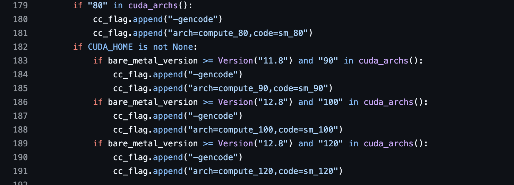
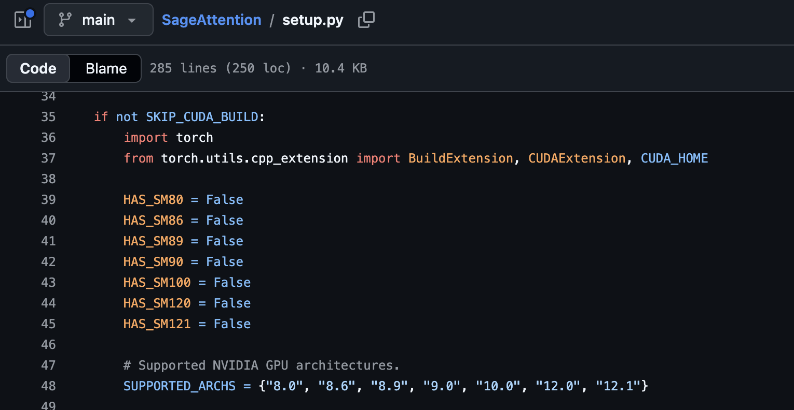

# Wheel my wheel run?

A wheel is Python code plus compiled extension modules (`.so` / `.pyd`)
zipped together.

The Python half runs anywhere; the compiled half is a **set
of 7 demands on the machine it will land on**.

### 1. "Your GPU speaks my instruction set"

GPUs have instruction sets like CPUs do, except NVIDIA changes theirs *every
generation*: Turing is `sm_75`, Ampere `sm_80`/`sm_86`, Ada `sm_89`, Hopper
`sm_90`, Blackwell `sm_100`/`sm_120`.

| CC | Generation | The actual cards |
|---|---|---|
| `sm_50` / `sm_52` | Maxwell | GTX 750 Ti, GTX 950/960/970/980/980 Ti |
| `sm_60` | Pascal (HPC) | Tesla P100 |
| `sm_61` | Pascal | GTX 1050–1080 Ti, TITAN Xp |
| `sm_70` | Volta | Tesla V100, TITAN V |
| `sm_75` | Turing | GTX 1650/1660, RTX 2060/2070/2080 (Ti), T4 |
| `sm_80` | Ampere (HPC) | A100, A30 |
| `sm_86` | Ampere | RTX 3050–3090 Ti, A10, A40 |
| `sm_87` | Ampere (Jetson) | Jetson Orin |
| `sm_89` | Ada | RTX 4050–4090, L4, L40/L40S, RTX 6000 Ada |
| `sm_90` | Hopper | H100, H200, GH200 |
| `sm_100` | Blackwell (HPC) | B100, B200, GB200 |
| `sm_103` | Blackwell (HPC) | B300, GB300 |
| `sm_110` | Blackwell (Jetson) | Jetson Thor |
| `sm_120` | Blackwell | RTX 5050–5090, RTX PRO 6000 Blackwell |
| `sm_121` | Blackwell | GB10 (DGX Spark) |

A cuda binary (cubin) built for one entry runs on *later minor versions of the same major*
(`sm_86` code runs on a technically `sm_89` RTX 4090) but never across majors (`sm_86` code would never run on a `sm_90` Hopper) which is why choosing what to compile for matters.

When compiling a binary for a CUDA library, one has to tell `nvcc` which
instruction set(s) to compile the binary for. Popular libraries hardcode this
choice in their build scripts:

<figure markdown>
  
  <figcaption>flash-attention setting the arches to compile for
  (<a href="https://github.com/Dao-AILab/flash-attention/blob/v2.8.3/setup.py#L179-L191">setup.py, v2.8.3</a>)
  — one <code>-gencode arch=compute_XX,code=sm_XX</code> pair per generation,
  gated on the CUDA toolkit version.</figcaption>
</figure>

<figure markdown>
  
  <figcaption>SageAttention declaring which compute capabilities exist for it
  (<a href="https://github.com/thu-ml/SageAttention/blob/main/setup.py#L47-L48">setup.py</a>)
  — the library's floor is Ampere; nothing older will ever compile.</figcaption>
</figure>


`nvcc` emits **SASS** (real machine code) separately for *each*
architecture it is asked for, and stuffs them all into one file (a
**fatbinary**).

`nvcc` can also emit **PTX**, a portable
intermediate (think bytecode for GPUs).

If a card is newer than anything
baked into the binary, the **CUDA driver** is supposed to JIT (Just In Time) compile
the PTX into SASS at runtime: slow first launch,
cached afterwards. Sometimes libraries will specify a trailing `+PTX` in their arch list, to be
compatible with cards that did not exist when the wheel was built.

!!! failure "`no kernel image is available for execution on the device`"
    "I carry machine code for six GPUs, yours is not one of them, and there
    was no PTX to fall back on."

### 2. "You have exactly this torch"

Very few CUDA packages here are standalone; nearly all are **PyTorch
extensions** that `#include` torch's C++ headers and link `libtorch`, compiled
against torch's actual C++ classes.

C++ has no stable ABI, and PyTorch publishes **no stable C++ ABI** across
releases: class layouts shift, inlined code changes, mangled symbol names
change. An extension built against 2.8 is calling into a `libtorch` that won't
exists in 2.9.

!!! failure "`undefined symbol: _ZN3c104impl...`"
    That mangled name is the tell. It means a torch ABI mismatch.

### 3. "I match your torch's CUDA"

**Why does this farm compile every package for cu124, cu126, cu128, cu129 AND
cu130?** Because PyTorch does.

Every version of torch (2.4, 2.8...) ships one build per CUDA line, every
user's environment is pinned to exactly one of them, and most CUDA packages
build against torch and must match the torch they load into.
This means that every CUDA line (12.4, 12.6...) torch compiles and ships for is a CUDA line
this farm must ship too.

That is why every wheel filename here carries both halves (`+cu128torch2.8`)
and the resolver matches both against the environment
([CW-ADR-0004](adr/0004-combo-encoded-versions-and-metadata-patching.md)).
One wheel per (CUDA x torch) pair is not caution, it is the bare minimum we must do to avoid compilation.

### 4. "You are running exactly this Python version"

CUDA is not callable from Python on its own. What ships is a **C++ shim** that
Python can import and that forwards into the kernels. That shim is
compiled against **one specific CPython's** internals: struct layouts,
function tables, reference-counting macros.

CPython changes those between *minor* versions, which makes 3.11 and 3.12
incompatible. The `cp312` in the wheel filenames
is not a preference but a hard filter: pip will not even offer that wheel to
a 3.11.

!!! failure "`undefined symbol: PyUnicode_...`"
    More often you never get that far, pip just reports **no matching
    distribution** and fails to install.

### 5. "Your CPU speaks my instruction set"

`nvcc` only does half the job. The **host** C++ code is ordinary CPU
machine code, and it is compiled for one instruction set.

x86-64 and arm64 are different machine languages, as mutually unintelligible
as `sm_75` and `sm_90`. An x86-64 build does not execute on an ARM chip at
all.

**Jetson, Grace Hopper and GB200 are
aarch64 machines with NVIDIA GPUs attached.** A wheel can be perfectly correct
about the GPU and still be unloadable because the CPU is the wrong kind.

!!! failure "`... is not a supported wheel on this platform.`"
    pip comparing the filename's tag against your interpreter's own and
    refusing before anything is unpacked.

### 6. "Your OS is the one I was built for"

Same host code, second assumption. `.so` versus `.pyd`. The Itanium C++ ABI
that gcc and clang follow versus MSVC's, which mangle names and pass arguments
differently. Different system libraries entirely. **A Linux build cannot load
on Windows on byte-identical hardware.**

Both this demand and the next land in the same field of the filename:

```text
...-cp312-cp312-win_amd64.whl                 Windows          + x86-64
...-cp312-cp312-manylinux_2_35_x86_64.whl     Linux glibc 2.35 + x86-64
```

### 7. "Your glibc is at least this new"

On Linux the OS demand has a *floor* as well as a name: a binary linked
against glibc 2.35 will not start on a distro shipping 2.31. `auditwheel`
bundles what it safely can and stamps whatever floor it could not avoid,
often as a dual tag, e.g. `manylinux_2_34_x86_64.manylinux_2_35_x86_64`,
meaning "measured floor 2.34, requested ceiling 2.35" (pip accepts either).

So a user on Ubuntu 20.04 can run torch but will not find these wheels, and
the failure is quiet (pip just skips them), not a clear error.

!!! failure "`libc.so.6: version 'GLIBC_2.35' not found`"
    The tag matched well enough for pip to install it, and the loader
    disagreed. The glibc floor is the one demand pip cannot fully check up
    front.

## To summarise:

A compiled wheel is bound to all of this at once

| Bound to | Because |
|---|---|
| **GPU architectures** | the `sm_XX` SASS baked into its fatbinary |
| **CUDA version** | the CUDA runtime it linked against |
| **Python version** (`cp312`) | CPython's C ABI |
| **torch version** | PyTorch ships no stable C++ ABI across releases |
| **CPU architecture** | x86-64 and arm64 are different machine languages |
| **OS** | gcc vs MSVC, `.so` vs `.pyd` |
| **glibc floor** (Linux) | the runner's toolchain, measured and stamped by auditwheel |

Almost no library publishes the full combination, and it is not laziness.
Every cell in this 7 dimensional grid is a **full CUDA compile**, twenty minutes to several hours of a
machine's life, needing a CUDA toolkit and, on Windows, a Visual Studio
install.

!!! tip "NOTE:"
    There are other things that could make wheels fail to run, like libstdc++ or GPU driver, but
    these can be fixed through reinstalling VC Redist or upgrading your GPU driver.

!!! tip "The saving grace: PyTorch already narrowed the grid"
    The space is not actually open-ended. **PyTorch itself only publishes
    builds for a specific set of CUDA, Python and OS combinations**, and an
    extension is only useful if it matches a torch that really exists -- you
    cannot link against a torch nobody can install.

    ComfyUI runs on torch, so this farm never has to guess: it reads what
    PyTorch **actually shipped** and matches it. That turns an explosion into
    a finite, enumerable list -- today **27 `(cuda, torch)` pairings**, which
    is large but knowable in advance and re-derivable whenever upstream moves.
    [How that becomes build jobs](build-process.md#how-does-a-package-become-build-jobs)
    walks the arithmetic.

