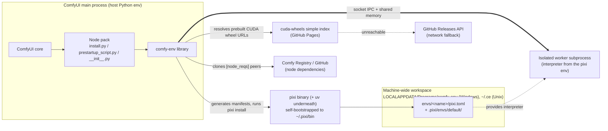
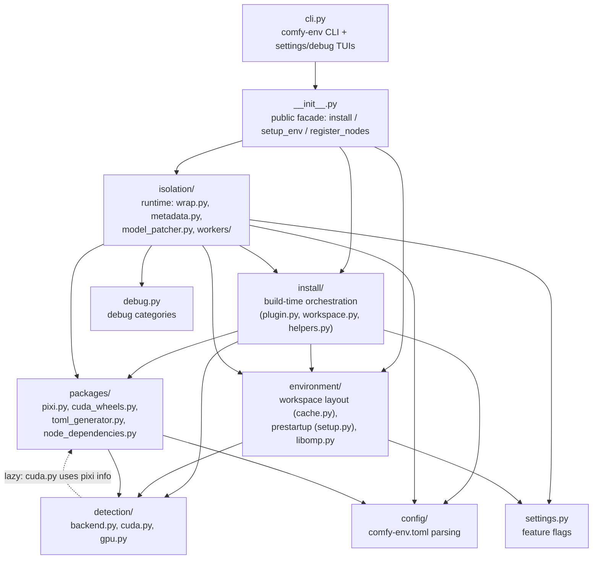
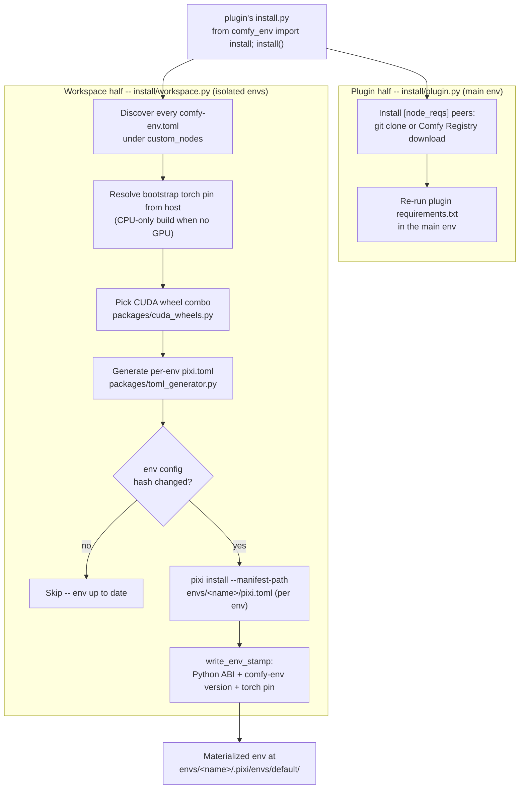
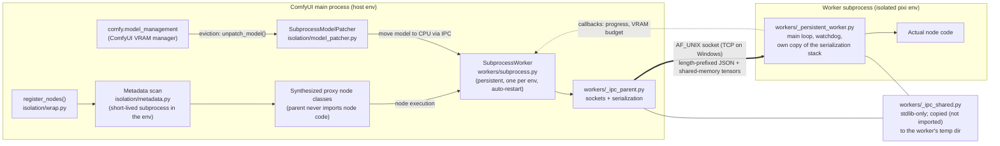

# comfy-env architecture

[comfy-env](https://github.com/PozzettiAndrea/comfy-env) is environment
management and automatic CUDA wheel resolution for ComfyUI custom nodes
(~12,000 lines of Python under `src/comfy_env/`).

## The two problems it solves

**ComfyUI context, for newcomers:** ComfyUI loads every custom node pack into
one shared Python process with one shared environment. A node pack is a
directory under `custom_nodes/` whose `__init__.py` exports
`NODE_CLASS_MAPPINGS`; ComfyUI also runs an optional `install.py` (at install
time) and `prestartup_script.py` (before the server boots) per pack.

That shared environment breaks in two ways:

1. **Dependency conflicts.** Node A needs torch 2.4, node B needs torch 2.8;
   two packages bundle conflicting native libraries (libomp, CUDA runtimes,
   cv2); a node needs a different Python version entirely.
   **Solution: process isolation.** Nodes that declare a `comfy-env.toml` run
   in their own pixi-managed environment as persistent subprocess workers,
   transparently proxied so ComfyUI never notices.
2. **CUDA wheel combinatorics.** Packages like flash-attn, nvdiffrast,
   pytorch3d ship wheels compiled per Python ABI x torch version x CUDA
   version x OS x GPU architecture.
   **Solution: a prebuilt wheel index** at
   [cuda-wheels](https://github.com/PozzettiAndrea/cuda-wheels), resolved
   automatically for the user's exact combination -- no CUDA toolkit or
   compiler needed.

## The three-call contract

A consuming node pack integrates with exactly three lines:

```python
# install.py
from comfy_env import install; install()

# prestartup_script.py
from comfy_env import setup_env; setup_env()

# __init__.py
from comfy_env import register_nodes
NODE_CLASS_MAPPINGS, NODE_DISPLAY_NAME_MAPPINGS = register_nodes()
```

These map to the three lifecycle phases below: **build time**
(`install/__init__.py:39`), **startup** (`environment/setup.py:135`), and
**runtime** (`isolation/wrap.py:701`).

## System context



The workspace is shared machine-wide: env names (`<plugin>-<subdir>`,
`ComfyUI-` prefix stripped, lowercased) act as global identifiers, so two
ComfyUI installs that declare the same node reuse one materialized env
([ADR-0007](adr/0007-machine-wide-workspace-with-per-env-manifests.md)).

## Module layering

The import graph is layered and acyclic at package level, with three
deliberate module-level cycles broken by function-local (lazy) imports.
Arrows read "depends on"; dotted arrows are lazy imports.



The three lazy-broken cycles, all inside `isolation/`:

- `wrap.py` <-> `metadata.py` (proxy building needs the worker pool; metadata
  fetch needs env resolution from wrap)
- `wrap.py` <-> `workers/subprocess.py` (`subprocess.py:334` lazily imports
  `build_isolation_env`)
- `tensor_utils.py` -> `workers/subprocess.py` (`tensor_utils.py:63`, for the
  CUDA IPC metadata cache)

See the [module inventory](modules.md) for every file's responsibility.

## Build time: `install()`



Installs run **per env manifest** deliberately: a parse error in one env's
`pixi.toml` cannot poison another env's scan or install
(`environment/cache.py` module docstring). The host's torch family pin is
replicated verbatim into every generated feature so parent and workers share
an identical torch
([ADR-0007](adr/0007-machine-wide-workspace-with-per-env-manifests.md)).

## Startup: `setup_env()`

The prestartup hook (`environment/setup.py`) is thin: enable `faulthandler`,
print the workspace banner (`[OK]` / `[MISSING -- run install.py]` per env),
dedupe macOS libomp copies, optionally register the shareable CUDA pool hook,
and ensure ComfyUI's `base_directory` is set.

## Runtime: `register_nodes()` and the process boundary



Key facts the diagram encodes:

- **The parent never imports node code.** `metadata.py` spawns a short-lived
  subprocess inside the isolation env to pickle out `INPUT_TYPES` /
  `RETURN_TYPES` etc., then synthesizes proxy classes in the parent
  ([ADR-0001](adr/0001-process-isolation-via-persistent-subprocess-workers.md)).
- **`_persistent_worker.py` is never imported by the parent.** It crosses the
  process boundary as *source text*: read at `subprocess.py:106-109` and
  materialized into a temp dir for the isolated interpreter
  ([ADR-0006](adr/0006-worker-crosses-the-boundary-as-source-text.md)).
- **`_ipc_shared.py` exists on both sides.** It is deliberately stdlib-only
  and is copied next to the worker script so the worker can `import
  _ipc_shared` without having comfy-env installed.
- **Models stay resident in workers** but participate in ComfyUI's VRAM
  accounting via `SubprocessModelPatcher` -- the only module that imports
  ComfyUI at module scope.

## Tensor serialization ladder

Results and inputs cross the boundary via the first applicable strategy
([ADR-0005](adr/0005-tiered-tensor-serialization.md)):

| # | Strategy | Wire type | Mechanism | Copies | Constraints |
|---|----------|-----------|-----------|--------|-------------|
| 1 | CUDA IPC | `CudaIPC` | `reduce_tensor()` / `rebuild_cuda_tensor()` | zero-copy GPU | Linux only; broken under `cudaMallocAsync` |
| 2 | Pool IPC | `PoolIPC` | `cudaMemPoolExportPointer` + FD passing | zero-copy GPU | in progress; the `cudaMallocAsync` fix |
| 3 | Torch shared memory | `TensorRef` | `file_system` strategy (/dev/shm) | zero-copy CPU | |
| 4 | NumPy | -- | converted to torch tensor, then #3 | zero-copy CPU | |
| 5 | Trimesh / pickle | -- | pickled into a `SharedMemory` block | 1 copy | anything picklable |
| 6 | Primitives | -- | inline in the JSON message | -- | small values |

!!! warning "Known caveat"
    ComfyUI sets `PYTORCH_CUDA_ALLOC_CONF=backend:cudaMallocAsync`, which
    breaks legacy CUDA IPC (`reduce_tensor()` raises). The `_probe_cuda_ipc()`
    checks on both sides test `Event` + allocation but not `reduce_tensor()`,
    so they can report IPC as available when it is not. Pool IPC (strategy 2)
    is the in-progress fix; until then the ladder falls back to CPU shared
    memory.

## Where to go next

- [Module inventory](modules.md) -- what every file under `src/comfy_env/` does
- [Decision records](adr/index.md) -- the "why" behind each of these choices
